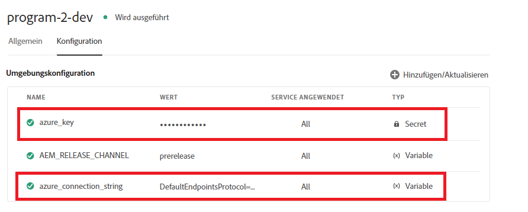

# Kontextbezogene Cloud-Konfigurationen

Wenn Sie die Cloud-Konfiguration in Ihrer lokalen Umgebung erstellen und erfolgreich testen, sollten Sie dieselbe Cloud-Konfiguration in Ihren Upstream-Umgebungen verwenden, ohne den Endpunkt, den geheimen Schlüssel/Kennwort und den Benutzernamen ändern zu müssen. Um dieses Anwendungsbeispiel zu erreichen, hat AEM Forms auf Cloud Service die Möglichkeit eingeführt, kontextbezogene Cloud-Konfigurationen zu definieren.
Beispielsweise kann die Cloud-Konfiguration des Azure-Speicherkontos in Entwicklungs-, Staging- und Produktionsumgebungen wiederverwendet werden, indem verschiedene Verbindungszeichenfolgen und -schlüssel für verwendet werden.

Die folgenden Schritte sind erforderlich, um eine kontextsensitive Cloud-Konfiguration zu erstellen

## Umgebungsvariablen erstellen

Standardumgebungsvariablen können über Cloud Manager konfiguriert und verwaltet werden. Sie werden der Laufzeitumgebung bereitgestellt und können in OSGi-Konfigurationen verwendet werden. [Umgebungsvariablen können umgebungsspezifische Werte oder Umgebungsgeheimnisse sein. Dies ist davon abhängig, was geändert wird.](https://experienceleague.adobe.com/docs/experience-manager-cloud-service/content/implementing/using-cloud-manager/environment-variables.html?lang=en)


Der folgende Screenshot zeigt die definierten Umgebungsvariablen azure_key und azure_connection_string


Diese Umgebungsvariablen können dann in den Konfigurationsdateien angegeben werden, die in der entsprechenden Umgebung verwendet werden sollen. Wenn Sie beispielsweise möchten, dass alle Ihre Autoreninstanzen diese Umgebungsvariablen verwenden, definieren Sie die Konfigurationsdatei im Ordner config.author wie unten angegeben.

## Konfigurationsdatei erstellen

Öffnen Sie Ihr Projekt in IntelliJ. Navigieren Sie zu config.author und erstellen Sie eine Datei mit dem Namen

```java
org.apache.sling.caconfig.impl.override.OsgiConfigurationOverrideProvider-integrationTest.cfg.json
```


Kopieren Sie den folgenden Text in die Datei, die Sie im vorherigen Schritt erstellt haben. Der Code in dieser Datei überschreibt den Wert der Eigenschaften accountName und accountKey mit den Umgebungsvariablen **azure_connection_string** und **azure_key**.

```json
{
  "enabled":true,
  "description":"dermisITOverrideConfig",
  "overrides":[
   "cloudconfigs/azurestorage/FormsCSAndAzureBlob/accountName=\"$[env:azure_connection_string]\"",
   "cloudconfigs/azurestorage/FormsCSAndAzureBlob/accountKey=\"$[secret:azure_key]\""

  ]
}
```

>[!NOTE]
>
>Diese Konfiguration gilt für alle Autorenumgebungen in Ihrer Cloud Service-Instanz. Um die Konfiguration auf Veröffentlichungsumgebungen anzuwenden, müssen Sie dieselbe Konfigurationsdatei im Ordner config.publish Ihres intelliJ-Projekts ablegen
>[!NOTE]
> Stellen Sie sicher, dass die Eigenschaft, die überschrieben wird, eine gültige Eigenschaft der Cloud-Konfiguration ist. Navigieren Sie zur Cloud-Konfiguration, um die Eigenschaft zu finden, die Sie überschreiben möchten, wie unten dargestellt.


Für REST-basierte Cloud-Konfigurationen mit einfacher Authentifizierung sollten Sie normalerweise Umgebungsvariablen für die Eigenschaften serviceEndPoint, userName und password erstellen.

## Nächste Schritte

[AEM Projekt in Cloud Manager verschieben](./push-project-to-cloud-manager-git.md)
