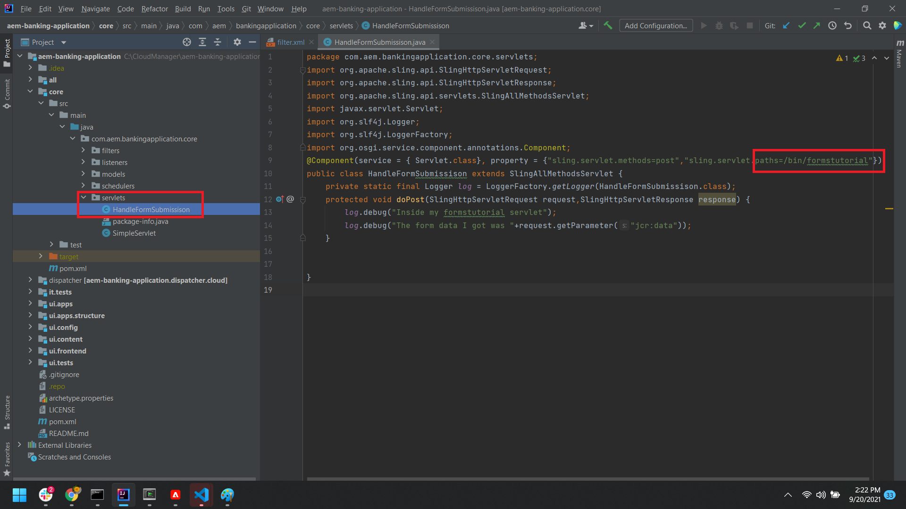

# Erstellen eines Servlets zur Verarbeitung der gesendeten Daten

Starten Sie Ihr AEM-Banking-Projekt in IntelliJ.
Erstellen Sie ein einfaches Servlet, um die gesendeten Daten in die Protokolldatei auszugeben. Stellen Sie sicher, dass sich der Code im Kernprojekt befindet, wie im Screenshot unten dargestellt


```java
package com.aem.bankingapplication.core.servlets;
import org.apache.sling.api.SlingHttpServletRequest;
import org.apache.sling.api.SlingHttpServletResponse;
import org.apache.sling.api.servlets.SlingAllMethodsServlet;
import javax.servlet.Servlet;
import org.slf4j.Logger;
import org.slf4j.LoggerFactory;
import org.osgi.service.component.annotations.Component;
@Component(service = { Servlet.class}, property = {"sling.servlet.methods=post","sling.servlet.paths=/bin/formstutorial"})
public class HandleFormSubmissison extends SlingAllMethodsServlet {
    private static final Logger log = LoggerFactory.getLogger(HandleFormSubmissison.class);
    protected void doPost(SlingHttpServletRequest request,SlingHttpServletResponse response) {
        log.debug("Inside my formstutorial servlet");
        log.debug("The form data I got was "+request.getParameter("jcr:data"));
    }
}
```

## Benutzerdefinierten Sende-Handler erstellen

Erstellen Sie Ihre benutzerdefinierte Sendeaktion im `apps/bankingapplication` -Ordner auf die gleiche Weise wie im [frühere Versionen von AEM Forms](https://experienceleague.adobe.com/docs/experience-manager-learn/forms/adaptive-forms/custom-submit-aem-forms-article.html?lang=en). Für diese Anleitung erstelle ich einen Ordner mit dem Namen SubmitToAEMServlet unter der `apps/bankingapplication` -Knoten im CRX-Repository.

Der folgende Code in post.POST.jsp leitet die Anfrage einfach an das Servlet weiter, das auf /bin/formstutorial bereitgestellt wurde. Dies ist dasselbe Servlet, das im vorherigen Schritt erstellt wurde

```java
com.adobe.aemds.guide.utils.GuideSubmitUtils.setForwardPath(slingRequest,"/bin/formstutorial",null,null);
```

Klicken Sie in Ihrem AEM Projekt in IntelliJ mit der rechten Maustaste auf das `apps/bankingapplication` Ordner und wählen Sie Neu aus | Paket und geben Sie in SubmitToAEMServlet nach der Anwendung apps.bankingim neuen Paketdialogfeld ein. Klicken Sie mit der rechten Maustaste auf den Knoten SubmitToAEMServlet und wählen Sie repo aus. | Befehl abrufen, um das AEM Projekt mit dem AEM Server-Repository zu synchronisieren.


## Adaptives Formular konfigurieren

Sie können jetzt jedes adaptive Formular so konfigurieren, dass es an diesen benutzerdefinierten Submit-Handler mit dem Namen **Senden an AEM Servlet**

## Nächste Schritte

[Aktivieren von Komponenten des Formularportals](./forms-portal-components.md)


