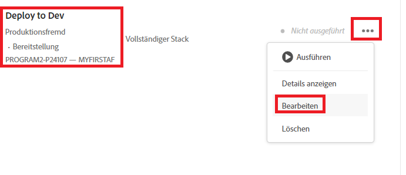
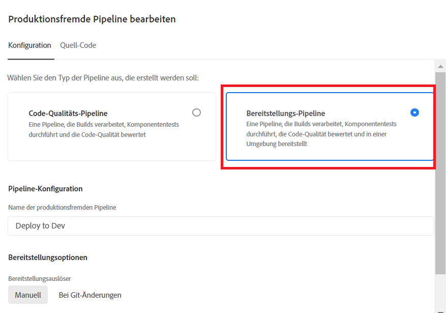
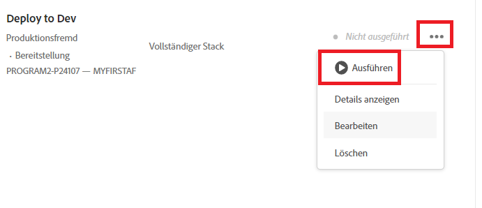

# Bereitstellen für die Entwicklungsumgebung

Im vorherigen Schritt haben wir unsere übergeordnete Verzweigung von unserem lokalen Git-Repository in die MyFirstAF-Verzweigung des Cloud Manager-Repositorys verschoben.

Der nächste Schritt besteht darin, den Code in der Entwicklungsumgebung bereitzustellen.
Melden Sie sich bei Cloud Manager an und wählen Sie Ihr Programm aus.

Wählen Sie die Option „Für Entwicklung bereitstellen“ wie unten dargestellt aus.

Wählen Sie Bereitstellungs-Pipeline wie folgt aus:

Wählen Sie den Quell-Code und entsprechende Git-Verzweigung aus:

Aktualisieren Sie Ihre Änderungen.

Führen Sie die Pipeline aus:

Nachdem der Code bereitgestellt wurde, sollten die Änderungen in Ihrer Cloud Service-Instanz von AEM Forms angezeigt werden.

## Nächste Schritte

[Aktualisieren des Maven-Archetyp-Projekts](./updating-project-archetype.md)
