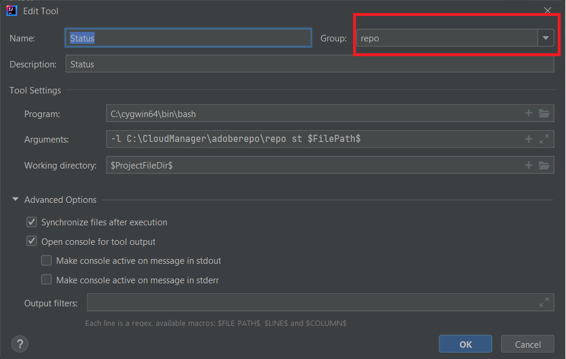

# Installieren von Cygwin

Cygwin ist eine POSIX-kompatible Programmierungs- und Laufzeitumgebung, die nativ unter Microsoft Windows ausgeführt wird.
Installieren Sie [Cygwin](https://www.cygwin.com/). Ich habe es in den Ordner „C:\cygwin64“ installiert.
>[!NOTE]
> Stellen Sie sicher, dass Sie die Pakete zip, unzip, curl, rsync mit Ihrer Cygwin-Installation installieren.

Erstellen Sie einen Ordner namens „adoberepo“ unter dem Ordner „c:\cloudmanager“.

[Installieren des Repo Tools](https://github.com/Adobe-Marketing-Cloud/tools/tree/master/repo) Die Installation des Repo Tools ist nichts anderes als das Kopieren der Repo-Datei und das Platzieren in den Ordner „c:\cloudmanger\adoberepo“.

Fügen Sie der Umgebungsvariablen „Path“ Folgendes hinzu: C:\cygwin64\bin;C:\CloudManager\adoberepo;

## Einrichten externer Tools

* Launch von IntelliJ
* Drücken Sie Tastenkombination Strg+Alt+S, um das Einstellungsfenster zu starten.
* Wählen Sie „Tools > Externe Tools“ aus, klicken Sie auf das Pluszeichen (+) und geben Sie wie im Screenshot gezeigt Folgendes ein:
  
* Stellen Sie sicher, dass Sie eine Gruppe mit dem Namen „repo“ erstellen, indem Sie „repo“ in das Dropdown-Feld „Gruppe“ eingeben, und dass alle von Ihnen erstellten Befehle zur Gruppe **repo** gehören.

**Put-Befehl**
**Program**: C:\cygwin64\bin\bash
**Arguments**: -l C:\CloudManager\adoberepo\repo put -f \$FilePath\$
**Working Dir**: \$ProjectFileDir\$

**Get-Befehl**
**Program**: C:\cygwin64\bin\bash
**Arguments**: -l C:\CloudManager\adoberepo\repo get -f \$FilePath\$
**Working Dir**: \$ProjectFileDir\$

**Status-Befehl**
**Program**: C:\cygwin64\bin\bash
**Arguments**: -l C:\CloudManager\adoberepo\repo st -f \$FilePath\$
**Working Dir**: \$ProjectFileDir\$

**Diff-Befehl**
**Program**: C:\cygwin64\bin\bash
**Arguments**: -l C:\CloudManager\adoberepo\repo diff -f $FilePath$
**Working Dir**: \$ProjectFileDir\$

Extrahieren Sie die .repo-Datei aus [repo.zip](assets/repo.zip) und platzieren Sie sie in den Stammordner Ihrer AEM-Projekte. (C:\CloudManager\aem-banking-application). Öffnen Sie die .repo -Datei und stellen Sie sicher, dass der Server und die Anmeldeinformationen Ihrer Umgebung entsprechen.
Öffnen Sie die .gitignore-Datei, fügen Sie am unteren Rand der Datei Folgendes hinzu und speichern Sie die Änderungen:
\# repo
.repo

Wählen Sie ein beliebiges Projekt innerhalb Ihres aem-banking-application-Projekts aus, z. B. „ui.content“, und klicken Sie mit der rechten Maustaste darauf. Sie sollten die Option „Repo“ sehen und unter der Option finden Sie die 4 Befehle, die wir zuvor hinzugefügt haben.

## Einrichten einer AEM-Autoreninstanz{#set-up-aem-author-instance}

Um eine Cloud-fähige Instanz auf Ihrem lokalen System schnell einzurichten, können die folgenden Schritte ausgeführt werden.
* [Laden Sie das aktuelle AEM SDK herunter.](https://experience.adobe.com/#/downloads/content/software-distribution/en/aemcloud.html)

* [Laden Sie die neueste AEM Forms-Erweiterung herunter](https://experience.adobe.com/#/downloads/content/software-distribution/de/aemcloud.html)

* Erstellen Sie die folgende Ordnerstruktur: 
c:\aemformscs\aem-sdk\author

* Extrahieren Sie die Datei „aem-sdk-quickstart-xxxxxxx.jar“ aus der ZIP-Datei des AEM SDK und platzieren Sie sie im Ordner „c:\aemformscs\aem-sdk\author“. Benennen Sie die JAR-Datei in „aem-author-p4502.jar“ um.

* Öffnen Sie die Eingabeaufforderung und navigieren Sie zu c:\aemformscs\aem-sdk\author
geben Sie den folgenden Befehl ein: java -jar aem-author-p4502.jar -gui. Dadurch wird die Installation von AEM gestartet.
* Anmeldung mit Admin-/Adminberechtigungen
* Halten Sie die AEM-Instanz an
* Erstellen Sie die folgende Ordnerstruktur: C:\aemformscs\aem-sdk\author\crx-quickstart\install
* Kopieren Sie aem-forms-addon-xxxxxx.far in den Installations-Ordner
* Öffnen Sie die Eingabeaufforderung und navigieren Sie zu c:\aemformscs\aem-sdk\author
geben Sie den folgenden Befehl ein: java -jar aem-author-p4502.jar -gui. Dadurch wird das Formularerweiterungspaket in Ihrer AEM-Instanz bereitgestellt.

## Nächste Schritte

[Synchronisieren von AEM-Formularen und -Vorlagen mit AEM-Projekten](./deploy-your-first-form.md)
