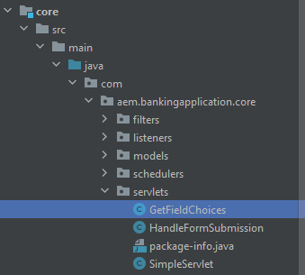

# Einführung

Das Binden von Servlets nach Pfaden hat im Vergleich zur Bindung nach Ressourcentypen mehrere Nachteile:

* Pfad-gebundene Servlets können nicht mithilfe der standardmäßigen JCR-Repository-ACLs gesteuert werden
* Pfadgebundene Servlets können nur in einem Pfad und nicht in einem Ressourcentyp registriert werden (d. h. keine Suffix-Verarbeitung).
* Wenn ein pfadgebundenes Servlet nicht aktiv ist, z. B. wenn das Bundle fehlt oder nicht gestartet wird, kann eine POST zu unerwarteten Ergebnissen führen. Erstellen eines Knotens normalerweise unter `/bin/xyz` die anschließend den Servlets-Pfad überlagert, ist die Zuordnung für einen Entwickler, der sich nur das Repository ansieht, nicht transparent. Aufgrund dieser Nachteile wird dringend empfohlen, Servlets an Ressourcentypen und nicht an Pfade zu binden

## Erstellen eines Servlets

Starten Sie Ihr AEM-Banking-Projekt in IntelliJ. Erstellen Sie ein Servlet namens GetFieldChoices im Ordner &quot;Servlets&quot;, wie im Screenshot unten dargestellt.


## Beispiel-Servlet

Das folgende Servlet ist an den Sling-Ressourcentyp gebunden: _**azure/fetchchoice**_


```java
import org.apache.sling.api.SlingHttpServletRequest;
import org.apache.sling.api.SlingHttpServletResponse;
import org.apache.sling.api.servlets.SlingAllMethodsServlet;
import org.apache.sling.servlets.annotations.SlingServletResourceTypes;
import org.osgi.framework.Constants;
import org.osgi.service.component.annotations.Component;
import org.osgi.service.component.annotations.Reference;
import org.slf4j.Logger;
import org.slf4j.LoggerFactory;

import javax.jcr.Session;
import javax.servlet.Servlet;
import java.io.IOException;
import java.io.Serializable;

@Component(
        service={Servlet.class }
)

        @SlingServletResourceTypes(
                resourceTypes="azure/fetchchoices",
                methods= "GET",
                extensions="json"
                )


public class GetFieldChoices extends SlingAllMethodsServlet implements Serializable {
    private static final long serialVersionUID = 1L;
    private final  transient Logger log = LoggerFactory.getLogger(this.getClass());


   

    protected void doGet(SlingHttpServletRequest request, SlingHttpServletResponse response) {

        log.debug("The form path I got was "+request.getParameter("formPath"));

    }
}
```

## Erstellen von Ressourcen in CRX

* Melden Sie sich bei Ihrem lokalen AEM SDK an.
* Erstellen Sie eine Ressource mit dem Namen `fetchchoices` (Sie können diesen Knoten trotzdem nennen, wenn Sie ihn möchten) des Typs `cq:Page` unter dem Inhaltsknoten.
* Speichern Sie Ihre Änderungen.
* Erstellen Sie einen Knoten mit dem Namen `jcr:content` des Typs `cq:PageContent` und speichern Sie die Änderungen
* Fügen Sie die folgenden Eigenschaften zum `jcr:content` Knoten

| Eigenschaftsname | Eigenschaftswert |
|--------------------|--------------------|
| jcr:title | Dienstprogramme |
| sling:resourceType | `azure/fetchchoices` |


Die `sling:resourceType` -Wert muss mit resourceTypes=&quot;azure/fetchchoice&quot;übereinstimmen, die im Servlet angegeben ist.

Sie können jetzt Ihr Servlet aufrufen, indem Sie die Ressource mit `sling:resourceType` = `azure/fetchchoices` im vollständigen Pfad mit allen Selektoren oder Erweiterungen, die im Sling-Servlet registriert sind.

```html
http://localhost:4502/content/fetchchoices/jcr:content.json?formPath=/content/forms/af/forrahul/jcr:content/guideContainer
```

Der Pfad `/content/fetchchoices/jcr:content` ist der Pfad der Ressource und Erweiterung `.json` ist, was im Servlet angegeben ist

## AEM Projekt synchronisieren

1. Öffnen Sie das AEM Projekt in Ihrem Lieblings-Editor. Dafür habe ich intelliJ eingesetzt.
1. Erstellen Sie unter `fetchchoices` den Ordner `\aem-banking-application\ui.content\src\main\content\jcr_root\content`.
1. Rechtsklick `fetchchoices` Ordner und auswählen `repo | Get Command` (Dieses Menüelement wird in einem vorherigen Kapitel dieses Tutorials eingerichtet.)

Dieser Knoten sollte von AEM mit Ihrem lokalen AEM-Projekt synchronisiert werden.

Ihre AEM Projektstruktur sollte wie folgt aussehen:

Aktualisieren Sie filter.xml im Ordner aem-banking-application\ui.content\src\main\content\META-INF\vault mit dem folgenden Eintrag

```xml
<filter root="/content/fetchchoices" mode="merge"/>
```

Sie können Ihre Änderungen jetzt mithilfe von Cloud Manager in eine AEM as a Cloud Service Umgebung übertragen.

## Nächste Schritte

[Aktivieren von Komponenten des Formularportals](./forms-portal-components.md)


