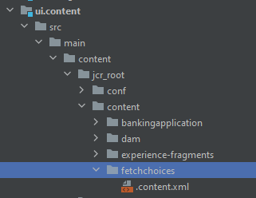

# Einführung

Das Binden von Servlets nach Pfaden hat im Vergleich zum Binden nach Ressourcentypen mehrere Nachteile, beispielsweise:

* Der Zugriff auf pfadgebundene Servlets kann nicht mithilfe der standardmäßigen JCR-Repository-ACLs gesteuert werden
* Pfadgebundene Servlets können nur bei einem Pfad und nicht bei einem Ressourcentyp registriert werden (d. h. keine Suffixhandhabung).
* Wenn ein pfadgebundenes Servlet nicht aktiv ist, z. B. wenn das Bundle fehlt oder nicht gestartet wurde, kann eine POST-Anfrage zu unerwarteten Ergebnissen führen. Dabei wird gewöhnlich ein Knoten unter `/bin/xyz` erstellt, wodurch die Pfadbindung des Servlets überlagert wird
Die Zuordnung ist für Entwickelnde, die lediglich das Repository betrachten, nicht transparent
Aufgrund dieser Nachteile wird dringend empfohlen, Servlets an Ressourcentypen und nicht an Pfade zu binden

## Erstellen eines Servlets

Starten Sie in IntelliJ Ihr Projekt „aem-banking“. Erstellen Sie im Ordner „servlets“ ein Servlet mit dem Namen „GetFieldChoices“, wie im Screenshot unten dargestellt.


## Servlet-Beispiel

Das folgende Servlet ist an den folgenden Sling-Ressourcentyp gebunden: _**azure/fetchchoices**_


```java
import org.apache.sling.api.SlingHttpServletRequest;
import org.apache.sling.api.SlingHttpServletResponse;
import org.apache.sling.api.servlets.SlingAllMethodsServlet;
import org.apache.sling.servlets.annotations.SlingServletResourceTypes;
import org.osgi.framework.Constants;
import org.osgi.service.component.annotations.Component;
import org.osgi.service.component.annotations.Reference;
import org.slf4j.Logger;
import org.slf4j.LoggerFactory;

import javax.jcr.Session;
import javax.servlet.Servlet;
import java.io.IOException;
import java.io.Serializable;

@Component(
        service={Servlet.class }
)

        @SlingServletResourceTypes(
                resourceTypes="azure/fetchchoices",
                methods= "GET",
                extensions="json"
                )


public class GetFieldChoices extends SlingAllMethodsServlet implements Serializable {
    private static final long serialVersionUID = 1L;
    private final  transient Logger log = LoggerFactory.getLogger(this.getClass());


   

    protected void doGet(SlingHttpServletRequest request, SlingHttpServletResponse response) {

        log.debug("The form path I got was "+request.getParameter("formPath"));

    }
}
```

## Erstellen von Ressourcen in CRX

* Melden Sie sich bei Ihrem lokalen AEM SDK an.
* Erstellen Sie unter dem Knoten „content“ eine Ressource mit dem Namen `fetchchoices` (Sie können diesen Knoten beliebig benennen) vom Typ `cq:Page`.
* Speichern Sie Ihre Änderungen
* Erstellen Sie einen Knoten mit dem Namen `jcr:content` vom Typ `cq:PageContent` und speichern Sie die Änderungen
* Fügen Sie dem Knoten `jcr:content` folgende Eigenschaften hinzu:

| Eigenschaftsname | Eigenschaftswert |
|--------------------|--------------------|
| jcr:title | Dienstprogramm-Servlets |
| sling:resourceType | `azure/fetchchoices` |


Der Wert `sling:resourceType` muss mit dem im Servlet angegebenen Ressourcentyp „resourceTypes=&quot;azure/fetchchoices“ übereinstimmen.

Sie können das Servlet jetzt aufrufen, indem Sie die Ressource mit `sling:resourceType` = `azure/fetchchoices` im vollständigen Pfad anfordern, wobei alle Selektoren und Erweiterungen im Sling-Servlet registriert sind.

```html
http://localhost:4502/content/fetchchoices/jcr:content.json?formPath=/content/forms/af/forrahul/jcr:content/guideContainer
```

Der Pfad `/content/fetchchoices/jcr:content` ist der Pfad der Ressource und die Erweiterung `.json` entspricht dem, was im Servlet angegeben ist

## Synchronisieren des AEM-Projekts

1. Öffnen Sie das AEM-Projekt in Ihrem bevorzugten Editor. Hier wurde IntelliJ verwendet.
1. Erstellen Sie unter `\aem-banking-application\ui.content\src\main\content\jcr_root\content` den Ordner `fetchchoices`
1. Klicken Sie mit der rechten Maustaste auf den Ordner `fetchchoices` und wählen Sie `repo | Get Command` aus. (Dieses Menüelement wurde in einem vorherigen Kapitel dieses Tutorials eingerichtet.)

Dadurch sollte dieser Knoten aus AEM mit Ihrem lokalen AEM-Projekt synchronisiert werden.

Ihre AEM-Projektstruktur sollte folgendermaßen aussehen:

Aktualisieren Sie die Datei „filter.xml“ im Ordner „aem-banking-application\ui.content\src\main\content\META-INF\vault“ mit dem folgenden Eintrag:

```xml
<filter root="/content/fetchchoices" mode="merge"/>
```

Sie können Ihre Änderungen jetzt mit Cloud Manager in eine AEM as a Cloud Service-Umgebung übertragen.

## Nächste Schritte

[Aktivieren von Komponenten des Formularportals](./forms-portal-components.md)
