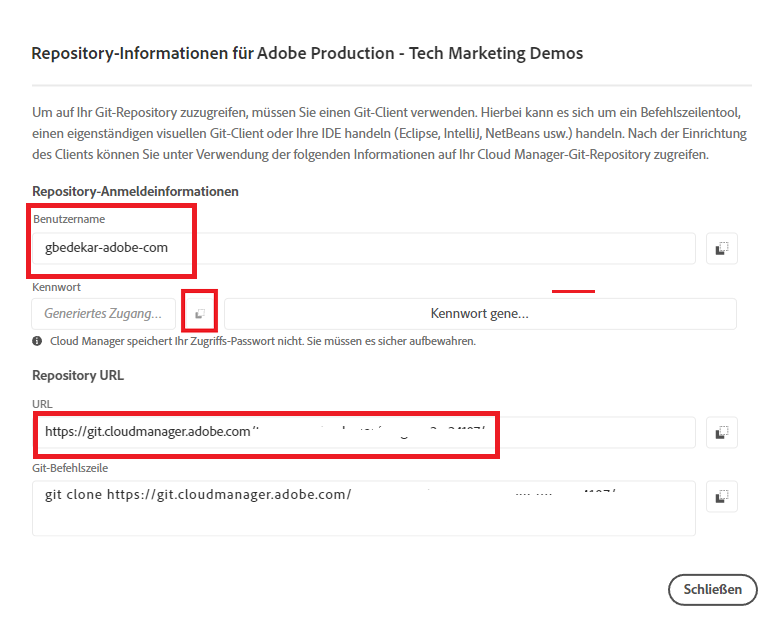

# Installieren von Git


[Installieren von Git](https://git-scm.com/downloads). Sie können die Standardeinstellungen auswählen und den Installationsprozess abschließen.
Wechseln Sie zur Eingabeaufforderung
Navigieren Sie zu c:\cloudmanager\aem-banking-app
geben Sie „git -- version“ ein. Sie sollten die Version von GIT sehen, die auf Ihrem System installiert ist

## Initialisieren des lokalen Git-Repositorys

Stellen Sie sicher, dass Sie sich im Ordner c:\cloudmanager\aem-banking-app befinden.

```
git init
```

Der obige Befehl initialisiert das Projekt als lokales Git-Repository.

```
git add .
```

Dadurch werden alle Projektdateien zum Git-Repository hinzugefügt, die zum Übertragen in das Git-Repository bereit sind

```
git commit -m "initial commit"
```

Dadurch werden die Dateien in das Git-Repository übertragen.


## Registrieren des Cloud Manager-Repositorys in unserem lokalen Git-Repository

Zugriff auf das Cloud Manager-Repository

Aufrufen der Repository-Anmeldeinformationen von Cloud Manager


Speichern des Benutzernamen in der Konfigurationsdatei

```java
git config --global credential.username "gbedekar-adobe-com"
```

Speichern des Kennworts in der Konfigurationsdatei

```java
git config --global user.password "XXXX"
```

(Das Kennwort ist Ihr Git-Repository-Passwort für Cloud Manager.)

Registrieren Sie das Cloud Manager-Git-Repository bei Ihrem lokalen Git-Repository. Der folgende Befehl verknüpft **bankingapp** mit dem Remote-Git-Repository von Cloud Manager. Sie könnten einen beliebigen Namen anstelle von **bankingapp** nutzen.


```shell
git remote add bankingapp https://git.cloudmanager.adobe.com/<cloud-manager-repo-path>
```

(Stellen Sie sicher, dass Sie Ihre Repository-URL verwenden.)

Überprüfen Sie, ob das Remote-Repository registriert ist

```java
git remote -v
```

## Nächste Schritte

[Synchronisieren von AEM mit AEM-Projekt in IntelliJ](./intellij-and-aem-sync.md)
