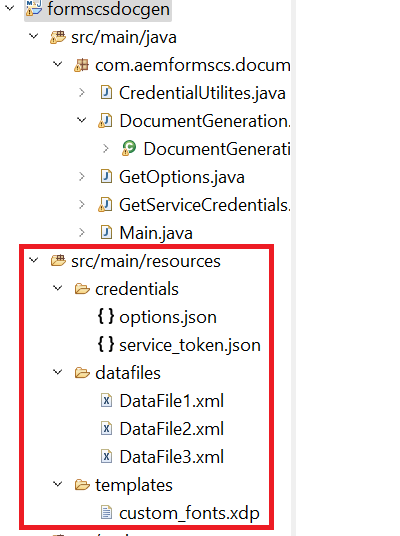

# Eclipse-Projekt importieren

Laden Sie die [ZIP-Datei](./assets/aem-forms-cs-doc-gen.zip)

Starten Sie Eclipse und importieren Sie das Projekt in Eclipse Das Projekt enthält die folgenden Dateien im Ressourcenordner:

* DataFile1, DataFile2 und DataFile3 - XML-Beispieldatendateien, die mit der Vorlage zusammengeführt werden sollen, um die endgültige PDF-Datei zu generieren
* custom_fonts.xdp - XDP-Vorlage.
* service_token.json - Sie müssen den Inhalt dieser Datei durch Ihre kontospezifischen Anmeldeinformationen ersetzen
* options.json - Die in dieser Datei angegebenen Optionen werden verwendet, um die Eigenschaften der von der API generierten PDF-Datei festzulegen.

## Testen der Lösung

* Kopieren Sie Ihre Dienstanmeldeinformationen und fügen Sie sie in die Ressourcendatei service_token.json in das Projekt ein.
* Öffnen Sie die Datei DocumentGeneration.java und geben Sie den Ordner an, in dem Sie die generierten PDF-Dateien speichern möchten
* Öffnen Sie Main.java. Legen Sie den Wert der Variablen postURL fest, um auf Ihre Instanz zu verweisen.
* Ausführen von Main.java als Java-Anwendung

>[!NOTE]
> Beim ersten Ausführen des Java-Programms wird der HTTP 403-Fehler angezeigt. Um dies zu überwinden, stellen Sie sicher, dass Sie [geeignete Berechtigungen für den technischen Kontobenutzer in AEM](https://experienceleague.adobe.com/docs/experience-manager-learn/getting-started-with-aem-headless/authentication/service-credentials.html?lang=en#configure-access-in-aem).

**AEM Forms-Benutzer** ist die Rolle, die ich für diesen Kurs genutzt habe.

