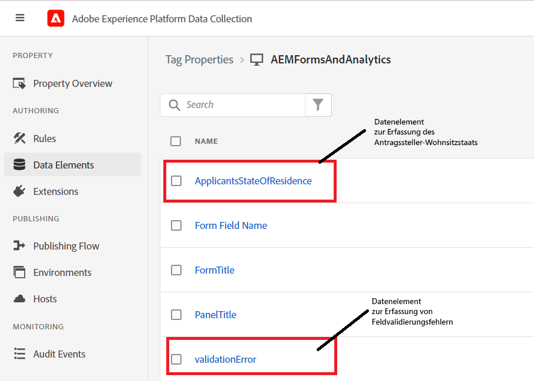

# Erstellen von Datenelementen

In der Tags-Eigenschaft wurden zwei neue Datenelemente hinzugefügt (ApplicationStateOfResidence und validationError).



## ApplicantStateOfResidence

Das Datenelement **ApplicantStateOfResidence** wurde konfiguriert, indem **Kern** in der Dropdown-Liste für die Erweiterung und **Benutzerdefinierter Code** für den Datenelementtyp ausgewählt wurde, wie in der folgenden Abbildung dargestellt:


Der folgende benutzerdefinierte Code wurde verwendet, um den Wert aus dem Feld **_state_** des adaptiven Formulars zu erfassen.

```javascript
// use the GuideBridge API to access adaptive form elements
//The state field's SOM expression is used to access the state field
var ApplicantsStateOfResidence = guideBridge.resolveNode("guide[0].guide1[0].guideRootPanel[0].state[0]").value;
_satellite.logger.log("Returning  Applicants State Of Residence is "+ApplicantsStateOfResidence);
return ApplicantsStateOfResidence;
```

## validationError

Das Datenelement **validationError** wurde konfiguriert, indem **Kern** in der Dropdown-Liste für die Erweiterung und **Benutzerdefinierter Code** für den Datenelementtyp ausgewählt wurde, wie in der folgenden Abbildung dargestellt:


Der folgende benutzerdefinierte Code wurde geschrieben, um den Wert des Datenelements `validationError` festzulegen.

```javascript
var validationError = "";
// Using GuideBridge API to access adaptive forms fields using the fields SOM expression
var tel = guideBridge.resolveNode("guide[0].guide1[0].guideRootPanel[0].telephone[0]");
var email = guideBridge.resolveNode("guide[0].guide1[0].guideRootPanel[0].email[0]");

_satellite.logger.log("Got tel in Tags custom script "+tel.isValid)
_satellite.logger.log("Got email in Tags custom script "+email.isValid)

if (tel.isValid == false) {  
  validationError = "error: telephone number";
  _satellite.logger.log("Validation error is "+ validationError);
}

if (email.isValid == false) {  
  validationError = "error: invalid email";
  _satellite.logger.log("Validation error is "+ validationError);
}

return validationError;
```

## Nächste Schritte

[Erstellen von Regeln](./rules.md)