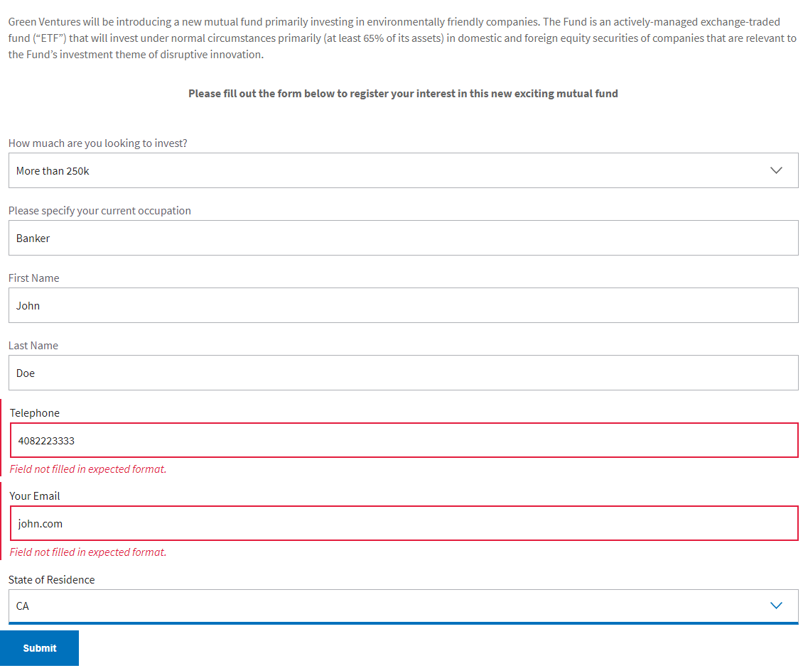

# Integrieren von AEM Forms mit Adobe Analytics für Berichte zu Formulardatenfeldern

Erfahren Sie, wie Sie AEM Forms as a Cloud Service mit Adobe Analytics in Ihre adaptiven Formulare integrieren, indem Sie Experience Platform-Tags verwenden. Dieses Beispiel führt Sie durch die Konfigurations- und Implementierungsschritte, um aufschlussreiche Berichte über die Interaktion der Besucher mit Ihren Formularen zu erstellen.

## Voraussetzungen

Um dieses Tutorial optimal zu nutzen, wird empfohlen, die folgenden Voraussetzungen zu erfüllen:

* Einige Erlebnisse mit AEM Forms as a Cloud Service
* Zugriff auf Experience Platform-Tags
* Zugriff auf Adobe Analytics

In diesem Tutorial wird ein einfaches adaptives Formular verwendet, das in AEM Forms erstellt wurde. Außerdem werden die Formularübermittlungen für den Status von Aufenthaltswerten sowie Felder gemessen, die Überprüfungsfehler verursachen.

## Nächste Schritte

[Datenelemente erstellen](./data-elements.md)