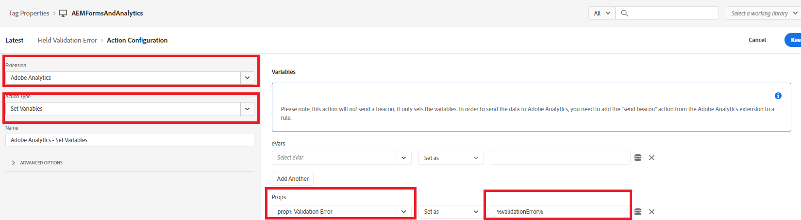

# Definieren der Regel

In der Eigenschaft „Tags“ haben wir zwei neue [Regeln](https://experienceleague.adobe.com/docs/platform-learn/implement-in-websites/configure-tags/add-data-elements-rules.html?lang=de) (**Fehler bei Feldvalidierung und FormSubmit**) erstellt.

## Feldvalidierungsfehler

Die **Feldvalidierungsfehler**-Regel wird jedes Mal ausgelöst, wenn in einem Feld des adaptiven Formulars ein Validierungsfehler auftritt. Wenn beispielsweise in unserem Formular die Telefonnummer oder die E-Mail-Adresse nicht das erwartete Format aufweist, wird eine Validierungsfehlermeldung angezeigt.

Die Feldvalidierungsfehler-Regel wird konfiguriert, indem das Ereignis auf _**Adobe Experience Manager Forms-Fehler**_ festgelegt wird, wie im Screenshot gezeigt

„Adobe Analytics – Variablen festlegen“ ist wie folgt konfiguriert

## Formularübermittlungs-Regel

Die Formularsenderegel wird jedes Mal ausgelöst, wenn ein adaptives Formular gesendet wurde.

Die Formularsenderegel wird mithilfe des _**Adobe Experience Manager Forms – Absenden**_-Ereignisses konfiguriert

In der Formularsenderegel ist der Wert des Datenelements _**applicantStateOfResidence**_ prop5 zugeordnet und der Wert des Datenelements „FormTitle“ ist prop8 zugeordnet.

„Adobe Analytics – Variablen festlegen“ ist wie folgt konfiguriert.

Wenn Sie bereit sind, Ihren Tags-Code zu testen,[veröffentlichen Sie die an den Tags vorgenommenen Änderungen](https://experienceleague.adobe.com/docs/experience-platform/tags/publish/publishing-flow.html?lang=de) mithilfe des Veröffentlichungsflusses.

## Nächste Schritte

[Testen der Lösung](./test.md)