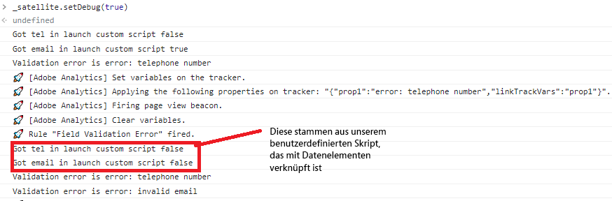

# Testen Ihrer Lösung

Zeigen Sie Ihr Formular in einer Vorschau an und übermitteln Sie es mit verschiedenen Kombinationen von Formularwerten. Es dauert bis zu 30 Minuten, bis Ihre Daten in Adobe Analytics-Berichten angezeigt werden. Auf Eigenschaften (Props) eingestellte Datensätze werden in Berichten früher angezeigt als auf eVars eingestellte Datensätze.

## Report Suite

Die in Adobe Analytics erfassten Formulardaten werden als Ringdiagramm angezeigt.

**Übermittlungen nach US-Bundesstaat**


Feldvalidierungsfehler


## Debugging

Stellen Sie sicher, dass das adaptive Formular denselben Konfigurations-Container verwendet, in dem auch die Adobe Experience Platform Launch-Konfiguration enthalten ist.

Gehen Sie wie folgt vor, um zu bestätigen, dass das Formular Daten an Adobe Analytics sendet:

* Öffnen Sie die Entwickler-Tools in Ihrem Browser.
* Geben Sie im Konsolenbedienfeld den folgenden Text ein.

```javascript
_satellite.setDebug(true)
```

Interagieren Sie mit Ihrem Formular, während Sie das Konsolenfenster geöffnet halten. Dies sollte ungefähr so aussehen:



## Verwenden von Adobe Experience Platform Debugger

Fügen Sie die [AEP Debugger-Erweiterung](https://experienceleague.adobe.com/docs/experience-platform/debugger/home.html?lang=de) zum Browser hinzu (Sie müssen sich anmelden), um weitere Debugging-Informationen zu erhalten.


## Herzlichen Glückwunsch!

Sie haben AEM Forms as a Cloud Service erfolgreich in Adobe Analytics integriert, um Berichte zu Formulardatenfeldern zu erstellen.