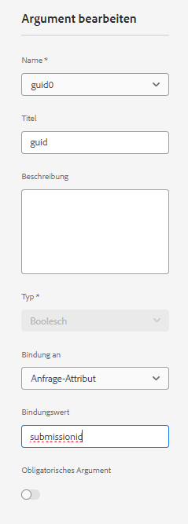
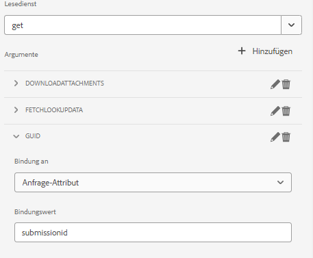
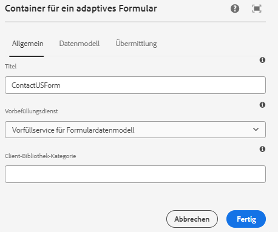

# Vorausfüllen des adaptiven Formulars mit SharePoint-Listendaten

In der vorherigen Version von AEM Form (6.5) musste benutzerdefinierter Code geschrieben werden, um ein durch Formulardatenmodell unterstütztes adaptives Formular mithilfe des Anforderungsattributs im Voraus auszufüllen. In AEM Forms as Cloud Service ist das Schreiben von benutzerdefiniertem Code nicht mehr erforderlich.

In diesem Artikel werden die Schritte erläutert, die zum Vorausfüllen/Vorausfüllen des adaptiven Formulars mit Daten erforderlich sind, die aus der Sharepoint-Liste mit dem Vorbefüllungs-Dienst für Formulardatenmodelle abgerufen wurden.

In diesem Artikel wird davon ausgegangen, dass [das adaptive Formular erfolgreich konfiguriert hat, um Daten an die Sharepoint-Liste zu senden.](https://experienceleague.adobe.com/docs/experience-manager-cloud-service/content/forms/adaptive-forms-authoring/authoring-adaptive-forms-core-components/create-an-adaptive-form-on-forms-cs/configure-submit-actions-core-components.html?lang=en#connect-af-sharepoint-list)

Im Folgenden finden Sie die Daten in der Sharepoint-Liste


Um ein adaptives Formular mit den Daten auszufüllen, die mit einem bestimmten Handbuch verknüpft sind, müssen die folgenden Schritte ausgeführt werden

## Konfigurieren des get-Dienstes

* Erstellen Sie einen get -Dienst für das Objekt der obersten Ebene des Formulardatenmodells mithilfe des guid -Attributs.
  

In diesem Screenshot ist die Spalte &quot;guid&quot;an ein Anforderungsattribut mit dem Namen `submissionid`.

Der vollständig konfigurierte get-Dienst sieht wie folgt aus



## Konfigurieren des adaptiven Formulars für die Verwendung des Vorfülldienstes für Formulardatenmodelle

* Öffnen Sie ein adaptives Formular, das auf dem Datenmodell des Freigabepunkt-Listenformulars basiert. Verknüpfen des Vorbefüllungs-Dienstes für das Formulardatenmodell
  

## Testen des Formulars

Vorschau des Formulars durch Einbeziehung der `submissionid` in der URL wie unten dargestellt

```html
http://localhost:4502/content/dam/formsanddocuments/contactusform/jcr:content?wcmmode=disabled&submissionid=57e12249-751a-4a38-a81f-0a4422b24412
```


