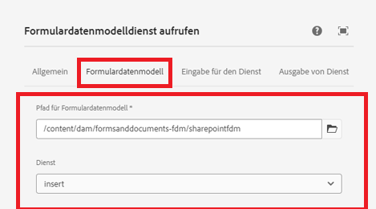
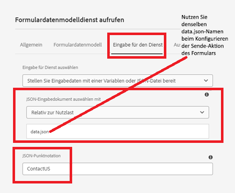
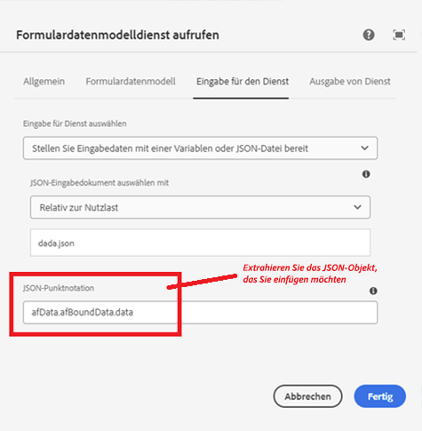
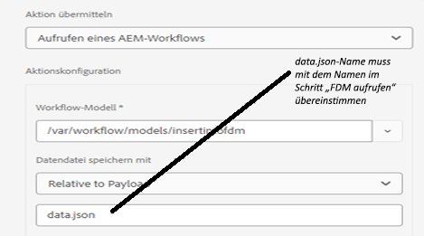

# Einfügen von Daten in die SharePoint-Liste mithilfe des Workflow-Schritts „Formulardatenmodelldienst aufrufen“


In diesem Artikel werden die Schritte erläutert, die zum Einfügen von Daten in die SharePoint-Liste mithilfe des AEM-Workflow-Schritts „Formulardatenmodelldienst aufrufen“ erforderlich sind.

In diesem Artikel wird davon ausgegangen, dass Sie [das adaptive Formular erfolgreich konfiguriert haben, um Daten an die SharePoint-Liste zu senden](https://experienceleague.adobe.com/docs/experience-manager-cloud-service/content/forms/adaptive-forms-authoring/authoring-adaptive-forms-core-components/create-an-adaptive-form-on-forms-cs/configure-submit-actions-core-components.html?lang=de#connect-af-sharepoint-list).


## Erstellen eines Formulardatenmodells basierend auf der SharePoint-Listen-Datenquelle

* Erstellen Sie ein Formulardatenmodell basierend auf der SharePoint-Listen-Datenquelle.
* Fügen Sie das entsprechende Modell und den Dienst „get“ des Formulardatenmodells hinzu.
* Konfigurieren Sie den Dienst „insert“, um das Modellobjekt der obersten Ebene einzufügen.
* Testen Sie den Dienst „insert“.


## Erstellen eines Workflows

* Erstellen Sie einen einfachen Workflow mit dem Schritt „Formulardatenmodelldienst aufrufen“.
* Konfigurieren Sie den Schritt „Formulardatenmodelldienst aufrufen“, um das im vorherigen Schritt erstellte Formulardatenmodell zu verwenden.
* 

## Auf Kernkomponenten basierendes adaptives Formular

Die übermittelten Daten haben das folgende Format. Wir müssen das Objekt „ContactUS“ mithilfe der Punktnotation im Workflow-Schritt „Formulardatenmodelldienst aufrufen“ extrahieren, wie im Screenshot gezeigt.

```json
{
  "ContactUS": {
    "Title": "Mr",
    "Products": "Photoshop",
    "HighNetWorth": "1",
    "SubmitterName": "John Does"
  }
}
```


* 


## Auf Foundation-Komponenten basierendes adaptives Formular

Die übermittelten Daten haben das folgende Format. Extrahieren Sie das JSON-Objekt „ContactUS“ mithilfe der Punktnotation im Workflow-Schritt „Formulardatenmodelldienst aufrufen“.

```json
{
    "afData": {
        "afUnboundData": {
            "data": {}
        },
        "afBoundData": {
            "data": {
                "ContactUS": {
                    "Title": "Lord",
                    "HighNetWorth": "true",
                    "SubmitterName": "John Doe",
                    "Products": "Forms"
                }
            }
        },
        "afSubmissionInfo": {
            "lastFocusItem": "guide[0].guide1[0].guideRootPanel[0].afJsonSchemaRoot[0]",
            "stateOverrides": {},
            "signers": {},
            "afPath": "/content/dam/formsanddocuments/foundationform",
            "afSubmissionTime": "20240517100126"
        }
    }
}
```



## Konfigurieren adaptiver Formulare zum Auslösen eines AEM-Workflows

* Erstellen Sie ein adaptives Formular basierend auf dem im vorherigen Schritt erstellten Formulardatenmodell.
* Ziehen Sie einige Felder aus der Datenquelle in das Formular.
* Konfigurieren Sie die Übermittlungsaktion des Formulars, wie nachfolgend dargestellt:
* 


## Testen des Formulars

Zeigen Sie das im vorherigen Schritt erstellte Formular in einer Vorschau an.  Füllen Sie das Formular aus und senden Sie es ab. Die Daten aus dem Formular sollten in die SharePoint-Liste eingefügt werden.
