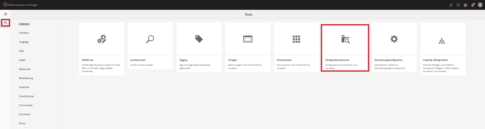
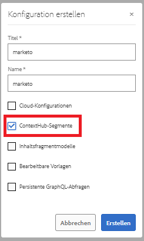
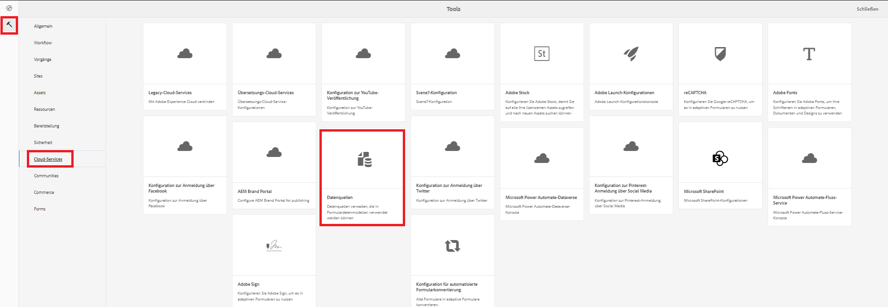
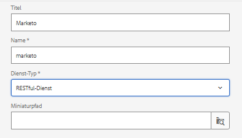
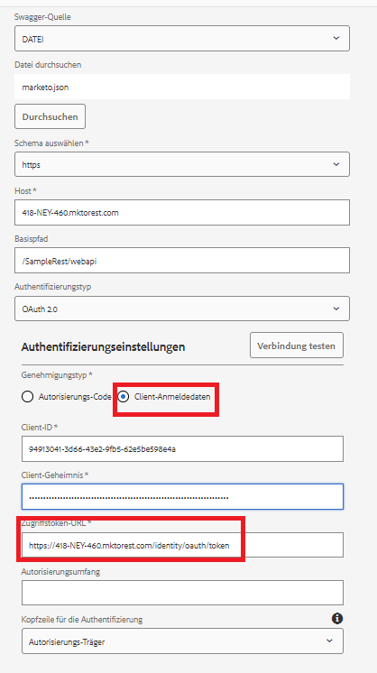

# Erstellen einer Datenquelle

Die REST-APIs von Marketo sind mit OAuth 2.0 mit zwei Abzweigungen authentifiziert. Wir können ganz einfach eine Datenquelle mithilfe der Swagger-Datei erstellen, die im vorherigen Schritt heruntergeladen wurde.

## Erstellen eines Konfigurations-Containers

* Melden Sie sich bei AEM an.
* Klicken Sie auf das Menü „Tools“ und dann auf **Konfigurations-Browser**, wie unten dargestellt

* 

* Klicken Sie auf **Erstellen** und geben Sie einen aussagekräftigen Namen ein, wie unten dargestellt. Stellen Sie sicher, dass Sie die Option „Cloud-Konfigurationen“ wie unten dargestellt auswählen

* 

## Erstellen von Cloud-Services

* Navigieren Sie zum Menü „Tools“ und klicken Sie dann auf „Cloud-Services“ > „Datenquellen“

* 

* Wählen Sie den Konfigurations-Container aus, der im vorherigen Schritt erstellt wurde, und klicken Sie auf **Erstellen**, um eine neue Datenquelle zu erstellen. Geben Sie einen aussagekräftigen Namen ein, wählen Sie aus der Dropdown-Liste „Diensttyp“ den RESTful-Dienst aus und klicken Sie auf **Weiter**
* 

* Laden Sie die Swagger-Datei hoch und geben Sie den Grant-Typ, die Client-ID, das Client-Geheimnis und die Zugriffs-Token-URL für Ihre Marketo-Instanz an, wie im Screenshot unten dargestellt.

* Testen Sie die Verbindung. Wenn sich die Verbindung erfolgreich herstellen lässt, klicken Sie auf die blaue Schaltfläche **Erstellen**, um die Erstellung der Datenquelle abzuschließen.

* 

## Nächste Schritte

[Erstellen eines Formulardatenmodells](./part3.md)
