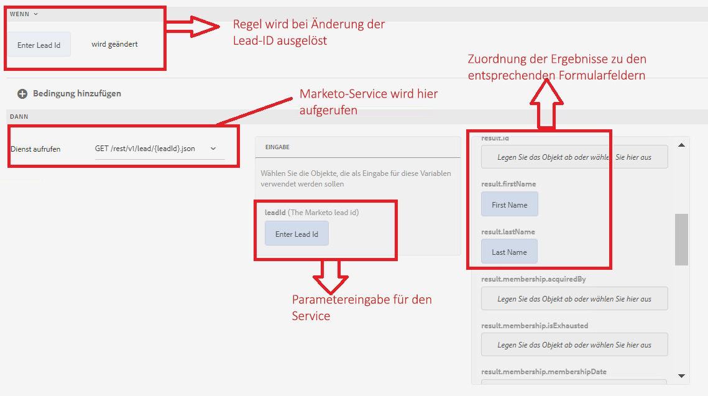

# Testen der Integration

Wir testen die Integration, indem wir einen einfachen Formularabruf erstellen und ein Lead-Objekt von Marketo anzeigen.
>[!NOTE]
>
>Diese Funktion wurde an Formularen anhand von Foundation-Komponenten getestet.

## Erstellen eines adaptiven Formulars

1. Erstellen Sie ein adaptives Formular auf der Grundlage einer „leeren Formularvorlage“ und verknüpfen Sie es mit dem Formulardatenmodell, das Sie im vorherigen Schritt erstellt haben.
1. Öffnen Sie das Formular im Bearbeitungsmodus.
1. Ziehen Sie eine TextField-Komponente und eine Bedienfeldkomponente per Drag-and-Drop in das adaptive Formular. Legen Sie den Titel der TextField-Komponente auf „Lead-ID eingeben“ und ihren Namen auf „LeadId“ fest
1. Ziehen Sie zwei TextField-Komponenten per Drag-and-Drop in die Bedienfeldkomponente
1. Legen Sie den Namen und Titel der zwei TextField-Komponenten auf „Vorname“ und „Nachname“ fest.
1. Konfigurieren Sie die Bedienfeldkomponente so, dass sie eine wiederholbare Komponente ist, indem Sie das Minimum auf 1 und das Maximum auf -1 setzen. Dies ist erforderlich, da der Marketo-Dienst ein Array von Lead-Objekten zurückgibt und Sie eine wiederholbare Komponente benötigen, um die Ergebnisse anzuzeigen. In diesem Fall erhalten wir jedoch nur ein Lead-Objekt zurück, da wir nach Lead-Objekten anhand ihrer ID suchen.
1. Erstellen Sie eine Regel für das LeadId-Feld, wie in der Abbildung unten dargestellt
1. Zeigen Sie eine Vorschau des Formulars an, geben Sie eine gültige Lead-ID in das LeadID-Feld ein, und verlassen Sie das Fenster per Tabulatortaste. Die Felder „Vorname“ und „Nachname“ sollten mit den Ergebnissen des Dienstaufrufs gefüllt werden.

Im folgenden Screenshot werden die Einstellungen des Regeleditors erläutert

## Herzlichen Glückwunsch!

Sie haben AEM Forms mithilfe des AEM Forms-Formulardatenmodells in Marketo integriert.