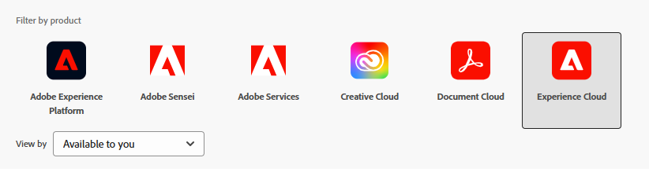

# Konfigurieren von OpenAPI-basierten Kommunikations-APIs von AEM Forms in AEM Forms as a Cloud Service

## Voraussetzungen

* Neueste Instanz von AEM Forms as a Cloud Service.
* Alle erforderlichen [Produktprofile sind der Umgebung hinzugefügt.](https://experienceleague.adobe.com/de/docs/experience-manager-learn/cloud-service/aem-apis/openapis/invoke-api-using-oauth-s2s)

* Aktivieren Sie den Zugriff der AEM-API auf das Produktprofil, wie unten dargestellt.
  
  

## Erstellen eines Adobe Developer Console-Projekts

Melden Sie sich mit Ihrer Adobe ID bei der [Adobe Developer Console](https://developer.adobe.com/console/) an.
Erstellen Sie ein neues Projekt, indem Sie auf das entsprechende Symbol klicken

Geben Sie dem Projekt einen aussagekräftigen Namen und klicken Sie auf das Symbol „API hinzufügen“.

Auswählen von Experience Cloud

Wählen Sie „AEM Forms-Kommunikations-API“ aus und klicken Sie auf „Weiter“

Vergewissern Sie sich, dass Sie die Server-zu-Server-Authentifizierung ausgewählt haben, und klicken Sie auf „Weiter“.

Wählen Sie die Profile aus und klicken Sie auf die Schaltfläche „Konfigurierte API speichern“, um Ihre Einstellungen zu speichern.

Klicken Sie in „OAuth-Server-zu-Server“

Kopieren Sie die Client-ID, das Client-Geheimnis und Bereiche.

## Konfigurieren der AEM-Instanz zur Aktivierung der ADC-Projektkommunikation

Wenn Sie bereits über ein AEM Forms-Projekt verfügen, [befolgen Sie diese Anleitung](https://experienceleague.adobe.com/de/docs/experience-manager-learn/cloud-service/aem-apis/openapis/invoke-api-using-oauth-s2s), um die Client-ID für die OAuth-Server-zu-Server-Anmeldedaten des Adobe Developer Console-Projekts für die Kommunikation mit der AEM-Instanz zu aktivieren.

Wenn Sie nicht über ein AEM Forms-Projekt verfügen, erstellen Sie ein [AEM Forms-Projekt, indem Sie dieser Dokumentation folgen.](https://experienceleague.adobe.com/de/docs/experience-manager-learn/cloud-service/forms/developing-for-cloud-service/getting-started) Aktivieren Sie anschließend die Client-ID für die OAuth-Server-zu-Server-Anmeldedaten des Adobe Developer Console-Projekts für die Kommunikation mit der AEM-Instanz [mithilfe dieser Dokumentation.](https://experienceleague.adobe.com/de/docs/experience-manager-learn/cloud-service/aem-apis/openapis/invoke-api-using-oauth-s2s)

## Nächste Schritte

[Generieren eines Zugriffs-Tokens](./generate-access-token.md)
