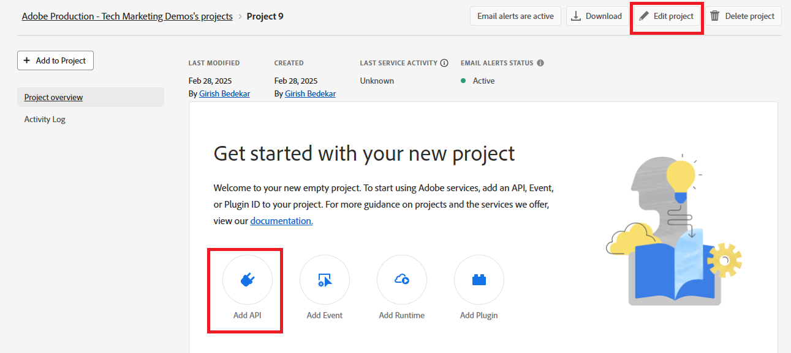

# Konfigurieren von OpenAPI-basierten AEM Forms-Kommunikations-APIs in AEM Forms as a Cloud Service

## Voraussetzungen

* Neueste Instanz von AEM Forms as a Cloud Service.
* Alle erforderlichen [Produktprofile“ werden der Umgebung hinzugefügt.](https://experienceleague.adobe.com/de/docs/experience-manager-learn/cloud-service/aem-apis/invoke-openapi-based-aem-apis)

* Aktivieren Sie den API-Zugriff von AEM auf das Produktprofil, wie unten dargestellt
  
  

## Erstellen eines Adobe Developer Console-Projekts

Melden Sie sich mit Ihrer Adobe ID bei ](https://developer.adobe.com/console/)0}Adobe Developer Console an.
[
Erstellen Sie ein neues Projekt durch Klicken auf das entsprechende Symbol

Geben Sie dem Projekt einen aussagekräftigen Namen und klicken Sie auf das Symbol API hinzufügen .

Experience Cloud auswählen

Wählen Sie AEM Forms Communications API aus und klicken Sie auf Weiter

Vergewissern Sie sich, dass Sie die Server-zu-Server-Authentifizierung ausgewählt haben, und klicken Sie auf Weiter

Wählen Sie die Profile aus und klicken Sie auf die Schaltfläche Konfigurierte API speichern , um Ihre Einstellungen zu speichern

Klicken Sie in OAuth Server-zu-Server

Kopieren Sie Client-ID, Client-Geheimnis und Bereiche

## Konfigurieren der AEM-Instanz zur Aktivierung der ADC-Projektkommunikation

Wenn Sie bereits über ein AEM Forms-Projekt verfügen[ befolgen Sie diese ](https://experienceleague.adobe.com/de/docs/experience-manager-learn/cloud-service/aem-apis/invoke-openapi-based-aem-apis), um die ClientID für die OAuth-Server-zu-Server-Anmeldedaten des Adobe Developer Console-Projekts für die Kommunikation mit der AEM-Instanz zu aktivieren

Wenn Sie kein AEM Forms-Projekt haben, erstellen Sie ein [AEM Forms-Projekt, indem Sie dieser Dokumentation folgen.](https://experienceleague.adobe.com/de/docs/experience-manager-learn/cloud-service/forms/developing-for-cloud-service/getting-started) und aktivieren Sie dann die Client-ID der OAuth-Server-zu-Server-Anmeldedaten des Adobe Developer Console-Projekts für die Kommunikation mit der AEM-Instanz [mithilfe dieser Dokumentation.](https://experienceleague.adobe.com/de/docs/experience-manager-learn/cloud-service/aem-apis/invoke-openapi-based-aem-apis)

## Nächste Schritte

[Generieren eines Zugriffs-Tokens](./generate-access-token.md)