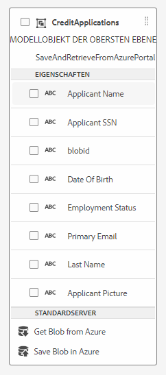

# Erstellen der Integration mit Azure Storage

Der nächste Schritt besteht darin, die Integration zwischen AEM Forms CS und Azure Storage mithilfe des Formulardatenmodells herzustellen.
Das folgende Video führt Sie durch die Schritte, die zum Erstellen der Integration erforderlich sind.

>[!VIDEO](https://video.tv.adobe.com/v/335385?quality=12&learn=on)

Für diese Anleitung wurde ein Formulardatenmodell mit dem Namen SaveAndRetrieveFromAzurePortal mit einer Entität namens CreditApplications erstellt

## Nächste Schritte

[Erstellen eines adaptiven Formulars](./create-af.md)
