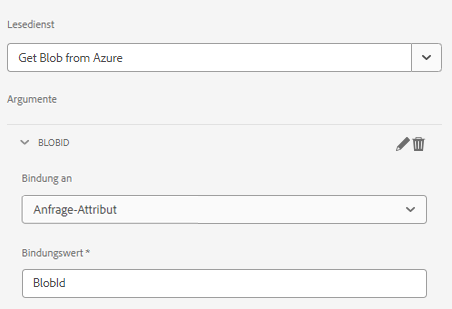

# Seitenkomponente 

Eine Seitenkomponente ist eine normale Komponente, die für das Rendern einer Seite verantwortlich ist. Wir gehen zur Erstellung einer neuen Seitenkomponente und werden diese Seitenkomponente mit einer neuen adaptiven Formularvorlage verknüpfen. Dadurch wird sichergestellt, dass unser Code nur ausgeführt wird, wenn ein adaptives Formular auf dieser bestimmten Vorlage basiert.

## Seitenkomponente erstellen

Melden Sie sich bei Ihrer lokalen Cloud-fähigen AEM Forms-Instanz an. Erstellen Sie die folgende Struktur im Ordner &quot;apps&quot;


1. Klicken Sie mit der rechten Maustaste auf den Seitenordner und erstellen Sie einen Knoten mit dem Namen storeAndFetch des Typs cq:Component .
1. Speichern Sie die Änderungen
1. Fügen Sie die folgenden Eigenschaften zum `storeandfetch` Knoten und speichern

| **Eigenschaftsname** | **Eigenschaftstyp** | **Eigenschaftswert** |
|-------------------------|-------------------|----------------------------------------|
| componentGroup | Zeichenfolge | hidden |
| jcr:description | Zeichenfolge | Seitentyp der adaptiven Formularvorlage |
| jcr:title | Zeichenfolge | Seiten der adaptiven Formularvorlage |
| sling:resourceSuperType | Zeichenfolge | `fd/af/components/page2/aftemplatedpage` |

Kopieren Sie die `/libs/fd/af/components/page2/aftemplatedpage/aftemplatedpage.jsp` und fügen Sie es unter dem `storeandfetch` Knoten. Benennen Sie die `aftemplatedpage.jsp` nach `storeandfetch.jsp`.

Öffnen `storeandfetch.jsp` und fügen Sie die folgende Zeile hinzu:

```jsp
<cq:include script="azureportal.jsp"/>
```

unter

```jsp
<cq:include script="fallbackLibrary.jsp"/>
```

Der endgültige Code sollte wie folgt aussehen:

```jsp
<cq:include script="fallbackLibrary.jsp"/>
<cq:include script="azureportal.jsp"/>
```

Erstellen Sie eine Datei mit dem Namen azureportal.jsp unter dem Knoten storeAndFetch , kopieren Sie den folgenden Code in die Datei azureportal.jsp und speichern Sie die Änderungen.

```jsp
<%@page session="false" %>
<%@include file="/libs/fd/af/components/guidesglobal.jsp" %>
<%@ page import="org.apache.commons.logging.Log" %>
<%@ page import="org.apache.commons.logging.LogFactory" %>
<%
    if(request.getParameter("guid")!=null) {
            logger.debug( "Got Guid in the request" );
            String BlobId = request.getParameter("guid");
            java.util.Map paraMap = new java.util.HashMap();
            paraMap.put("BlobId",BlobId);
            slingRequest.setAttribute("paramMap",paraMap);
    } else {
            logger.debug( "There is no Guid in the request " );
    }            
%>
```

In diesem Code erhalten wir den Wert des Anforderungsparameters **guid** und speichern Sie sie in einer Variablen namens BlobId. Diese BlobId wird dann mithilfe des paramMap -Attributs an die Sling-Anfrage übergeben. Damit dieser Code funktioniert, wird davon ausgegangen, dass Sie über ein Formular verfügen, das auf einem Azure Storage-unterstützten Formulardatenmodell basiert, und der Lesedienst des Formulardatenmodells an ein Anforderungsattribut namens BlobId gebunden ist, wie im Screenshot unten dargestellt.



### Nächste Schritte

[Verknüpfen der Seitenkomponente mit der Vorlage](./associate-page-component.md)
