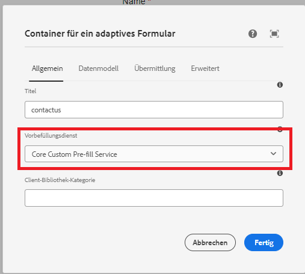

# Testen der Lösung

Nachdem der Code bereitgestellt wurde, erstellen Sie ein adaptives Formular basierend auf Kernkomponenten. Verknüpfen Sie das adaptive Formular mit dem Vorbefüllungs-Dienst, wie im Screenshot unten dargestellt.


Jedes Mal, wenn das Formular wiedergegeben wird, wird der zugehörige Vorbefüllungsdienst ausgeführt und das Formular wird mit den vom Vorbefüllungs-Dienst zurückgegebenen Daten ausgefüllt.

Beispiel: Um das Formular mit den Daten auszufüllen, die mit dem Guide verknüpft sind **d815a2b3-5f4c-4422-8197-d0b73479bf0e**verwendet wird, wird die folgende URL verwendet.
Der Code im Vorbefüllungs-Dienst extrahiert den Wert des guid-Parameters und ruft die mit der GUID verknüpften Daten aus der Datenquelle ab.

```html
http://localhost:4502/content/dam/formsanddocuments/contactus/jcr:content?wcmmode=disabled&guid=d815a2b3-5f4c-4422-8197-d0b73479bf0e
```
