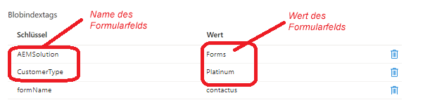

# Blob-Index-Tags hinzufügen

Wenn Datensätze größer werden, kann es schwierig sein, ein bestimmtes Objekt in einem Meer von Daten zu finden. Blob-Index-Tags bieten Datenmanagement- und Erkennungsfunktionen durch Verwendung von Schlüssel-Wert-Index-Tag-Attributen. Sie können Objekte in einem einzelnen Container oder über alle Container in Ihrem Speicherkonto kategorisieren und suchen. Beispiel: Blob-Index-Tag _**CustomerType=Platinum**_, wobei Platinum der Wert des Felds CustomerType ist.


Der folgende Code erstellt die Blob-Index-Daten-Tag-Zeichenfolge mit den entsprechenden Werten aus den gesendeten Daten

```java
@Override
    public String getMetaDataTags(String submittedFormName,String formPath,Session session,String formData) {

        JsonObject jsonObject = JsonParser.parseString(formData).getAsJsonObject();
        List<String>metaDataTags = new ArrayList<String>();
        metaDataTags.add("formName="+submittedFormName);
        Map< String, String > map = new HashMap< String, String >();
        map.put("path", formPath);
        map.put("1_property", "Searchable");
        map.put("1_property.value","true");
        Query query = queryBuilder.createQuery(PredicateGroup.create(map),session);
        query.setStart(0);
        query.setHitsPerPage(20);
        SearchResult result = query.getResult();
        logger.debug("Get result hits " + result.getHits().size());
        for (Hit hit: result.getHits()) {
            try {
                    logger.debug(hit.getPath());
                    String jsonElementName = (String) hit.getProperties().get("name");
                    String fieldName = hit.getProperties().get("name").toString();
                    if(jsonObject.get(jsonElementName).isJsonArray())
                    {
                        
                        JsonArray arrayOfValues = jsonObject.get(jsonElementName).getAsJsonArray();
                        StringBuilder valuesString = new StringBuilder();
                        for(int j=0;j<arrayOfValues.size();j++)
                        {
                            valuesString.append(arrayOfValues.get(j).getAsString());
                            if(j < arrayOfValues.size() -1)
                            {
                                valuesString.append(" and ");
                            }
                        }

                        
                        metaDataTags.add(fieldName + "=" + valuesString.toString());

                    }
                    else
                    {
                        logger.debug("The searchable field name is " + fieldName + "the json element name is " + jsonElementName);
                        metaDataTags.add(fieldName + "=" + jsonObject.get(jsonElementName).getAsString());
                    }

            } catch (RepositoryException e) {
                throw new RuntimeException(e);
            }
        }
        return String.join("&",metaDataTags);
    }
```

## Nächste Schritte

[Benutzerdefinierten Sende-Handler erstellen](./create-custom-submit.md)
