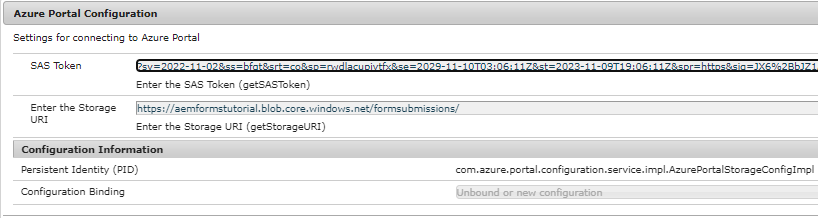

# Erstellen einer OSGi-Konfiguration

Eine benutzerdefinierte OSGi-Konfiguration mit dem Namen „Azure Portal Configuration“ wurde erstellt, um den Azure Storage-URI und den SAS-Token-URI anzugeben. Mithilfe dieser beiden Werte wird die REST-API für die Kommunikation mit Azure Storage erstellt



Der vollständige Code für den Konfigurationsdienst ist nachfolgend zu finden

AzurePortalConfiguration

```java
package com.azure.portal.configuration;

import org.osgi.service.metatype.annotations.AttributeDefinition;
import org.osgi.service.metatype.annotations.ObjectClassDefinition;

@ObjectClassDefinition(name = "Azure Portal Configuration", description = "Settings for connecting to Azure Portal")

public @interface AzurePortalConfiguration {

    @AttributeDefinition(name = "SAS Token", description = "Enter the SAS Token")
    String getSASToken() default "";

    @AttributeDefinition(name = "Enter the Storage URI", description = "Enter the Storage URI")
    String getStorageURI() default"";

}
```

AzurePortalConfigurationService

```java
package com.azure.portal.configuration.service;

public interface AzurePortalConfigurationService {
    String getStorageURI();
    String getSASToken();

}
```

AzurePortalStorageConfigImpl

```java
package com.azure.portal.configuration.service.impl;

import org.osgi.framework.Constants;
import org.osgi.service.component.annotations.Activate;
import org.osgi.service.component.annotations.Component;
import org.osgi.service.metatype.annotations.Designate;
import com.azure.portal.configuration.service.AzurePortalConfigurationService;
import com.azure.portal.configuration.AzurePortalConfiguration;
@Component(
        service = AzurePortalConfigurationService.class,
        immediate = true,
        property = {
                Constants.SERVICE_ID+ "=Azure Portal Config Service",
                Constants.SERVICE_DESCRIPTION +"=This service reads values from Azure portal config"
        }
)
@Designate(ocd=AzurePortalConfiguration.class)
public class AzurePortalStorageConfigImpl implements AzurePortalConfigurationService {
    private AzurePortalConfiguration azurePortalConfiguration;
    @Activate
    protected void activate(AzurePortalConfiguration configuration) {
        System.out.println("##### in activate #####");
        this.azurePortalConfiguration = configuration;
    }

    @Override
    public String getStorageURI() {
        // TODO Auto-generated method stub
        return azurePortalConfiguration.getStorageURI();
    }

    @Override
    public String getSASToken() {
        // TODO Auto-generated method stub
        return azurePortalConfiguration.getSASToken();
    }

}
```

## Nächste Schritte

[Erstellen von Blob-Index-Tags](./create-blob-index-tags.md)
