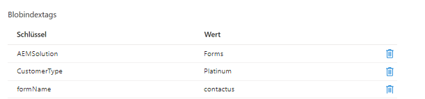

# Einführung

In diesem Tutorial erfahren Sie, wie Sie ein einfaches Anwendungsbeispiel zum Speichern von Formularübermittlungen in Azure-Speicher mit Blob-Index-Tags implementieren. Blob-Index-Tags bieten Datenmanagement- und Erkennungsfunktionen durch Verwendung von Schlüssel-Wert-Index-Tag-Attributen. Sie können Objekte in einem einzelnen Container oder über alle Container in Ihrem Speicherkonto kategorisieren und suchen.

## Voraussetzungen

* Erlebnis mit AEM Forms CS.
* Erlebnis bei der Bereitstellung von Code mithilfe von Cloud Manager.
* Zugriff auf Cloud-fähige Instanz von AEM Forms CS.

Zum Implementieren des oben genannten Anwendungsfalls in AEM Forms CS benötigen Sie Folgendes

* [AEM Forms CS-Cloud-fähige Instanz](https://experienceleague.adobe.com/docs/experience-manager-learn/cloud-service/forms/developing-for-cloud-service/intellij-and-aem-sync.html?lang=de#set-up-aem-author-instance)
* [Azure Portal-Konto](https://portal.azure.com/)

### Nächste Schritte

[extending-choice-group-components](./extend-choice-group-components.md)
