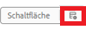
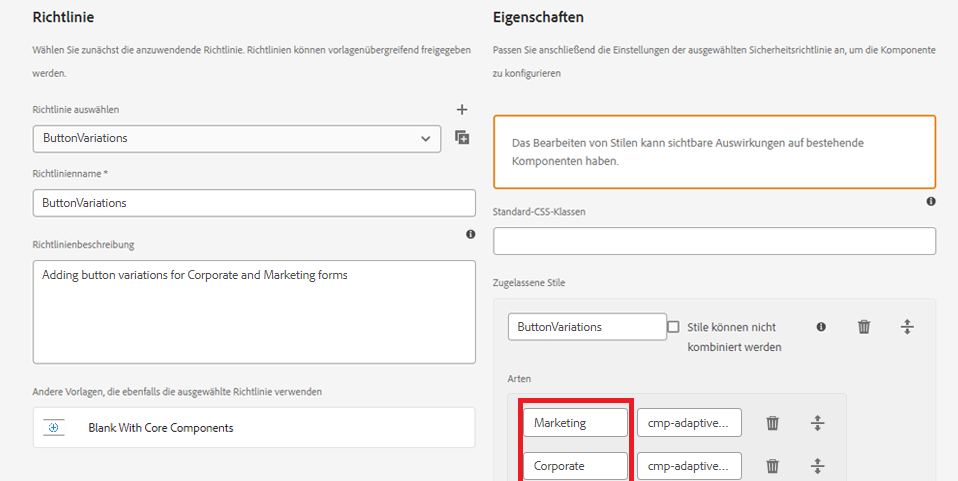

# Definieren des Stils in der Richtlinie für die Komponente

* Melden Sie sich bei Ihrer lokalen Cloud-fähigen AEM-Instanz an und navigieren Sie zu Tools | Allgemein | Vorlagen | Ihren Projektnamen.

* Wählen Sie die Vorlage **Leer mit Kernkomponenten** aus und öffnen Sie sie im Bearbeitungsmodus.
* Klicken Sie auf das Richtliniensymbol der Schaltflächenkomponente, um den Richtlinien-Editor zu öffnen.

* 

Definieren Sie die Richtlinie wie unten dargestellt.

Wir haben zwei Stile/Varianten definiert, die als Marketing und Unternehmen bezeichnet werden. Diese Varianten sind mit entsprechenden CSS-Klassen verknüpft.**Stellen Sie sicher, dass vor und nach den CSS-Klassennamen** kein Leerzeichen vorhanden ist.
Speichern Sie Ihre Änderungen.

| Stil | CSS-Klasse |
|-----------|------------------------------------|
| Marketing | cmp-adaptiveform-button—marketing |
| Unternehmen | cmp-adaptiveform-button—corporate |

Diese CSS-Klassen werden in der CSS-Datei der Komponente (_button.scss) definiert.

## Nächste Schritte

[Definieren von CSS-Klassen](./create-variations.md)
