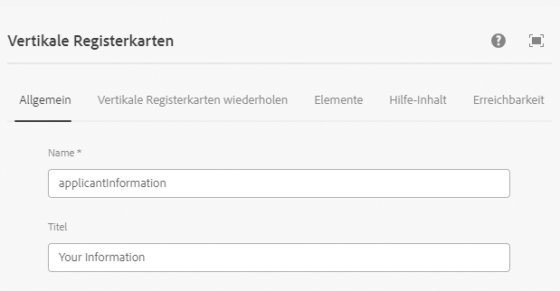
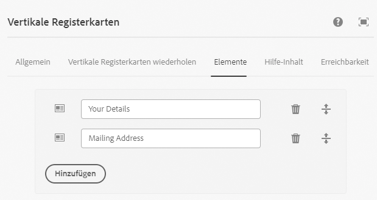
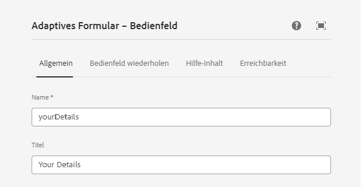
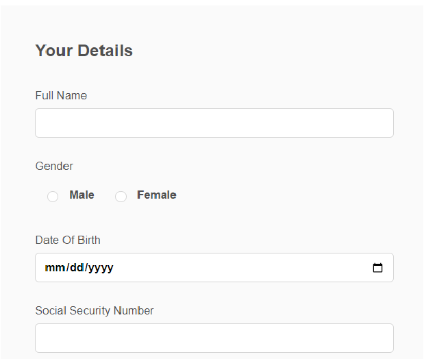
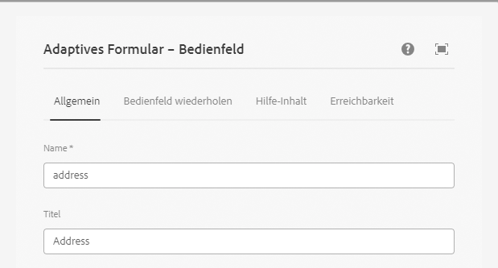
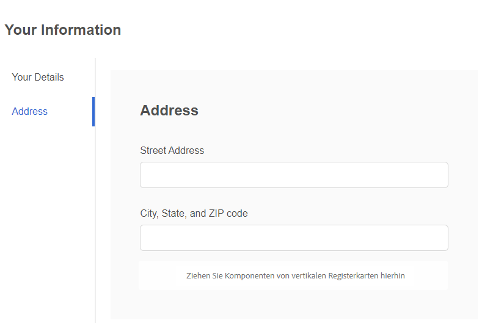

# Erstellen eines adaptiven Formulars

Erstellen Sie ein auf einer Kernkomponente basierendes adaptives Formular und fügen Sie eine Komponente der vertikalen Registerkarte in Ihr Formular ein.

## Vertikale Komponente konfigurieren

Klicken Sie auf die Komponente für vertikale Registerkarten , um das Konfigurationseigenschaftsblatt zu öffnen. Konfigurieren Sie die folgenden Registerkarten

1. Einfach - Geben Sie der vertikalen Registerkartenkomponente einen aussagekräftigen Namen und Titel, wie unten dargestellt.
   
1. Elemente - Auf der Registerkarte &quot;Elemente&quot;können Sie Elemente zur Komponente der vertikalen Registerkarte hinzufügen. Im Allgemeinen fügen Sie ein Bedienfeld als Element hinzu und fügen dann Ihre Formularelemente zum Bedienfeld hinzu. Die Registerkarte &quot;Vertikal&quot;verfügt standardmäßig über zwei Elemente. Sie können die Elemente gemäß Ihren Anforderungen benennen, wie unten dargestellt.
   

## Einzelne Bedienfelder konfigurieren

1. Ihre Details - Wählen Sie Element 1 unter dem Knoten **Ihre Informationen** aus und öffnen Sie das Konfigurationseigenschaftsblatt. Geben Sie einen aussagekräftigen Namen und Titel ein, wie unten dargestellt
   

Fügen Sie die folgenden Felder zum Bereich &quot;Ihre Details&quot;hinzu, wie in der Abbildung dargestellt

1. Adresse - Wählen Sie Element 2 unter dem Knoten **Ihre Informationen** aus und öffnen Sie das Konfigurationseigenschaftsblatt. Geben Sie einen aussagekräftigen Namen und Titel ein, wie unten dargestellt
   

Fügen Sie die folgenden beiden Textfelder wie unten gezeigt zum Bereich &quot;Adresse&quot;hinzu

