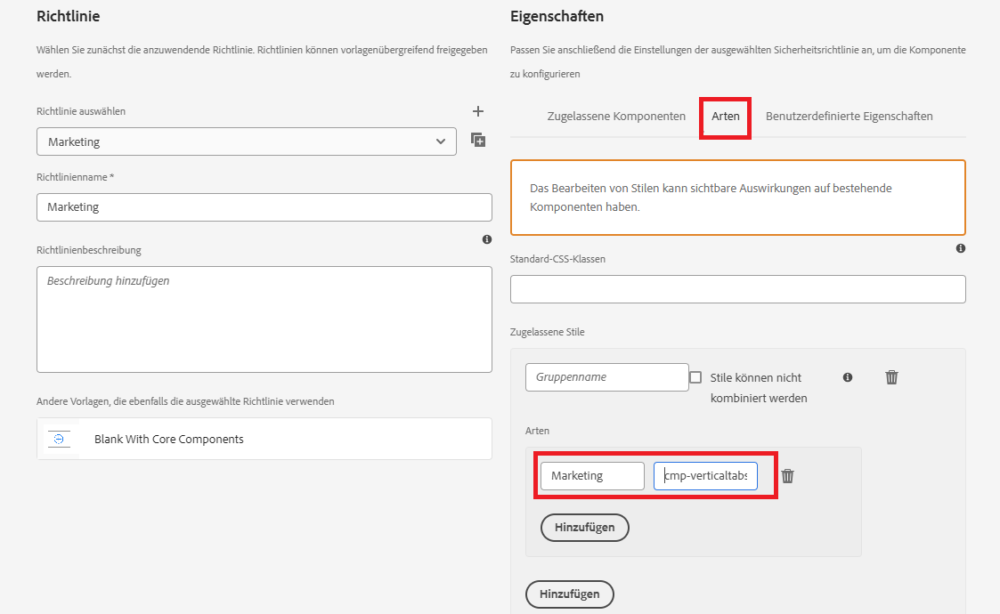
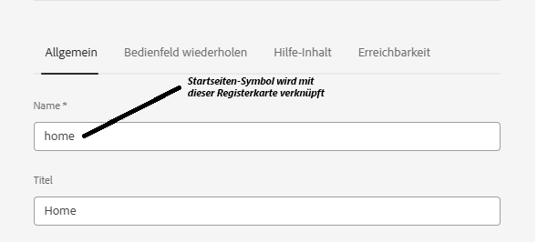

# Hinzufügen benutzerdefinierter Symbole

Das Hinzufügen benutzerdefinierter Symbole zu Registerkarten kann das Benutzererlebnis und die visuelle Darstellung auf verschiedene Arten verbessern:

* Verbesserte Benutzerfreundlichkeit: Symbole vermitteln den Zweck jeder Registerkarte schnell, sodass Benutzer leichter finden können, wonach sie suchen. Visuelle Hinweise wie Symbole helfen Benutzern, intuitiver zu navigieren.

* Visuelle Hierarchie und Fokus: Symbole ermöglichen eine deutlichere Trennung zwischen Registerkarten, wodurch die visuelle Hierarchie verbessert wird. Dies kann dazu beitragen, dass wichtige Tabs hervorgehoben werden und die Aufmerksamkeit der Benutzer effektiv lenken.
Wenn Sie diesem Artikel folgen, sollten Sie die Symbole wie unten gezeigt platzieren können


## Voraussetzungen

Um diesem Artikel zu folgen, müssen Sie mit Git, dem Erstellen und Bereitstellen eines AEM Projekts mit Cloud Manager, dem Einrichten einer Frontend-Pipeline in AEM Cloud Manager und einem kleinen Teil von CSS vertraut sein. Wenn Sie mit den oben genannten Themen nicht vertraut sind, befolgen Sie den Artikel [Verwenden von Designs zum Formatieren von Kernkomponenten](https://experienceleague.adobe.com/en/docs/experience-manager-cloud-service/content/forms/adaptive-forms-authoring/authoring-adaptive-forms-core-components/create-an-adaptive-form-on-forms-cs/using-themes-in-core-components#rename-env-file-theme-folder) .

## Hinzufügen von Symbolen zum Design

Öffnen Sie das Designprojekt im Visual Studio-Code oder einem anderen Editor Ihrer Wahl.
Fügen Sie die von Ihnen ausgewählten Symbole zum Ordner Bilder hinzu.
Die rot markierten Symbole sind die neuen hinzugefügten Symbole.


## Erstellen einer Symbolzuordnung zum Speichern der Symbole

Erstellen Sie die icon-map in der Datei _variable.scss . Die SCSS-Zuordnung $icon-map ist eine Sammlung von Schlüssel-Wert-Paaren, bei denen jeder Schlüssel einen Symbolnamen darstellt (z. B. Startseite, Familie usw.) und jeder Wert der Pfad zur Bilddatei ist, die mit diesem Symbol verknüpft ist.


```css
$icon-map: (
    home: "./resources/images/home.png",
    family: "./resources/images/icons8-family-80.png",
    pdf: "./resources/images/pdf.png",
    income: "./resources/images/income.png",
    assets: "./resources/images/assets.png",
    cars: "./resources/images/cars.png"
);
```

## Mixin hinzufügen

Fügen Sie den folgenden Code zu _mixin.scss hinzu

```css
@mixin add-icon-to-vertical-tab($image-url) {
  display: inline-flex;
  align-self: center;
  &::before {
    content: "";
    display:inline-block;
    background: url($image-url) left center / cover no-repeat;
    margin-right: 8px; /* Space between icon and text */
    height:40px;
    width:40px;
    vertical-align:middle;
    
  }
  
}
```

Das Mixin &quot;Add-Icon zur vertikalen Registerkarte&quot;wurde entwickelt, um neben dem Text auf einer vertikalen Registerkarte ein benutzerdefiniertes Symbol hinzuzufügen. Damit können Sie ein Bild einfach als Symbol auf Registerkarten einfügen, es neben dem Text positionieren und gestalten, um Konsistenz und Ausrichtung zu gewährleisten.

Aufschlüsselung des Mixins: Die einzelnen Teile des Mixins funktionieren wie folgt:

Parameter:

* $image-url: Die URL des Symbols oder Bildes, das/das neben dem Registerkartentext angezeigt werden soll. Wenn Sie diesen Parameter übergeben, ist das Mixin vielseitig, da es bei Bedarf verschiedene Symbole zu verschiedenen Registerkarten hinzufügen kann.

* Angewendete Stile:

   * display: inline-flex: Dadurch wird das Element zu einem Flex-Container, der verschachtelte Inhalte (wie das Symbol und den Text) horizontal ausrichtet.
   * align-self: center: Stellt sicher, dass das Element innerhalb seines Containers vertikal zentriert ist.
   * Pseudo-Element (::before):
   * content: &quot;&quot;: Initialisiert das Pseudo-Element ::before , mit dem das Symbol als Hintergrundbild angezeigt wird.
   * display: inline-block: Legt für das Pseudo-Element einen Inline-Block fest, sodass es sich wie ein Symbol verhalten kann, das inline mit dem Text platziert wird.
   * background: url($image-url) left center / cover no-repeat;: Fügt das Hintergrundbild mithilfe der URL hinzu, die über $image-url bereitgestellt wird. Das Symbol wird links ausgerichtet und vertikal zentriert.

## Aktualisieren Sie _verticaltabs.scss

Für die Zwecke des Artikels habe ich eine neue CSS-Klasse (cmp-verticaltabs—marketing) erstellt, um die Registerkartensymbole anzuzeigen. In dieser neuen Klasse erweitern wir das Tab-Element durch Hinzufügen der Symbole. Die vollständige Auflistung der CSS-Klasse lautet wie folgt

```css
.cmp-verticaltabs--marketing
{
  .cmp-verticaltabs
    {
      &__tab 
        {
          cursor:pointer;
            @each $name, $url in $icon-map {
            &[data-icon-name="#{$name}"]
              {
                  @include add-icon-to-vertical-tab($url);
              }
            }
        }
    }
}
```

## Bearbeiten der Komponente &quot;vertikaltabs&quot;

Kopieren Sie die Datei &quot;verticaltabs.html&quot;aus ```/apps/core/fd/components/form/verticaltabs/v1/verticaltabs/verticaltabs.html``` und fügen Sie sie unter der Komponente &quot;vertikaltabs&quot;Ihres Projekts ein. Fügen Sie die folgende Zeile ```data-icon-name="${tab.name}"``` zur kopierten Datei unter der Rolle li hinzu, wie in der Abbildung unten dargestellt

Wir legen ein benutzerdefiniertes Datenattribut namens data-icon-name mit dem Wert des Registerkartennamens fest. Wenn der Registerkartenname mit einem Bildnamen in der Symbolzuordnung übereinstimmt, wird das entsprechende Bild mit der Registerkarte verknüpft.


## Testen des Codes

Stellen Sie die aktualisierte Komponente &quot;vertikaltabs&quot;in Ihrer Cloud-Instanz bereit.
Stellen Sie das aktualisierte Design mithilfe der Frontend-Pipeline bereit.
Erstellen Sie eine Stilvariante für die Komponenten der vertikalen Registerkarte, wie unten dargestellt

Wir haben eine Stilvariante namens Marketing erstellt, die mit der CSS-Klasse _**cmp-verticaltabs—marketing**_ verknüpft ist.
Erstellen Sie ein adaptives Formular mit einer vertikalen Registerkartenkomponente. Verknüpfen Sie die Komponente der vertikalen Registerkarte mit der Variante des Marketingstils.
Fügen Sie den Vertikalen einige Registerkarten hinzu und benennen Sie sie so, dass sie mit den in der Symbolkarte definierten Bildern übereinstimmen, z. B. Startseite, Familie.


Vorschau des Formulars anzeigen, sollten die entsprechenden Symbole für die Registerkarte angezeigt werden.
