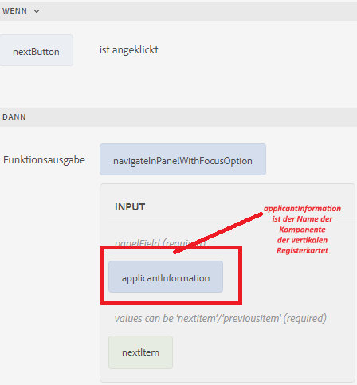
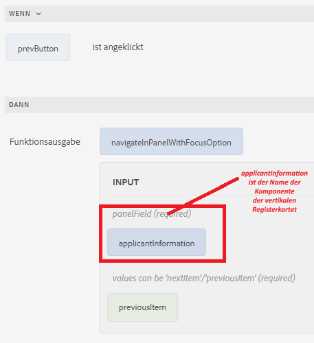

# Navigieren zischen den Registerkarten

Sie können zwischen den Registerkarten navigieren, indem Sie auf die einzelnen Registerkarten klicken oder die Schaltflächen „Zurück“ und „Weiter“ im Formular verwenden.
Damit mithilfe von Schaltflächen navigiert werden kann, fügen Sie dem Formular zwei Schaltflächen hinzu und nennen Sie sie „Zurück“ und „Weiter“. Verknüpfen Sie die folgende benutzerdefinierte Funktion mit dem Klickereignis der Schaltfläche, um zwischen den Registerkarten zu navigieren.

Im Folgenden finden Sie die benutzerdefinierte Funktion zum Navigieren zwischen den Registerkarten.


```javascript
/**
 * Navigate in panel with focusOption
 * @name navigateInPanelWithFocusOption
 * @param {object} panelField
 * @param {string} focusOption - values can be 'nextItem'/'previousItem'
 * @param {scope} globals
 */
function navigateInPanelWithFocusOption(panelField, focusOption, globals)
{
    globals.functions.setFocus(panelField, focusOption);
}
```

Im Folgenden finden Sie den Regeleditor für die Schaltflächen „Weiter“ und „Zurück“.

**Schaltfläche „Weiter“**



**Schaltfläche „Zurück“**


