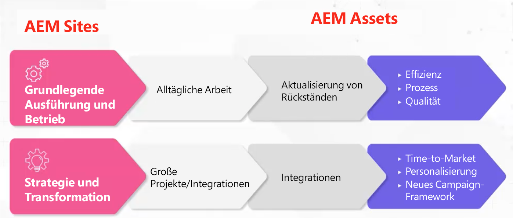

# Adobe Experience Manager (AEM) - Governance- und Personalmodelle und Archetypen

Als Customer Experience Leader versteht Adobe, wie schwierig es für Sie sein kann, sicherzustellen, dass Sie über die richtigen Personen und Governance-Rahmenbedingungen verfügen, um betriebliche Effizienz zu steigern. Mit branchenbewährten Governance- und Personalmodellen von Adobe verfügen Sie über die nötigen Werkzeuge und Kenntnisse, um eine solide Basis für Content und Asset Management zu schaffen. In diesem Artikel besprechen wir, wie Sie Ihre Adobe Experience Manager-Plattform (AEM) umsetzen und den größtmöglichen Nutzen aus Ihren Bemühungen ziehen können.

## Schaffung eines überlegenen operativen Rahmens

Folgende Elemente sollten berücksichtigt AEM, um ausgeführt und ausgeführt werden zu können:

* Ausführen strategischer Meilensteine - Es wird viele strategische Meilensteine geben (Personalisierung, Integration mehrerer Kanäle usw.) die nur dann ausgeführt werden können, wenn Sie über das richtige Personalmodell verfügen.
* Erstellen Sie eine Grundlage für die digitale Transformation - AEM wird oft als erster Schritt im Modernisierungsprozess eines Unternehmens verwendet. Durch die Einrichtung eines Fundaments können Sie AEM auf die volle Kapazität nutzen.
* Benutzerinteraktion - Ein Team muss vorhanden sein, um taktische Arbeit auszuführen (Workflows aktualisieren, Berechtigungen, CSS usw.) Je mehr Lücken zwischen dem, was Benutzer wollen und dem, was ihnen gegeben wird, bestehen, desto frustrierter können sie werden. Es ist wichtig, dass Benutzer in das System investiert, in die Lösung investiert und dass Sie das richtige Betriebssystem haben.

Was ist dann das richtige Modell? Was ist die richtige Matrix von Rollen zu erstellen?

Es gibt keine einzige spezifische Antwort, da eine AEM Konfiguration sehr unterschiedlich sein kann, was dazu führt, dass unterschiedliche Rollen benötigt werden. Jede Vertikale, jede Branche und jede Teamstruktur benötigt eine andere Implementierung. Sie können jedoch eine Grundlinie erstellen, indem Sie Archetypen erstellen.

## Archetypen

Archetypen sind spezifische, allgemeine Rollenideen, die bestimmten Attributen zugeordnet sind. Dies wiederum kann verwendet werden, um eine grundlegende Prämisse zu erstellen, die hilft, zu informieren, welches Modell Sie wirklich benötigen. Beachten Sie, dass Archetypen nicht auf eine Person pro Archetyp beschränkt sind. Beispielsweise könnte ein DAM-Bibliothekar über einige technische Erfahrungen verfügen.

### Streams der Operationalisierung

Es gibt zwei Phasen der Operationalisierung für [!DNL AEM Sites] und [!DNL AEM Assets]:

1. Grundlegende Ausführung und Betrieb der täglichen Arbeit (Metadatenaktualisierung)

1. Strategie- und Transformationsarbeiten, z. B. große, organisationsübergreifende Projekte

### Allgemeine AEM Asset-Rollen

**Allgemeine Lücke:** Diese Grundlinie unterstützt zentralisierte und dezentralisierte Modelle. Wenn Sie über ein dezentralisiertes Modell verfügen, können AEM abstrakt verwendet werden. Beachten Sie, dass die Rolle &quot;Produkteigentümer&quot;kreativ verwendet werden muss. Sie müssen jedoch auch über einen Produkteigentümer verfügen, dem die verschiedenen Stile für einen Asset-Typ gehören, und über einen anderen, der die gesamte Organisation überwacht.

1. Grundlegende Ausführen- und Operationsrollen

   * Technische Ressource - Personen, die über AEM Erfahrung verfügen, verstehen die Berechtigungen und können das Metadatenschema aktualisieren
   * Release Manager
   * Produkteigentümer: Diese Rolle ist mit der Lösung abgestimmt. Einige Produkteigentümer können an Analysen beteiligt sein.
   * DAM-Bibliothekar - Dies ist eine Person, die dabei helfen kann, die integrativen Framework-Prozesse zu gestalten. Diese kreative Rolle kann sich mit anderen Rollen überschneiden. (Hinweis: Dies ist eine Rolle, die in den letzten fünf Jahren an Popularität gewonnen hat.)
   * Kreativ

1. Strategie und Transformation

   * Entwicklungsteam - Dieses Team ist für die Zusammenarbeit mit einem wichtigen strategischen Meilenstein erforderlich.
   * Business Architect - entwickelt Anforderungen zur Unterstützung technischer Meilensteine und strategischer Initiativen; kann mit einem zusätzlichen Produkteigentümer ausgeglichen werden
   * Technischer Architekt: jemand, der über Verständnis auf Unternehmensebene verfügt und über eine ständige Präsenz im gesamten Unternehmen verfügt. Diese Rolle dient als DAM-Mittelpunkt der Wahrheit.

**Beispielszenarien**

1. **Führen Sie Folgendes aus:**

Im Folgenden finden Sie Rollenbeispiele für ein leichtes (Sportbekleidungsunternehmen) und schweres (kosmetisches Unternehmen) Szenario:

1. Unternehmensrollen von Light - Sports Bekleidung:

   * 2 Teilzeitentwickler - Teilzeit, Offshore
   * 1 Produkteigentümer - Vollzeit, Onshore
   * 1 DAM-Bibliothek - Vollzeit, Onshore
   * 1 Technischer Architekt - Teilzeit, Onshore
   * 1 Release Manager - Teilzeit, Onshore

1. Unternehmen für Kosmetika (mehrere Marken)

   * 3 Vollzeitentwickler - Vollzeit, Offshore
   * 4 Produkteigentümer - 3 markenspezifisch, 1 primär
   * 1 DAM-Bibliothek - Vollzeit, Onshore
   * 4 Hauptadministratoren KMU pro Marke
   * 1 Technischer Architekt

### Allgemeine [!DNL AEM Sites] Rollen

1. Grundlegende Ausführung und Funktionsweise

   **Allgemeine Lücke:** CSS-Entwickler erstellen neue Skins für Komponenten. Adobe Sr Business Consultant, Joseph Van Buskirk, empfiehlt &quot;Entkorkte Komponenten und Stilsysteme zu erhalten. Dies ist die Rolle, die zu Kosteneinsparungen führt. 80 % der Erlebnisse, die erstellt werden, sollten mit zuvor erstellten oder Kernkomponenten erstellt werden.&quot; Das Ziel besteht darin, zentrale oder benutzerdefinierte Komponenten mit neuen Stilen wiederzuverwenden, indem ein CSS-Entwickler (oder Front-End-Entwicklungsteam) verwendet wird.

   Rollenbeispiele:

   * CSS-Entwicklung - Erlebnisartefakte werden durch die Neuverwendung von Komponenten mit neuen Stilen erstellt.
   * Back-End-Entwicklung - erstellt neue Komponenten oder kann eine Kernkomponente erweitern. Wenn diese Rolle korrekt ausgeführt wird, sollte sie nicht mehr als eine Person haben, es sei denn, es sind große Animationsaufgaben erforderlich.
   * Versionsverwaltung - überwacht die Codebereitstellung und dient als aktueller Customer Success Engineer.
   * Produkteigentümer: Zusammenarbeit mit BU bei der Vermittlung technischer und strategischer Visionen; erstellt Wartungsaufgaben und Verbesserungen und dient als Business Owner der Lösung.
   * Admin Authors - aktualisiert die CSS-Skin und bietet Autoren, die Inhalte aktualisieren und anwenden, Anleitungen. Diese Rolle arbeitet an Workflow-Konfigurationen und erstellt Anleitungen, die von den Inhaltsautoren angewendet werden können. HINWEIS: In Version 6.5 empfiehlt Adobe die Verwendung bearbeitbarer Vorlagen.
   * Autoren von Inhalten - wendet Inhalte an, führt mehrstufige Eigentümerschaft ein und liefert Kommunikationsprobleme und -belange, sobald sie mit CSM auftreten.

1. Strategie und Transformation

   Rollenbeispiele:

   * Entwicklungsteam - liefert AEM Wissen und führt neue transformative Meilensteine mit dem technischen Architekten aus.
   * Technischer Architekt - bietet Integrationswissen, arbeitet mit dem Produkteigentümer zusammen, um technische Meilensteine zu kartieren, und bietet fundiertes technisches Wissen über AEM.
   * Business Architect - erstellt Aufgaben für Benutzergeschichten und unterstützt den Produkteigentümer bei der Verwaltung von technischen und geschäftlichen Meilensteinen.

### Beispielszenarien

Die folgenden Rollenbeispiele für ein leichtes und schweres Client-Szenario:

1. Hell

   * 2 CSS-Entwickler - Onshore
   * 1 Produkteigentümer - Vollzeit, Onshore
   * 1 Backend-Entwickler - Offshore
   * 1 Technischer Architekt - Onshore
   * 1 Release Manager - Teilzeit, Onshore

1. Stark (kampagnenorientiert)

   * 4 CSS-Entwickler - Vollzeit, Onshore
   * 2 Backend-Entwickler - Vollzeit, Onshore
   * 1 Technischer Architekt - Onshore
   * 1 Produktinhaber
   * 2 Unternehmensarchitekten - Offshore

### Wichtige Vorteile

**Grundlegendes zu den Archetypen** — Beginnen Sie langsam, verstehen und analysieren Sie die Archetypen. Seien Sie kreativ und flexibel und denken Sie daran, dass es kein korrektes Modell gibt.

**Roadmap verstehen** - Einige Organisationen haben viele Meilensteine, die sie ausführen möchten. Seien Sie bereit, mehr technische Ressourcen bereitzustellen, als Sie schätzen können.

**Nutzung interner Ressourcen** - Lücken können unerwartet eintreten. Möglicherweise können Sie sie schneller füllen, indem Sie interne Team-Mitglieder beziehen, anstatt außerhalb Ihres Unternehmens zu suchen.

Sehen Sie sich diese einstündige Bedienfelddiskussion an, um eine eingehendere Diskussion über Governance- und Staffelmodelle und Archetypen zu erhalten: [RollenArchetypen und Erstellen eines operativen Frameworks für [!DNL AEM Assets] und [!DNL Sites]](https://adobecustomersuccess.adobeconnect.com/p8ml5nmy0758mp4/)

Erfahren Sie mehr über Strategie und Gedankenführung auf der [Kundenerfolg](https://experienceleague.adobe.com/docs/customer-success/customer-success/overview.html) Hub.
