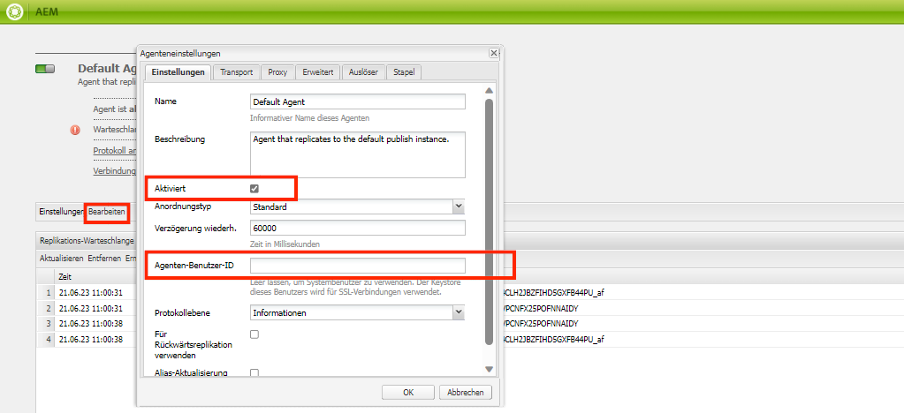
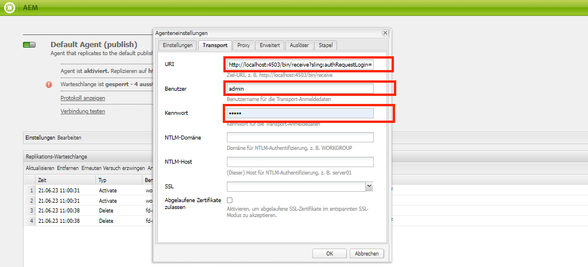
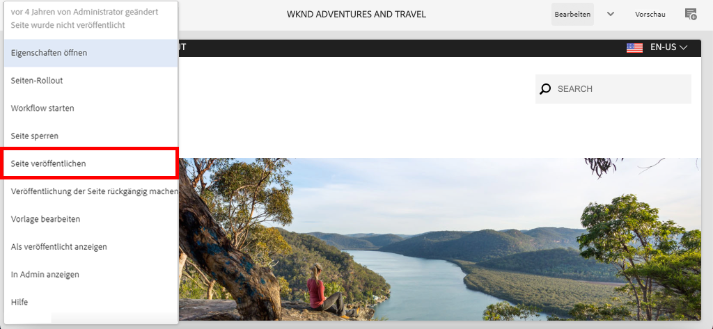

# Lokale AEM Runtime einrichten {#set-up-local-aem-runtime}

>[!CONTEXTUALHELP]
>id="aemcloud_localdev_aemruntime"
>title="Lokale AEM-Laufzeit"
>abstract="Adobe Experience Manager (AEM) kann mit dem QuickStart Jar des AEM as a Cloud Service SDK lokal ausgeführt werden. Auf diese Weise können Entwickelnde benutzerdefinierten Code, Konfigurationen und Inhalte bereitstellen und testen, bevor sie sie der Quell-Code-Kontrolle übergeben und in einer AEM as a Cloud Service-Umgebung bereitstellen."
>additional-url="https://experienceleague.adobe.com/docs/experience-manager-cloud-service/implementing/developing/aem-as-a-cloud-service-sdk.html?lang=de" text="AEM as a Cloud Service-SDK"
>additional-url="https://experience.adobe.com/#/downloads/content/software-distribution/en/aemcloud.html" text="Herunterladen des AEM as a Cloud Service SDK"

Adobe Experience Manager (AEM) kann mit dem QuickStart Jar des AEM as a Cloud Service SDK lokal ausgeführt werden. Auf diese Weise können Entwickelnde benutzerdefinierten Code, Konfigurationen und Inhalte bereitstellen und testen, bevor sie sie der Quell-Code-Kontrolle übergeben und in einer AEM as a Cloud Service-Umgebung bereitstellen.

Beachten Sie Folgendes: `~` wird als Kurzbezeichnung für das Benutzerverzeichnis verwendet. Unter Windows entspricht dies dem `%HOMEPATH%`.

## Java installieren

Experience Manager ist eine Java-Anwendung und erfordert daher das Java-SDK, um die Entwicklungs-Tools zu unterstützen.

1. [Herunterladen und Installieren des neuesten Java SDK 11](https://experience.adobe.com/#/downloads/content/software-distribution/en/general.html?1_group.propertyvalues.property=.%2Fjcr%3Acontent%2Fmetadata%2Fdc%3AsoftwareType&amp;1_group.propertyvalues.operation=equals&amp;1_group.propertyvalues.0_values=software-type%3Atooling&amp;fulltext=Oracle%7E+JDK%7E+11%7E&amp;orderby=%40jcr%3Acontent Fjcr%3AlastModified&amp;orderby.sort=desc&amp;layout=list&amp;p.offset=0&amp;p.limit=14)
1. Stellen Sie sicher, dass das Java 11 SDK installiert ist, indem Sie den Befehl ausführen:
   + Windows:`java -version`
   + macOS/Linux: `java --version`


## Herunterladen des AEM as a Cloud Service SDK

Das AEM as a Cloud Service SDK bzw. AEM SDK enthält das Schnellstart-Jar, das zum lokalen Ausführen von AEM Author und Publish für die Entwicklung verwendet wird, sowie die kompatible Version der Dispatcher Tools.

1. Anmelden bei [https://experience.adobe.com/#/downloads](https://experience.adobe.com/#/downloads) mit Adobe ID
   + Beachten Sie, dass Ihre Adobe Organisation __must__ für AEM as a Cloud Service Download des as a Cloud Service SDK bereitgestellt werden.
1. Navigieren Sie zur Registerkarte __AEM as a Cloud Service__
1. Sortieren nach __Veröffentlichungsdatum__ in __Absteigend__ order
1. Klicken Sie auf die neueste __AEM SDK__ Ergebniszeile
1. Überprüfen und akzeptieren Sie den Endbenutzer-Lizenzvertrag und tippen Sie auf die __Download__ button

## Extrahieren Sie die Schnellstart-JAR-Datei aus der AEM SDK-ZIP-Datei

1. Entpacken Sie die heruntergeladene Datei `aem-sdk-XXX.zip` file

## Lokalen AEM-Autorendienst einrichten{#set-up-local-aem-author-service}

Der lokale AEM-Autorendienst bietet Entwicklern ein lokales Erlebnis, das digitale Marketing-Experten/Inhaltsautoren für die Erstellung und Verwaltung von Inhalten freigeben.  Der AEM-Autorendienst ist sowohl als Authoring- als auch als Vorschau-Umgebung konzipiert, sodass die meisten Validierungen der Funktionsentwicklung dagegen durchgeführt werden können. Dadurch wird er zu einem wichtigen Element des lokalen Entwicklungsprozesses.

1. Erstellen Sie den Ordner `~/aem-sdk/author`
1. Kopieren Sie die __Schnellstart-JAR__ Datei in  `~/aem-sdk/author` und benennen Sie sie in um `aem-author-p4502.jar`
1. Starten Sie den lokalen AEM-Autorendienst, indem Sie Folgendes über die Befehlszeile ausführen:
   + `java -jar aem-author-p4502.jar`
      + Geben Sie das Administratorkennwort als `admin`. Jedes Administratorkennwort ist akzeptabel. Es wird jedoch empfohlen, den Standard für die lokale Entwicklung zu verwenden, um eine Neukonfiguration zu vermeiden.

   You *cannot* Starten Sie den AEM als Cloud Service-Schnellstart-JAR. [durch Doppelklick](#troubleshooting-double-click).
1. Greifen Sie auf den lokalen AEM-Autorendienst zu unter [http://localhost:4502](http://localhost:4502) in einem Webbrowser

Windows:

```shell
$ mkdir -p c:\Users\<My User>\aem-sdk\author
$ copy aem-sdk-Quickstart-XXX.jar c:\Users\<My User>\aem-sdk\author\aem-author-p4502.jar
$ cd c:\Users\<My User>\aem-sdk\author
$ java -jar aem-author-p4502.jar
```

macOS/Linux:

```shell
$ mkdir -p ~/aem-sdk/author
$ cp aem-sdk-Quickstart-XXX.jar ~/aem-sdk/author/aem-author-p4502.jar
$ cd ~/aem-sdk/author
$ java -jar aem-author-p4502.jar
```

## Einrichten des lokalen AEM-Veröffentlichungsdienstes

Der lokale AEM-Veröffentlichungsdienst bietet Entwicklern das lokale Erlebnis, das Endbenutzer der AEM haben werden, z. B. das Durchsuchen der auf AEM gehosteten Website. Ein lokaler AEM-Veröffentlichungsdienst ist wichtig, da er mit AEM SDKs integriert wird. [Dispatcher-Tools](./dispatcher-tools.md) und ermöglicht es Entwicklern, das Endbenutzererlebnis zu testen und zu optimieren.

1. Erstellen Sie den Ordner `~/aem-sdk/publish`
1. Kopieren Sie die __Schnellstart-JAR__ Datei in  `~/aem-sdk/publish` und benennen Sie sie in um `aem-publish-p4503.jar`
1. Starten Sie den lokalen AEM-Veröffentlichungsdienst, indem Sie Folgendes über die Befehlszeile ausführen:
   + `java -jar aem-publish-p4503.jar`
      + Geben Sie das Administratorkennwort als `admin`. Jedes Administratorkennwort ist akzeptabel. Es wird jedoch empfohlen, den Standard für die lokale Entwicklung zu verwenden, um eine Neukonfiguration zu vermeiden.

   You *cannot* Starten Sie den AEM als Cloud Service-Schnellstart-JAR. [durch Doppelklick](#troubleshooting-double-click).
1. Greifen Sie auf den lokalen AEM-Veröffentlichungsdienst zu unter [http://localhost:4503](http://localhost:4503) in einem Webbrowser

Windows:

```shell
$ mkdir -p c:\Users\<My User>\aem-sdk\publish
$ copy aem-sdk-Quickstart-XXX.jar c:\Users\<My User>\aem-sdk\publish\aem-publish-p4503.jar
$ cd c:\Users\<My User>\aem-sdk\publish
$ java -jar aem-publish-p4503.jar
```

macOS/Linux:

```shell
$ mkdir -p ~/aem-sdk/publish
$ cp aem-sdk-Quickstart-XXX.jar ~/aem-sdk/publish/aem-publish-p4503.jar
$ cd ~/aem-sdk/publish
$ java -jar aem-publish-p4503.jar
```

## Einrichten lokaler AEM-Dienste im Vorversionsmodus

Die lokale AEM-Laufzeit kann in [Vorabversion-Modus](https://experienceleague.adobe.com/docs/experience-manager-cloud-service/content/release-notes/prerelease.html?lang=de) Entwickler können mit den Funktionen der nächsten Version von AEM as a Cloud Service erstellen. Die Vorabversion wird aktiviert, indem die Variable `-r prerelease` -Argument beim ersten Start der lokalen AEM-Laufzeitumgebung. Dies kann sowohl mit lokalen AEM Author- als auch AEM Publish-Diensten verwendet werden.

```shell
# For AEM Author service in prerelease mode
$ java -jar aem-author-p4502.jar -r prerelease

# For AEM Publish service in prerelease mode
$ java -jar aem-publish-p4503.jar -r prerelease
```

## Inhaltsverteilung simulieren {#content-distribution}

In einer Umgebung vom Typ &quot;true Cloud Service&quot;werden Inhalte vom Autorendienst an den Veröffentlichungsdienst verteilt, indem [Sling Content Distribution](https://sling.apache.org/documentation/bundles/content-distribution.html) und die Adobe-Pipeline. Die [Adobe Pipeline](https://experienceleague.adobe.com/docs/experience-manager-cloud-service/core-concepts/architecture.html?lang=en#content-distribution) ist ein isolierter Microservice, der nur in der Cloud-Umgebung verfügbar ist.

Bei der Entwicklung kann es wünschenswert sein, die Verteilung von Inhalten mithilfe des lokalen Autoren- und Veröffentlichungsdienstes zu simulieren. Dies kann durch Aktivierung der Legacy-Replikationsagenten erreicht werden.

>[!NOTE]
>
> Replikationsagenten sind nur für die Verwendung in der lokalen Schnellstart-JAR verfügbar und bieten nur eine Simulation der Inhaltsverteilung.

1. Melden Sie sich bei der **Autor** Dienst und navigieren Sie zu [http://localhost:4502/etc/replication/agents.author.html](http://localhost:4502/etc/replication/agents.author.html).
1. Klicken **Standardagent (publish)** , um den standardmäßigen Replikationsagenten zu öffnen.
1. Klicken **Bearbeiten** , um die Konfiguration des Agenten zu öffnen.
1. Unter dem **Einstellungen** aktualisieren Sie die folgenden Felder:

   + **Aktiviert** - check true
   + **Agenten-Benutzer-ID** - Lassen Sie dieses Feld leer.

   

1. Unter dem **Verkehr** aktualisieren Sie die folgenden Felder:

   + **URI** - `http://localhost:4503/bin/receive?sling:authRequestLogin=1`
   + **Benutzer** - `admin`
   + **Kennwort** - `admin`

   

1. Klicken **Ok** , um die Konfiguration zu speichern und die **Standard** Replikationsagent.
1. Sie können jetzt Änderungen an Inhalten im Autorendienst vornehmen und sie im Veröffentlichungsdienst veröffentlichen.



## Schnellstart-JAR-Startmodi

Die Benennung der Schnellstart-JAR-Datei, `aem-<tier>_<environment>-p<port number>.jar` gibt an, wie es gestartet wird. Sobald AEM in einer bestimmten Ebene, einem bestimmten Autor oder einer bestimmten Veröffentlichungsinstanz gestartet wurde, kann sie nicht mehr in die alternative Ebene geändert werden. Dazu muss die Variable `crx-Quickstart` -Ordner, der während der ersten Ausführung generiert wurde, muss gelöscht und die Schnellstart-JAR-Datei muss erneut ausgeführt werden. Umgebung und Ports können geändert werden, sie erfordern jedoch das Anhalten/Starten der lokalen AEM-Instanz.

Ändern von Umgebungen, `dev`, `stage` und `prod`kann für Entwickler nützlich sein, um sicherzustellen, dass umgebungsspezifische Konfigurationen von AEM korrekt definiert und aufgelöst werden. Es wird empfohlen, die lokale Entwicklung in erster Linie gegen die Standardeinstellung durchzuführen `dev` Umgebungs-Ausführungsmodus.

Folgende Permutationen sind verfügbar:

| Quickstart Jar-Dateiname | Modusbeschreibung |
|------------------------------|-----------------------------------------------------------------------------|
| `aem-author-p4502.jar` | Als Autor im Entwicklungs-Ausführungsmodus auf Port 4502 |
| `aem-author_dev-p4502.jar` | Als Autor im Entwicklungs-Ausführungsmodus für Port 4502 (identisch mit `aem-author-p4502.jar`) |
| `aem-author_stage-p4502.jar` | Als Autor im Staging-Ausführungsmodus auf Port 4502 |
| `aem-author_prod-p4502.jar` | Als Autor im Produktionsmodus am Port 4502 |
| `aem-publish-p4503.jar` | Als Veröffentlichen im Entwicklungs-Ausführungsmodus auf Port 4503 |
| `aem-publish_dev-p4503.jar` | Als Veröffentlichen im Entwicklungs-Ausführungsmodus auf Port 4503 (identisch mit `aem-publish-p4503.jar`) |
| `aem-publish_stage-p4503.jar` | Als Veröffentlichung im Staging-Ausführungsmodus auf Port 4503 |
| `aem-publish_prod-p4503.jar` | Als Veröffentlichung im Produktionsmodus auf Port 4503 |

Beachten Sie, dass die Portnummer ein beliebiger verfügbarer Port auf dem lokalen Entwicklungscomputer sein kann, jedoch gemäß folgenden Richtlinien:

+ Port __4502__ wird für __lokaler AEM-Autorendienst__
+ Port __4503__ wird für __lokaler AEM-Veröffentlichungsdienst__

Eine Änderung dieser Konfigurationen erfordert möglicherweise Anpassungen an AEM SDK-Konfigurationen

## Beenden einer lokalen AEM-Laufzeit

Um eine lokale AEM-Laufzeit zu beenden, öffnen Sie entweder den AEM-Autoren- oder Veröffentlichungsdienst, das Befehlszeilenfenster, das zum Starten der AEM Runtime verwendet wurde, und tippen Sie auf `Ctrl-C`. Warten Sie, bis AEM heruntergefahren ist. Wenn der Herunterfahren-Prozess abgeschlossen ist, ist die Eingabeaufforderung für die Befehlszeile verfügbar.

## Optionale Aufgaben zur Einrichtung lokaler AEM zur Laufzeit

+ __Variablen der OSGi-Konfigurationsumgebung und geheime Variablen__ are [speziell für die AEM lokale Laufzeit festgelegt](https://experienceleague.adobe.com/docs/experience-manager-cloud-service/implementing/deploying/configuring-osgi.html?lang=de#local-development), anstatt sie mit der aio-CLI zu verwalten.

## Wann wird die Schnellstart-JAR aktualisiert?

Aktualisieren Sie das AEM SDK mindestens monatlich am letzten Donnerstag jedes Monats oder kurz danach. Dies ist die Veröffentlichungsintervall für AEM as a Cloud Service &quot;Feature Releases&quot;.

>[!WARNING]
>
> Die Aktualisierung des Schnellstart-JAR auf eine neue Version erfordert das Ersetzen der gesamten lokalen Entwicklungsumgebung, was zu einem Verlust von Code, Konfiguration und Inhalt in den lokalen AEM-Repositorys führt. Stellen Sie sicher, dass Code, Konfigurationen oder Inhalte, die nicht zerstört werden sollen, sicher in Git übertragen oder von der lokalen AEM als AEM Pakete exportiert werden.

### So vermeiden Sie Inhaltsverluste beim Aktualisieren des AEM SDK

Durch die Aktualisierung des AEM SDK wird effektiv eine brandneue AEM Laufzeitumgebung erstellt, einschließlich eines neuen Repositorys, d. h. alle Änderungen, die an einem früheren AEM SDK-Repository vorgenommen wurden, gehen verloren. Im Folgenden finden Sie praktikable Strategien zur Unterstützung der Inhaltserstellung zwischen AEM SDK-Upgrades und können diskret oder gemeinsam verwendet werden:

1. Erstellen Sie ein Inhaltspaket mit Beispielinhalten, um die Entwicklung zu unterstützen, und verwalten Sie es in Git. Alle Inhalte, die durch AEM SDK-Upgrades persistiert werden sollen, werden in diesem Paket beibehalten und nach der Aktualisierung des AEM SDK erneut bereitgestellt.
1. Verwendung [oak-upgrade](https://jackrabbit.apache.org/oak/docs/migration.html) mit dem `includepaths` zum Kopieren von Inhalten aus dem vorherigen AEM SDK-Repository in das neue AEM SDK-Repository.
1. Sichern Sie alle Inhalte mit AEM Package Manager und Inhaltspaketen auf dem vorherigen AEM SDK und installieren Sie sie erneut auf dem neuen AEM SDK.

Beachten Sie, dass die Verwendung der oben genannten Ansätze zur Codepflege zwischen AEM SDK-Upgrades ein Anti-Muster der Entwicklung anzeigt. Nicht verfügbarer Code sollte aus Ihrer Entwicklungs-IDE stammen und über Implementierungen in AEM SDK fließen.

## Fehlerbehebung

### Durch Doppelklicken auf die Schnellstart-JAR-Datei wird ein Fehler ausgegeben{#troubleshooting-double-click}

Wenn Sie auf die Schnellstart-JAR-Datei doppelklicken, wird ein Fehler-Modal angezeigt, das verhindert, dass AEM lokal gestartet werden.


Dies liegt daran, dass AEM as a Cloud Service Schnellstart-JAR das Doppelklicken des Schnellstart-JAR nicht unterstützt, um AEM lokal zu starten. Stattdessen müssen Sie die JAR-Datei über diese Befehlszeile ausführen.

So starten Sie den AEM-Autorendienst: `cd` in das Verzeichnis mit der Schnellstart-JAR-Datei und führen Sie den Befehl aus:

`$ java -jar aem-author-p4502.jar`

oder , um den AEM-Veröffentlichungsdienst zu starten, `cd` in das Verzeichnis mit der Schnellstart-JAR-Datei und führen Sie den Befehl aus:

`$ java -jar aem-publish-p4503.jar`

### Starten der Schnellstart-JAR-Datei über die Befehlszeile wird sofort abgebrochen{#troubleshooting-java-8}

Beim Starten der Schnellstart-JAR-Datei über die Befehlszeile wird der Prozess sofort abgebrochen und der AEM-Dienst startet nicht, mit dem folgenden Fehler:

```shell
➜  ~/aem-sdk/author: java -jar aem-author-p4502.jar
Loading quickstart properties: default
Loading quickstart properties: instance
java.lang.Exception: Quickstart requires a Java Specification 11 VM, but your VM (Java HotSpot(TM) 64-Bit Server VM / Oracle Corporation) reports java.specification.version=1.8
  at com.adobe.granite.quickstart.base.impl.Main.checkEnvironment(Main.java:1046)
  at com.adobe.granite.quickstart.base.impl.Main.<init>(Main.java:646)
  at com.adobe.granite.quickstart.base.impl.Main.main(Main.java:981)
Quickstart: aborting
```

Dies liegt daran, dass AEM as a Cloud Service Java SDK 11 erfordert und Sie eine andere Version ausführen, höchstwahrscheinlich Java 8. Um dieses Problem zu beheben, laden Sie herunter und installieren Sie [Oracle Java SDK 11](https://experience.adobe.com/#/downloads/content/software-distribution/en/general.html?1_group.propertyvalues.property=.%2Fjcr%3Acontent%2Fmetadata%2Fdc%3AsoftwareType&amp;1_group.propertyvalues.operation=equals&amp;1_group.propertyvalues.0_values=software-type%3Atooling&amp;fulltext=Oracle%7E+JDK%7E+11%7E&amp;orderby=%40jcr%3Acontent Fjcr%3AlastModified&amp;orderby.sort=desc&amp;layout=list&amp;p.offset=0&amp;p.limit=14).
Überprüfen Sie nach der Installation von Java SDK 11, ob es sich um die aktive Version handelt, indem Sie Folgendes über die Befehlszeile ausführen.

Überprüfen Sie nach der Installation des Java 11 SDK, ob es sich um die aktive Version handelt, indem Sie den Befehl über die Befehlszeile ausführen:

+ Windows: `java -version`
+ macOS/Linux: `java --version`

## Zusätzliche Ressourcen

+ [AEM SDK herunterladen](https://experience.adobe.com/#/downloads)
+ [Adobe Cloud Manager](https://my.cloudmanager.adobe.com/)
+ [Docker herunterladen](https://www.docker.com/)
+ [Experience Manager Dispatcher-Dokumentation](https://experienceleague.adobe.com/docs/experience-manager-dispatcher/using/dispatcher.html?lang=de)
