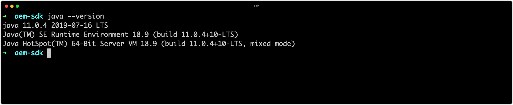

# Lokale AEM einrichten

Adobe Experience Manager (AEM) kann lokal mit dem AEM als QuickStart-Jar des Cloud Service-SDK ausgeführt werden. Auf diese Weise können Entwickler benutzerdefinierten Code, Konfiguration und Inhalt bereitstellen und testen, bevor sie sich an die Quellcodeverwaltung wenden, und ihn als Cloud Service-Umgebung auf einem AEM bereitstellen.

Beachten Sie, dass dies als Kurzschrift für das Benutzerverzeichnis verwendet `~` wird. Unter Windows entspricht dies `%HOMEPATH%`.

## Java installieren

Experience Manager ist eine Java-Anwendung und erfordert daher das Java-SDK, um die Entwicklungs-Tools zu unterstützen.

1. [Laden Sie das neueste Java SDK 11 herunter und installieren Sie es](https://experience.adobe.com/#/downloads/content/software-distribution/en/general.html?1_group.propertyvalues.property=.%2Fjcr%3Acontent%2Fmetadata%2Fdc%3AsoftwareType&amp;1_group.propertyvalues.operation=equals&amp;1_group.propertyvalues.0_values=software-type%3Atooling&amp;fulltext=Oracle%7E+JDK%7E+11%7E&amp;orderby=%40jcr%3Acontent%2Fdc jcr%3AlastModified&amp;orderby.sort=desc&amp;layout=Liste&amp;p.offset=0&amp;p.limit=14)
1. Stellen Sie sicher, dass Java 11 SDK installiert ist, indem Sie den Befehl ausführen:
   + Windows:`java -version`
   + macOS/Linux: `java --version`



## Herunterladen der AEM als Cloud Service-SDK

Die AEM als Cloud Service-SDK oder AEM SDK enthält die QuickStart-JAR, mit der AEM Author und Publish lokal für die Entwicklung ausgeführt werden, sowie die kompatible Version der Dispatcher-Tools.

1. Log in to [https://experience.adobe.com/#/downloads](https://experience.adobe.com/#/downloads) with your Adobe ID
   + Beachten Sie, dass Ihre Adobe-Organisation AEM als Cloud Service zum Herunterladen der AEM als Cloud Service-SDK bereitgestellt werden __muss__ .
1. Navigieren Sie zur Registerkarte &quot; __AEM als Cloud Service__ &quot;
1. Sortieren nach __Veröffentlichungsdatum__ in __Absteigend__ Reihenfolge
1. Klicken Sie auf die letzte __AEM SDK__ -Ergebniszeile
1. Überprüfen und akzeptieren Sie den EULA und klicken Sie auf die Schaltfläche __Herunterladen__

## Extrahieren Sie die Schnellstart-JAR-Datei aus der AEM SDK-ZIP.

1. Unzip the downloaded `aem-sdk-XXX.zip` file

## Lokalen AEM Authoring-Dienst einrichten{#set-up-local-aem-author-service}

Der lokale AEM Author-Dienst bietet Entwicklern eine lokale Erfahrung, die digitale Marketingexperten/Inhaltsersteller gemeinsam verwenden, um Inhalte zu erstellen und zu verwalten.  Der AEM Author-Dienst ist sowohl als Authoring- als auch als Vorschau-Umgebung konzipiert, sodass die meisten Validierungen der Funktionsentwicklung dagegen durchgeführt werden können. Dadurch wird er zu einem wichtigen Bestandteil des lokalen Entwicklungsprozesses.

1. Erstellen Sie den Ordner `~/aem-sdk/author`
1. Kopieren Sie die __Quickstart-JAR__ -Datei in `~/aem-sdk/author` und benennen Sie sie in `aem-author-p4502.jar`
1. Beginn Sie den lokalen AEM Author-Dienst, indem Sie Folgendes über die Befehlszeile ausführen:
   + `java -jar aem-author-p4502.jar`
      + Geben Sie das Administratorkennwort an `admin`. Jedes Admin-Kennwort ist zulässig. Es wird jedoch empfohlen, den Standard für die lokale Entwicklung zu verwenden, um eine Neukonfiguration zu vermeiden.

   Sie *können den AEM nicht* als Cloud Service-Schnellstartjar [durch Klicken](#troubleshooting-double-click)auf die Dublette Beginn werden.
1. Zugriff auf den lokalen AEM Author-Dienst unter [http://localhost:4502](http://localhost:4502) in einem Webbrowser

Windows:

```shell
$ mkdir -p c:\Users\<My User>\aem-sdk\author
$ copy aem-sdk-Quickstart-XXX.jar c:\Users\<My User>\aem-sdk\author\aem-author-p4502.jar
$ cd c:\Users\<My User>\aem-sdk\author
$ java -jar aem-author-p4502.jar
```

macOS/Linux:

```shell
$ mkdir -p ~/aem-sdk/author
$ cp aem-sdk-Quickstart-XXX.jar ~/aem-sdk/author/aem-author-p4502.jar
$ cd ~/aem-sdk/author
$ java -jar aem-author-p4502.jar
```

## Einrichten des lokalen AEM Publishing-Dienstes

Der lokale AEM Publish-Dienst bietet Entwicklern die lokale Erfahrung, die Endbenutzer der AEM haben, z. B. beim Durchsuchen der auf AEM gehosteten Website. Ein lokaler AEM Publish-Dienst ist wichtig, da er mit AEM [Dispatcher-Tools](./dispatcher-tools.md) des SDK integriert ist und Entwicklern die Möglichkeit bietet, die Endbenutzererfahrung zu testen und genauer einzustellen.

1. Erstellen Sie den Ordner `~/aem-sdk/publish`
1. Kopieren Sie die __Quickstart-JAR__ -Datei in `~/aem-sdk/publish` und benennen Sie sie in `aem-publish-p4503.jar`
1. Beginn Sie den lokalen AEM Publish-Dienst, indem Sie Folgendes über die Befehlszeile ausführen:
   + `java -jar aem-publish-p4503.jar`
      + Geben Sie das Administratorkennwort an `admin`. Jedes Admin-Kennwort ist zulässig. Es wird jedoch empfohlen, den Standard für die lokale Entwicklung zu verwenden, um eine Neukonfiguration zu vermeiden.

   Sie *können den AEM nicht* als Cloud Service-Schnellstartjar [durch Klicken](#troubleshooting-double-click)auf die Dublette Beginn werden.
1. Zugriff auf den lokalen AEM Publish-Dienst unter [http://localhost:4503](http://localhost:4503) in einem Webbrowser

Windows:

```shell
$ mkdir -p c:\Users\<My User>\aem-sdk\publish
$ copy aem-sdk-Quickstart-XXX.jar c:\Users\<My User>\aem-sdk\publish\aem-publish-p4503.jar
$ cd c:\Users\<My User>\aem-sdk\publish
$ java -jar aem-publish-p4503.jar
```

macOS/Linux:

```shell
$ mkdir -p ~/aem-sdk/publish
$ cp aem-sdk-Quickstart-XXX.jar ~/aem-sdk/publish/aem-publish-p4503.jar
$ cd ~/aem-sdk/publish
$ java -jar aem-publish-p4503.jar
```

## Schnellstart-Jar-Beginn-Up-Modus

Die Benennung der Schnellstart-JAR-Datei `aem-<tier>_<environment>-p<port number>.jar` gibt an, wie sie Beginn wird. Sobald AEM in einer bestimmten Ebene gestartet, verfasst oder veröffentlicht wurde, kann sie nicht mehr in eine andere Ebene geändert werden. Dazu muss der während der ersten Ausführung generierte `crx-Quickstart` Ordner gelöscht und die Schnellstartjar erneut ausgeführt werden. Umgebung und Anschlüsse können geändert werden, allerdings ist ein Stopp/Beginn der lokalen AEM erforderlich.

Das Ändern von Umgebung `dev`und `stage` `prod`Funktionen kann für Entwickler nützlich sein, um sicherzustellen, dass Umgebung-spezifische Konfigurationen korrekt definiert und AEM gelöst werden. Es wird empfohlen, die lokale Entwicklung in erster Linie gegen den Standard- `dev` Umgebung-Ausführungsmodus durchzuführen.

Folgende Permutationen stehen zur Verfügung:

+ `aem-author-p4502.jar`
   + Als Autor im Dev-Ausführungsmodus am Port 4502
+ `aem-author_dev-p4502.jar`
   + Als Autor im Dev-Ausführungsmodus auf Port 4502 (identisch mit `aem-author-p4502.jar`)
+ `aem-author_stage-p4502.jar`
   + Als Autor im Staging-Ausführungsmodus am Port 4502
+ `aem-author_prod-p4502.jar`
   + Als Autor im Produktionsmodus auf Port 4502
+ `aem-publish-p4503.jar`
   + Als Autor im Dev-Ausführungsmodus am Port 4503
+ `aem-publish_dev-p4503.jar`
   + Als Autor im Dev-Ausführungsmodus auf Port 4503 (identisch mit `aem-publish-p4503.jar`)
+ `aem-publish_stage-p4503.jar`
   + Als Autor im Staging-Ausführungsmodus am Port 4503
+ `aem-publish_prod-p4503.jar`
   + Als Autor im Produktionsmodus auf Port 4503

Beachten Sie, dass die Portnummer ein beliebiger verfügbarer Anschluss auf dem lokalen Entwicklungscomputer sein kann, jedoch gemäß der folgenden Konvention:

+ Port __4502__ wird für den __lokalen AEM Author-Dienst verwendet__
+ Port __4503__ wird für den __lokalen AEM Publish-Dienst verwendet__

Um diese Einstellungen zu ändern, müssen möglicherweise Anpassungen an AEM SDK-Konfigurationen vorgenommen werden

## Anhalten einer lokalen AEM Laufzeit

Um eine lokale AEM zu beenden, öffnen Sie entweder den AEM Author- oder den Publish-Dienst das Befehlszeilenfenster, das zum Beginn der AEM Runtime verwendet wurde, und tippen Sie auf `Ctrl-C`. Warten Sie, bis AEM heruntergefahren ist. Nach Abschluss des Herunterfahrens ist die Eingabeaufforderung verfügbar.

## Wann wird die Schnellstartjar aktualisiert?

Aktualisieren Sie das AEM SDK mindestens monatlich am oder kurz nach dem letzten Donnerstag eines jeden Monats, der die Veröffentlichungsknappheit für AEM als Cloud Service &quot;Feature Releases&quot;darstellt.

>[!WARNING]
>
> Die Aktualisierung der Quickstart-JAR-Datei auf eine neue Version erfordert das Ersetzen der gesamten lokalen Entwicklungs-Umgebung, wodurch Code, Konfiguration und Inhalt in den lokalen AEM-Repositorys verloren gehen. Stellen Sie sicher, dass Code, Konfigurationen oder Inhalte, die nicht zerstört werden sollen, sicher an Git übertragen oder als AEM Pakete aus der lokalen AEM exportiert werden.

### Vermeidung von Inhaltsverlusten beim Aktualisieren des AEM SDK

Durch die Aktualisierung des AEM SDK wird eine brandneue AEM Laufzeitumgebung einschließlich eines neuen Repositorys erstellt, d. h. alle Änderungen, die an einem AEM SDK-Repository vorgenommen wurden, gehen verloren. Die folgenden Strategien sind praktikabel, um bei der Speicherung von Inhalten zwischen AEM SDK-Upgrades behilflich zu sein und können diskret oder gemeinsam verwendet werden:

1. Erstellen Sie ein Inhaltspaket mit Beispielinhalten, um die Entwicklung zu unterstützen, und verwalten Sie es in Git. Alle Inhalte, die durch AEM SDK-Upgrades beibehalten werden sollen, bleiben in diesem Paket erhalten und werden nach der Aktualisierung des AEM SDK erneut bereitgestellt.
1. Verwenden Sie die [Eichenaktualisierung](https://jackrabbit.apache.org/oak/docs/migration.html) mit der `includepaths` Direktive, um Inhalte aus dem vorherigen AEM SDK-Repository in das neue AEM SDK-Repository zu kopieren.
1. Sichern Sie alle Inhalte mit AEM Package Manager und Inhaltspaketen auf dem vorherigen AEM SDK und installieren Sie sie erneut auf dem neuen AEM SDK.

Denken Sie daran, dass Sie mithilfe der oben genannten Ansätze zur Codepflege zwischen AEM SDK-Aktualisierungen ein Anti-Muster für die Entwicklung angeben. Nicht verfügbarer Code sollte aus Ihrer Entwicklungs-IDE stammen und über Bereitstellungen in AEM SDK fließen.

## Fehlerbehebung

## Dublette-Klick auf die Schnellstartjar-Datei führt zu einem Fehler{#troubleshooting-double-click}

Wenn Sie mit der Dublette auf die Schnellstartjar zu Beginn klicken, wird ein Fehlermodal angezeigt, das den lokalen Start von AEM verhindert.


Dies liegt daran, dass AEM als Cloud Service QuickStart Jar nicht unterstützt Dublette-Klick auf die Schnellstart-JAR auf Beginn AEM lokal. Stattdessen müssen Sie die JAR-Datei über diese Befehlszeile ausführen.

Zum Beginn des AEM Author-Dienstes in `cd` den Ordner mit der Schnellstart-JAR und führen Sie den Befehl aus:

`$ java -jar aem-author-p4502.jar`

oder zum Beginn des AEM Publish-Dienstes in `cd` den Ordner mit der Schnellstart-JAR-Datei und führen Sie den Befehl aus:

`$ java -jar aem-author-p4503.jar`

## Starten der Schnellstartjar über die Befehlszeile sofort abgebrochen{#troubleshooting-java-8}

Beim Starten der Schnellstart-JAR-Datei über die Befehlszeile wird der Vorgang sofort abgebrochen und der AEM-Dienst wird nicht Beginn, mit der folgenden Fehlermeldung:

```shell
➜  ~/aem-sdk/author: java -jar aem-author-p4502.jar
Loading quickstart properties: default
Loading quickstart properties: instance
java.lang.Exception: Quickstart requires a Java Specification 11 VM, but your VM (Java HotSpot(TM) 64-Bit Server VM / Oracle Corporation) reports java.specification.version=1.8
  at com.adobe.granite.quickstart.base.impl.Main.checkEnvironment(Main.java:1046)
  at com.adobe.granite.quickstart.base.impl.Main.<init>(Main.java:646)
  at com.adobe.granite.quickstart.base.impl.Main.main(Main.java:981)
Quickstart: aborting
```

Der Grund dafür ist, dass AEM als Cloud Service Java SDK 11 erfordert und Sie eine andere Version, höchstwahrscheinlich Java 8, ausführen. Um dieses Problem zu beheben, laden Sie [Oracle Java SDK 11](https://experience.adobe.com/#/downloads/content/software-distribution/en/general.html?1_group.propertyvalues.property=.%2Fjcr%3Acontent%2Fmetadata%2Fdc%3AsoftwareType&amp;1_group.propertyvalues.operation=equals&amp;1_group.propertyvalues.0_values=software-type%3Atooling&amp;fulltext=Oracle%7E+JDK%7E+11%7E&amp;orderby=%40jcr%3Acontent%2Fdc jcr%3AlastModified&amp;orderby.sort=desc&amp;layout=Liste&amp;p.offset=0&amp;p.limit=14)herunter und installieren Sie es.
Nachdem Java SDK 11 installiert wurde, überprüfen Sie, ob es sich um die aktive Version handelt, indem Sie Folgendes über die Befehlszeile ausführen:

Nachdem Java 11 SDK installiert wurde, überprüfen Sie, ob es sich um die aktive Version handelt, indem Sie den Befehl über die Befehlszeile ausführen:

+ Windows: `java -version`
+ macOS/Linux: `java --version`

## Zusätzliche Ressourcen

+ [AEM SDK herunterladen](https://experience.adobe.com/#/downloads)
+ [Adobe Cloud Manager](https://my.cloudmanager.adobe.com/)
+ [Docker herunterladen](https://www.docker.com/)
+ [Dokumentation zum Experience Manager-Dispatcher](https://docs.adobe.com/content/help/de-DE/experience-manager-dispatcher/using/dispatcher.html)
