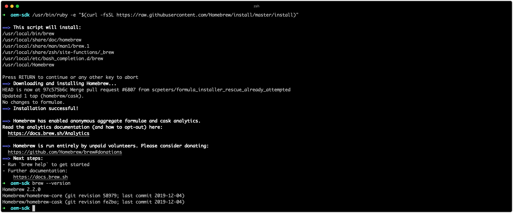

# Einrichten von Entwicklungs-Tools

>[!CONTEXTUALHELP]
>id="aemcloud_localdev_devtools"
>title="Einrichten von Entwicklungstools"
>abstract="Für die Entwicklung von Adobe Experience Manager (AEM) ist ein minimaler Satz von Entwicklungs-Tools erforderlich, die auf dem Entwicklercomputer installiert und eingerichtet werden. Zu diesen Tools gehören Java, Maven, Adobe I/O CLI, Entwicklungs-IDE und mehr."
>additional-url="https://experienceleague.adobe.com/docs/experience-manager-cloud-service/implementing/developing/development-guidelines.html?lang=de" text="Entwicklungsrichtlinien"
>additional-url="https://experienceleague.adobe.com/docs/experience-manager-learn/cloud-service/developing/basics/aem-sdk.html" text="Entwicklungsgrundlagen"

Für die Entwicklung von Adobe Experience Manager (AEM) ist ein minimaler Satz von Entwicklungs-Tools erforderlich, die auf dem Entwicklercomputer installiert und eingerichtet werden. Diese Instrumente unterstützen die Entwicklung und den Aufbau von AEM.

Beachten Sie, dass `~` als Kurzbezeichnung für das Benutzerverzeichnis verwendet wird. Unter Windows entspricht dies `%HOMEPATH%`.

## Java installieren

Experience Manager ist eine Java-Anwendung und erfordert daher das Java-SDK, um die Entwicklung und das AEM as a Cloud Service SDK zu unterstützen.

1. [Herunterladen und Installieren des neuesten Java 11-SDK-Releases](https://experience.adobe.com/#/downloads/content/software-distribution/en/general.html?1_group.propertyvalues.property=.%2Fjcr%3Acontent%2Fmetadata%2Fdc%3AsoftwareType&amp;1_group.propertyvalues.operation=equals&amp;1_group.propertyvalues.0_values=software-type%3Atooling&amp;fulltext=Oracle%7E+JDK%7E+11%7E&amp;orderby=%40jcr%3Acontent Fjcr%3AlastModified&amp;orderby.sort=desc&amp;layout=list&amp;p.offset=0&amp;p.limit=14)
1. Stellen Sie sicher, dass das Java 11 SDK installiert ist, indem Sie den Befehl ausführen:
   + Windows: `java -version`
   + macOS/Linux: `java --version`

## Installation von Homebrew

_Die Verwendung von Homebrew ist optional, wird jedoch empfohlen._

Homebrew ist ein Open-Source-Paketmanager für macOS, Windows und Linux. Alle unterstützenden Tools können separat installiert werden. Homebrew bietet eine praktische Möglichkeit, eine Vielzahl von Entwicklungs-Tools zu installieren und zu aktualisieren, die für die Entwicklung von Experience Managern erforderlich sind.

1. Terminal öffnen
1. Überprüfen Sie, ob Homebrew bereits installiert ist, indem Sie den Befehl ausführen: `brew --version`.
1. Wenn Homebrew nicht installiert ist, installieren Sie Homebrew
   + [Installieren von Homebrew auf macOS](https://brew.sh/)
      + Für Homebrew unter macOS ist [Xcode](https://apps.apple.com/us/app/xcode/id497799835) oder [Befehlszeilenwerkzeuge](https://developer.apple.com/download/more/) erforderlich, die über den Befehl installiert werden können:
         + `xcode-select --install`
   + [Installieren von Homebrew unter Linux](https://docs.brew.sh/Installation#linux-or-windows-10-subsystem-for-linux)
   + [Installieren von Homebrew unter Windows 10](https://docs.brew.sh/Installation#linux-or-windows-10-subsystem-for-linux)
1. Stellen Sie sicher, dass Homebrew installiert ist, indem Sie den Befehl ausführen: `brew --version`

Wenn Sie Homebrew verwenden, befolgen Sie die Anweisungen __Installieren mit Homebrew__ in den folgenden Abschnitten. Wenn Sie __nicht__ mit Homebrew arbeiten, installieren Sie die Tools unter Verwendung der betriebssystemspezifischen Links.

## Git installieren

 Gibt das von  [Adobe Cloud Manager](https://experienceleague.adobe.com/docs/experience-manager-cloud-manager/using/requirements/source-code-repository.html) verwendete Quellcodeverwaltungssystem an und ist daher für die Entwicklung erforderlich.

+ Git mithilfe von Homebrew installieren
   1. Öffnen Sie Ihr Terminal/Ihre Eingabeaufforderung.
   1. Führen Sie den Befehl aus: `brew install git`
   1. Stellen Sie mithilfe des Befehls sicher, dass Git installiert ist: `git --version`
+ Oder laden Sie Git (macOS, Linux oder Windows) herunter und installieren Sie es.
   1. [Herunterladen und Installieren von Git](https://git-scm.com/downloads)
   1. Öffnen Sie Ihr Terminal/Ihre Eingabeaufforderung.
   1. Stellen Sie mithilfe des Befehls sicher, dass Git installiert ist: `git --version`

## Installieren von Node.js (und npm){#node-js}

[Node.](https://nodejs.org) jsis ist eine JavaScript-Laufzeitumgebung, die zum Arbeiten mit den Frontend-Assets des  __ui.__ frontendsub-Projekts eines AEM Projekts verwendet wird. Node.js wird mit [npm](https://www.npmjs.com/) bereitgestellt. Dies ist der De-facto-Paketmanager von Node.js, der zur Verwaltung von JavaScript-Abhängigkeiten verwendet wird.

+ Installieren von Node.js mithilfe von Homebrew
   1. Öffnen Sie Ihr Terminal/Ihre Eingabeaufforderung.
   1. Führen Sie den Befehl aus: `brew install node`
   1. Stellen Sie mithilfe des Befehls sicher, dass Node.js installiert ist: `node -v`
   1. Stellen Sie mithilfe des Befehls sicher, dass npm installiert ist: `npm -v`
+ Oder laden Sie Node.js (macOS, Linux oder Windows) herunter und installieren Sie es.
   1. [Node.js herunterladen und installieren](https://nodejs.org/en/download/)
   1. Öffnen Sie Ihr Terminal/Ihre Eingabeaufforderung.
   1. Stellen Sie mithilfe des Befehls sicher, dass Node.js installiert ist: `node -v`
   1. Stellen Sie mithilfe des Befehls sicher, dass npm installiert ist: `npm -v`

>[!TIP]
>
>[AEM Projektarchetyp](https://github.com/adobe/aem-project-archetype)-basierte AEM Projekte installieren eine isolierte Version von Node.js zum Zeitpunkt der Erstellung. Es ist gut, die Version des lokalen Entwicklungssystems mit den Node.js- und NPM-Versionen, die in der Reactor pom.xml Ihres AEM Maven-Projekts angegeben sind, synchronisieren (oder nahe daran) zu lassen.
>
>In diesem Beispiel [AEM Project Reactor pom.xml](https://github.com/adobe/aem-guides-wknd/blob/9ac94f3f40c978a53ec88fae79fbc17dd2db72f2/pom.xml#L117-L118) finden Sie Informationen dazu, wo Sie die Build-Versionen Node.js und npm finden.

## Maven installieren

Apache Maven ist das Open-Source-Java-Befehlszeilenwerkzeug, mit dem AEM Projekte erstellt werden, die aus dem AEM Projekt-Maven-Archetyp generiert wurden. Alle wichtigen IDEs ([IntelliJ IDEA](https://www.jetbrains.com/idea/), [Visual Studio Code](https://code.visualstudio.com/), [Eclipse](https://www.eclipse.org/) usw.) über integrierte Maven-Unterstützung verfügen.

+ Maven mithilfe von Homebrew installieren
   1. Öffnen Sie Ihr Terminal/Ihre Eingabeaufforderung.
   1. Führen Sie den Befehl aus: `brew install maven`
   1. Stellen Sie mithilfe des Befehls sicher, dass Maven installiert ist: `mvn -v`
+ Oder laden Sie Maven (macOS, Linux oder Windows) herunter und installieren Sie es.
   1. [Maven herunterladen](https://maven.apache.org/download.cgi)
   1. [Maven installieren](https://maven.apache.org/install.html)
   1. Öffnen Sie Ihr Terminal/Ihre Eingabeaufforderung.
   1. Stellen Sie mithilfe des Befehls sicher, dass Maven installiert ist: `mvn -v`

## Einrichten der Adobe I/O-CLI{#aio-cli}

Die [Adobe I/O-CLI](https://github.com/adobe/aio-cli) oder `aio` bietet Befehlszeilenzugriff auf eine Vielzahl von Adobe-Services, einschließlich [Cloud Manager](https://github.com/adobe/aio-cli-plugin-cloudmanager) und [Asset compute](https://github.com/adobe/aio-cli-plugin-asset-compute). Die Adobe I/O-CLI spielt eine wesentliche Rolle bei der Entwicklung von AEM as a Cloud Service, da sie Entwicklern Folgendes ermöglicht:

+ Trackinglogs von AEM as a Cloud Services services
+ Verwalten von Cloud Manager-Pipelines über die CLI

### Installieren der Adobe I/O-CLI

1. Stellen Sie sicher, dass [Node.js](#node-js) installiert ist, da die Adobe I/O-CLI ein NPM-Modul ist.
   + Führen Sie `node --version` zur Bestätigung aus
1. Führen Sie `npm install -g @adobe/aio-cli` aus, um das `aio` npm-Modul global zu installieren.

### Einrichten des Adobe I/O CLI Cloud Manager-Plug-ins{#aio-cloud-manager}

Mit dem Adobe I/O Cloud Manager-Plug-in kann die aio-CLI über den Befehl `aio cloudmanager` mit Adobe Cloud Manager interagieren.

1. Führen Sie `aio plugins:install @adobe/aio-cli-plugin-cloudmanager` aus, um das [aio Cloud Manager-Plug-in](https://github.com/adobe/aio-cli-plugin-cloudmanager) zu installieren.

### Einrichten des Adobe I/O CLI Asset compute-Plug-ins{#aio-asset-compute}

Mit dem Adobe I/O Cloud Manager-Plug-in kann die aio-CLI Asset compute-Sekundäre über den Befehl `aio asset-compute` generieren und ausführen.

1. Führen Sie `aio plugins:install @adobe/aio-cli-plugin-asset-compute` aus, um das [aio Asset compute-Plug-in](https://github.com/adobe/aio-cli-plugin-asset-compute) zu installieren.

### Einrichten der Adobe I/O CLI-Authentifizierung

Damit die Adobe I/O-CLI mit Cloud Manager kommunizieren kann, muss eine [Cloud Manager-Integration in der Adobe I/O Console](https://github.com/adobe/aio-cli-plugin-cloudmanager) erstellt werden und die Anmeldeinformationen müssen für die erfolgreiche Authentifizierung erhalten werden.

1. Melden Sie sich bei [console.adobe.io](https://console.adobe.io) an.
1. Stellen Sie sicher, dass Ihr Unternehmen, das das Cloud Manager-Produkt enthält, mit dem eine Verbindung hergestellt werden soll, im Adobe Org-Umschalter aktiv ist.
1. Erstellen Sie ein neues oder öffnen Sie ein vorhandenes [Adobe I/O-Programm](https://www.adobe.io/apis/experienceplatform/console/docs.html#!AdobeDocs/adobeio-console/master/projects.md)
   + Adobe I/O Console-Programme sind einfach organisatorische Zusammenstellungen von Integrationen, erstellen oder verwenden Sie ein vorhandenes Programm, je nachdem, wie Sie Ihre Integrationen verwalten möchten.
   + Wenn Sie ein neues Projekt erstellen, wählen Sie bei entsprechender Aufforderung (vs. &quot;Aus Vorlage erstellen&quot;)
   + Adobe I/O Console-Programme unterscheiden sich von Cloud Manager-Programmen
1. Erstellen Sie eine neue Cloud Manager-API-Integration mit dem Profil &quot;Entwickler - Cloud Service&quot;.
1. Rufen Sie die Anmeldedaten für das Dienstkonto (JWT) ab, um die [config.json](https://github.com/adobe/aio-cli-plugin-cloudmanager#authentication) der Adobe I/O CLI zu füllen.
1. Laden Sie die Datei `config.json` in die Adobe I/O-CLI.
   + `$ aio config:set ims.contexts.aio-cli-plugin-cloudmanager PATH_TO_CONFIG_JSON_FILE --file --json`
1. Laden Sie die Datei `private.key` in die Adobe I/O-CLI.
   + `$ aio config:set ims.contexts.aio-cli-plugin-cloudmanager.private_key PATH_TO_PRIVATE_KEY_FILE --file`

Starten Sie [Ausführen von Befehlen](https://github.com/adobe/aio-cli-plugin-cloudmanager#commands) für Cloud Manager über die Adobe I/O-CLI.

## Einrichten der Entwicklungs-IDE

AEM Entwicklung besteht in erster Linie aus der Java- und Front-End-Entwicklung (JavaScript, CSS usw.) sowie der XML-Verwaltung. Im Folgenden finden Sie die beliebtesten IDEs für AEM Entwicklung.

### IntelliJ IDEA

__[IntelliJ ](https://www.jetbrains.com/idea/)__ IDEAist eine leistungsstarke IDE zur Java-Entwicklung. IntelliJ IDEA ist in zwei Geschmacksrichtungen erhältlich: eine kostenlose Community-Edition und eine kommerzielle (bezahlte) Ultimate-Version. Die kostenlose Community-Version reicht für AEM Entwicklung aus, aber das Ultimate [erweitert seinen Funktionssatz](https://www.jetbrains.com/idea/download).

>[!VIDEO](https://video.tv.adobe.com/v/26089/?quality=12&learn=on)

+ [IntelliJ IDEA herunterladen](https://www.jetbrains.com/idea/download)
+ [Repo-Tool herunterladen](https://github.com/Adobe-Marketing-Cloud/tools/tree/master/repo#installation)

### Microsoft Visual Studio Code

__[Visual Studio Code](https://code.visualstudio.com/)__  (VS Code) ist ein kostenloses Open-Source-Tool für Frontend-Entwickler. Visual Studio Code kann mithilfe eines Adobe-Tools, __[repo](https://github.com/Adobe-Marketing-Cloud/tools/tree/master/repo#integration-into-visual-studio-code)__, eingerichtet werden, um die Inhaltssynchronisierung mit AEM zu integrieren.

Visual Studio Code ist die ideale Wahl für Frontend-Entwickler, die in erster Linie Frontend-Code erstellen. JavaScript, CSS und HTML. Obwohl VS-Code Java-Unterstützung über [Erweiterungen](https://code.visualstudio.com/docs/java/java-tutorial) bietet, fehlen möglicherweise einige der erweiterten Funktionen, die von Java-spezifischeren bereitgestellt werden.

>[!VIDEO](https://video.tv.adobe.com/v/25907?quality=12&learn=on)

+ [Herunterladen von Visual Studio-Code](https://code.visualstudio.com/Download)
+ [Repo-Tool herunterladen](https://github.com/Adobe-Marketing-Cloud/tools/tree/master/repo#integration-into-visual-studio-code)
+ [Herunterladen der eingebetteten VS-Code-Erweiterung](https://aemfed.io/)
+ [Download AEM Sync VS Code-Erweiterung](https://marketplace.visualstudio.com/items?itemName=Yinkai15.aemsync)

### Eclipse

__[Eclipse ](https://www.eclipse.org/ide/)__ IDEs ist eine beliebte IDEs für die Java-Entwicklung und unterstützt das   __[AEM Developer ](https://experienceleague.adobe.com/docs/experience-manager-64/developing/devtools/aem-eclipse.html?lang=en)__ Toolslug-in von Adobe, das ein In-IDE-GUI für das Authoring und die Synchronisierung von JCR-Inhalten mit einer lokalen AEM-Instanz bereitstellt.

>[!VIDEO](https://video.tv.adobe.com/v/25906?quality=12&learn=on)

+ [Eclipse herunterladen](https://www.eclipse.org/ide/)
+ [Herunterladen der Eclipse Dev Tools](https://experienceleague.adobe.com/docs/experience-manager-64/developing/devtools/aem-eclipse.html?lang=en)
