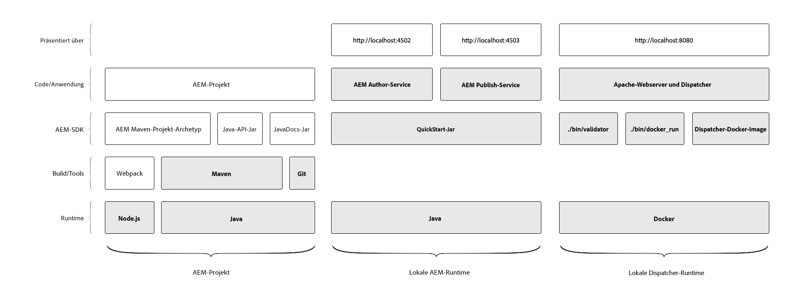

# Umgebung für lokale Entwicklung einrichten

Dieses Lernprogramm führt Sie durch die Einrichtung einer lokalen Entwicklungs-Umgebung für Adobe Experience Manager (AEM) mithilfe des AEM als Cloud Service-SDK. Dazu gehören die für die Entwicklung, Erstellung und Kompilierung AEM Projekte erforderlichen Entwicklungs-Tools sowie die Möglichkeit zur schnellen Überprüfung neuer Funktionen auf lokaler Ebene, bevor sie über Adobe Cloud Manager als Cloud Service AEM werden.

>[!VIDEO](https://video.tv.adobe.com/v/32565/?quality=12&learn=on)

Die örtliche Umgebung für AEM kann in drei logische Gruppen unterteilt werden:

+ Das __AEM Projekt__ enthält den benutzerdefinierten Code, die Konfiguration und den Inhalt, der die benutzerdefinierte AEM Anwendung ist.
+ Die __Local AEM Runtime__, die eine lokale Version der AEM Author- und Publish-Dienste lokal ausführt.
+ Die __Local Dispatcher Runtime__, die eine lokale Version von Apache HTTP Web Server und Dispatcher ausführt.

In diesem Lernprogramm wird erläutert, wie die im obigen Diagramm hervorgehobenen Elemente installiert und eingerichtet werden, um eine stabile lokale Entwicklungs-Umgebung für AEM Entwicklung zu gewährleisten.

## Dateisystemorganisation

In diesem Lernprogramm wurde der Speicherort des AEM als Cloud Service-SDK-Artefakte und AEM Projektcode wie folgt festgelegt:

+ `~/aem-sdk` ist ein Unternehmensordner mit den verschiedenen Tools, die vom AEM als Cloud Service-SDK bereitgestellt werden.
+ `~/aem-sdk/author` enthält den AEM Author-Dienst
+ `~/aem-sdk/publish` enthält den AEM Publish-Dienst
+ `~/aem-sdk/dispatcher` enthält die Dispatcher Tools
+ `~/code/<project name>` enthält den benutzerdefinierten AEM Project-Quellcode

Beachten Sie, dass `~` für das Benutzerverzeichnis kurz ist. Unter Windows entspricht dies `%HOMEPATH%`;

## Entwicklungstools für AEM Projekte

Das AEM-Projekt ist die benutzerspezifische Codebasis mit dem Code, der Konfiguration und dem Inhalt, der über Cloud Manager bereitgestellt wird, um als Cloud Service AEM zu werden. Die Projektstruktur wird über das [AEM Projekt Maven Archetype](https://github.com/adobe/aem-project-archetype) erstellt.

Dieser Abschnitt des Tutorials zeigt, wie:

+ Installieren [!DNL Java]
+ [!DNL Node.js] (und npm) installieren
+ Installieren [!DNL Maven]
+ Installieren [!DNL Git]

[Einrichten von Entwicklungstools für AEM Projekte](./development-tools.md)

## Lokale AEM Laufzeit

Das AEM als Cloud Service-SDK stellt eine [!DNL QuickStart Jar] bereit, die eine lokale Version von AEM ausführt. Das [!DNL QuickStart Jar] kann verwendet werden, um den AEM Author-Dienst oder den AEM Publish-Dienst lokal auszuführen. Beachten Sie, dass [!DNL QuickStart Jar] zwar eine lokale Entwicklungsumgebung bietet, jedoch nicht alle in AEM als Cloud Service verfügbaren Funktionen in [!DNL QuickStart Jar] enthalten sind.

Dieser Abschnitt des Tutorials zeigt, wie:

+ Installieren [!DNL Java]
+ AEM SDK herunterladen
+ Führen Sie die [!DNL AEM Author Service]
+ Führen Sie die [!DNL AEM Publish Service]

[Richten Sie die lokale AEM ein](./aem-runtime.md)

## Local [!DNL Dispatcher] Runtime

AEM als Cloud Service-SDKs Dispatcher Tools bieten alles, was zum Einrichten der lokalen [!DNL Dispatcher]-Laufzeit erforderlich ist. [!DNL Dispatcher] Die Tools sind  [!DNL Docker]auf Befehlszeilenwerkzeugen basieren, um  [!DNL Apache HTTP] Webserver- und  [!DNL Dispatcher] Konfigurationsdateien in kompatible Formate zu übertragen und sie für die  [!DNL Dispatcher] Ausführung im  [!DNL Docker] Container bereitzustellen.

Dieser Abschnitt des Tutorials zeigt, wie:

+ AEM SDK herunterladen
+ Tools installieren[!DNL Dispatcher]
+ Ausführen der lokalen [!DNL Dispatcher]-Laufzeit

[Einrichten der  [!DNL Dispatcher] LocalRuntime](./dispatcher-tools.md)
