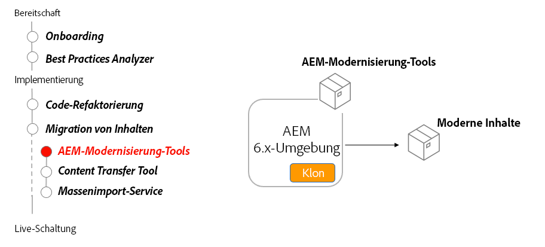

# AEM-Modernisierungs-Tools

Erfahren Sie, wie AEM Modernisierungs-Tools verwendet werden, um einen vorhandenen AEM Sites-Inhalt zu aktualisieren, damit er AEM as a Cloud Service kompatibel ist und mit Best Practices übereinstimmt.

## All-in-One-Konverter

>[!VIDEO](https://video.tv.adobe.com/v/338802?quality=12&learn=on)

## Seitenkonvertierung

>[!VIDEO](https://video.tv.adobe.com/v/338799?quality=12&learn=on)

## Komponentenkonvertierung

>[!VIDEO](https://video.tv.adobe.com/v/338788?quality=12&learn=on)

## Richtlinienimport

>[!VIDEO](https://video.tv.adobe.com/v/338797?quality=12&learn=on)

## Verwenden AEM Modernisierungs-Tools

AEM Modernisierungs-Tools konvertieren automatisch vorhandene AEM Seiten, die aus älteren statischen Vorlagen, Foundation-Komponenten und ParSys bestehen, um moderne Ansätze wie bearbeitbare Vorlagen, AEM WCM-Kernkomponenten und Layout-Container zu verwenden.

## Wichtigste Aktivitäten

+ Klonen Sie AEM 6.x-Produktion, um AEM Modernisierungs-Tools für auszuführen.
+ Laden Sie die [Die neuesten AEM-Modernisierungs-Tools](https://github.com/adobe/aem-modernize-tools/releases/latest) über den AEM 6.x-Produktionsklon über Package Manager

+ [Seitenstrukturkonverter](https://opensource.adobe.com/aem-modernize-tools/pages/structure/about.html) Aktualisiert vorhandenen Seiteninhalt von einer statischen Vorlage in eine zugeordnete bearbeitbare Vorlage mithilfe von Layout-Containern.
   + Definieren von Konversionsregeln mithilfe der OSGi-Konfiguration
   + Seitenstrukturkonverter für vorhandene Seiten ausführen

+ [Komponenten-Konverter](https://opensource.adobe.com/aem-modernize-tools/pages/component/about.html) Aktualisiert vorhandenen Seiteninhalt von einer statischen Vorlage in eine zugeordnete bearbeitbare Vorlage mithilfe von Layout-Containern.
   + Definieren von Konvertierungsregeln über JCR-Knotendefinitionen/XML
   + Ausführen des Komponenten Converter-Tools für vorhandene Seiten

+ [Policy Importer](https://opensource.adobe.com/aem-modernize-tools/pages/policy/about.html) erstellt Richtlinien aus der Designkonfiguration
   + Konvertierungsregeln mithilfe von JCR-Knotendefinitionen/XML definieren
   + Richtlinien-Importer mit vorhandenen Designdefinitionen ausführen
   + Anwenden importierter Richtlinien auf AEM Komponenten und Container

## Übungen

Wenden Sie Ihr Wissen an, indem Sie ausprobieren, was Sie mit dieser praktischen Übung gelernt haben.

Bevor Sie die praktische Übung testen, müssen Sie sich das Video und die folgenden Materialien angesehen und verstanden haben:

+ [Über AEM as a Cloud Service anders nachdenken](./introduction.md)
+ [Repository-Modernisierung](./repository-modernization.md)
+ [Veränderlicher und unveränderlicher Inhalt](../../developing/basics/mutable-immutable.md)
+ [AEM Projektstruktur](https://experienceleague.adobe.com/docs/experience-manager-cloud-service/implementing/developing/aem-project-content-package-structure.html?lang=de)

Stellen Sie außerdem sicher, dass Sie die vorherige praktische Übung abgeschlossen haben:

+ [Praktisches Training von BPA und CAM](./bpa-and-cam.md#hands-on-exercise)

<table style="border-width:0">
    <tr>
        <td style="width:150px">
                    
        </td>
        <td style="width:100%;margin-bottom:1rem;">
            
Weiterführende AEM

            

                Erfahren Sie, wie Sie mit AEM Modernisierungs-Tools eine alte WKND-Site aktualisieren können, um AEM as a Cloud Service Best Practices zu entsprechen.
            

            <a  rel="noreferrer"
                target="_blank"
                href="https://github.com/adobe/aem-cloud-engineering-video-series-exercises/tree/session2-migration#bootcamp---session-2-migration-methodology" class="spectrum-Button spectrum-Button--primary spectrum-Button--sizeM">
                Testen Sie die AEM Modernisierungs-Tools.
            </a>
        </td>
    </tr>
</table>

## Sonstige Ressourcen

+ [Herunterladen AEM Modernisierungs-Tools](https://github.com/adobe/aem-modernize-tools/releases/latest)
+ [Dokumentation zu AEM Modernisierungs-Tools](https://opensource.adobe.com/aem-modernize-tools/)
+ [AEM Gems - Einführung in die AEM-Modernisierungs-Suite](https://helpx.adobe.com/experience-manager/kt/eseminars/gems/Introducing-the-AEM-Modernization-Suite.html)

1. Stellen Sie die neu modernisierte wknd-legacy-Site im lokalen AEM SDK bereit. AEM ASK kann hier heruntergeladen werden:
   + [Software Distribution-Portal](https://experience.adobe.com/#/downloads/content/software-distribution/en/general.html).
