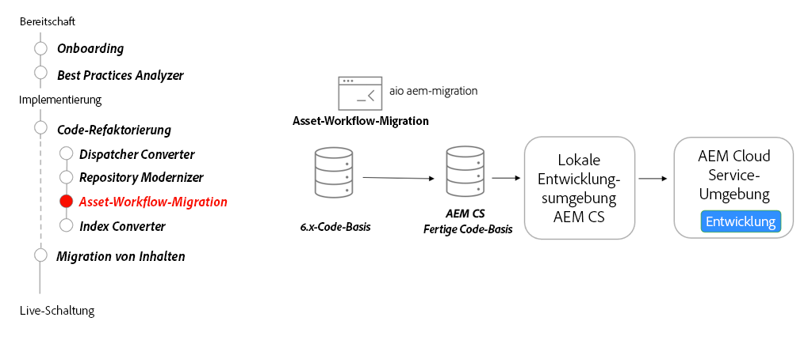

# AEM Assets-Microservices – Umstellen auf AEM as a Cloud Service

Erfahren Sie, wie Sie mit den Asset Compute-Microservices von AEM Assets as a Cloud Service automatisch und effizient eine beliebige Ausgabedarstellung für Ihre Assets generieren können. Dadurch wird diese Rolle des herkömmlichen AEM-Workflows ersetzt.

>[!VIDEO](https://video.tv.adobe.com/v/336990?quality=12&learn=on)

## Workflow-Migrations-Tool

Verwenden Sie als Teil der Refaktorierung Ihrer Code-Basis das [Asset-Workflow-Migrations-Tool](https://experienceleague.adobe.com/docs/experience-manager-cloud-service/moving/refactoring-tools/asset-workflow-migration-tool.html?lang=de), um bestehende Workflows zu migrieren und die Asset Compute-Microservices in AEM as a Cloud Service zu verwenden.

## Wichtigste Aktivitäten

+ Verwenden Sie das Tool [Adobe I/O Workflow Migrator](https://github.com/adobe/aio-cli-plugin-aem-cloud-service-migration#command-aio-aem-migrationworkflow-migrator), um Asset-Verarbeitungs-Workflows zur Verwendung der Asset Compute-Microservices zu migrieren.
+ Richten Sie eine [lokale Entwicklungsumgebung](https://experienceleague.adobe.com/docs/experience-manager-learn/cloud-service/local-development-environment-set-up/overview.html?lang=de) ein und stellen Sie die aktualisierten Workflows bereit. Für komplexe Workflows kann eine manuelle Anpassung erforderlich sein.
+ Führen Sie die Iteration in einer lokalen Entwicklungsumgebung mit dem AEM SDK fort, bis der aktualisierte Workflow mit der Funktionsparität übereinstimmt.
+ Stellen Sie die aktualisierte Code-Basis in einer AEM as a Cloud Service-Entwicklungsumgebung bereit und fahren Sie mit der Validierung fort.

## Praktische Übung

Wenden Sie Ihr Wissen an, indem Sie ausprobieren, was Sie mit dieser praktischen Übung gelernt haben.

Vergewissern Sie sich, dass Sie das obige Video und die folgenden Materialien gesehen und verstanden haben, bevor Sie die praktische Übung durchführen:

+ [Anders denken über AEM as a Cloud Service](./introduction.md)
+ [Onboarding](./onboarding.md)

Stellen Sie außerdem sicher, dass Sie die vorherige praktische Übung abgeschlossen haben:

+ [Praktische Übung zum Suchen und Indizieren](./search-and-indexing.md#hands-on-exercise)

<table style="border-width:0">
    <tr>
        <td style="width:150px">
                    
        </td>
        <td style="width:100%;margin-bottom:1rem;">
            
Vorgehensweise beim Hochladen von Assets

            

                Erfahren Sie, wie Sie AEM Assets-Verarbeitungsprofile definieren sowie Ordnern zuweisen und Assets mit dem npm-CLI-Modul „aem-upload“ in AEM hochladen.
            

            <a  rel="noreferrer"
                target="_blank"
                href="https://github.com/adobe/aem-cloud-engineering-video-series-exercises/tree/session8-assets#cloud-acceleration-bootcamp---session-8-assets-and-microservices" class="spectrum-Button spectrum-Button--primary spectrum-Button--sizeM">
Asset-Management ausprobieren
</a>
        </td>
    </tr>
</table>
