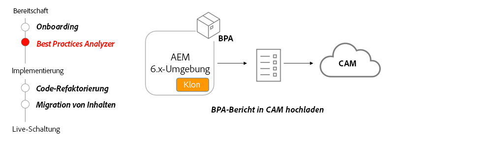

# Best Practices Analyzer und Cloud Acceleration Manager

Erfahren Sie, inwiefern Best Practices Analyzer (BPA) und Cloud Acceleration Manager (CAM) eine benutzerdefinierte Anleitung für Migrationen auf AEM as a Cloud Service bereitstellen. 

>[!VIDEO](https://video.tv.adobe.com/v/336957?quality=12&learn=on)

## Verwenden von BPA und CAM

Das BPA-Paket sollte auf einem Klon der AEM 6.x-Produktionsumgebung installiert sein. BPA erstellt einen Bericht, der dann in CAM hochgeladen werden kann, um eine Anleitung für die wichtigsten Aktivitäten zu erhalten, die für die Umstellung auf AEM as a Cloud Service erforderlich sind.

## Wichtigste Aktivitäten

+ Erstellen Sie einen Klon Ihrer 6.x-Produktionsumgebung. Beim Migrieren von Inhalten und Refaktorieren von Code ist ein Klon der Produktionsumgebung nützlich, um verschiedene Tools und Änderungen zu testen.
+ Laden Sie das neueste BPA-Tool aus dem [Software Distribution Portal](https://experience.adobe.com/#/downloads/content/software-distribution/de/aemcloud.html) herunter und installieren Sie es in Ihrer geklonten AEM 6.x-Umgebung.
+ Verwenden Sie das BPA-Tool, um einen Bericht zu erstellen, der in Cloud Acceleration Manager (CAM) hochgeladen werden kann. Der Zugriff auf CAM erfolgt über [https://experience.adobe.com/de/](https://experience.adobe.com/) > **Experience Manager** > **Cloud Acceleration Manager**.
+ Verwenden Sie CAM, um zu erfahren, welche Aktualisierungen an der aktuellen Code-Basis und Umgebung vorgenommen werden müssen, um zu AEM as a Cloud Service wechseln zu können.

## Praktische Übung

Wenden Sie Ihr Wissen an, indem Sie ausprobieren, was Sie mit dieser praktischen Übung gelernt haben.

Vergewissern Sie sich, dass Sie das obige Video und die folgenden Materialien gesehen und verstanden haben, bevor Sie die praktische Übung durchführen:

+ [Anders denken über AEM as a Cloud Service](./introduction.md)
+ [Was ist AEM as a Cloud Service?](https://experienceleague.adobe.com/docs/experience-manager-learn/cloud-service/introduction/what-is-aem-as-a-cloud-service.html?lang=de)
+ [Architektur von AEM as a Cloud Service](https://experienceleague.adobe.com/docs/experience-manager-learn/cloud-service/introduction/architecture.html?lang=de)
+ [Veränderliche und unveränderliche Inhalte](https://experienceleague.adobe.com/docs/experience-manager-learn/cloud-service/developing/basics/mutable-immutable.html?lang=de)
+ [Unterschiede bei der Entwicklung für AEM as a Cloud Service und AEM 6.x](https://experienceleague.adobe.com/docs/experience-manager-cloud-service/implementing/developing/development-guidelines.html?lang=de#developing)

<table style="border-width:0">
    <tr>
        <td style="width:150px">
                    
        </td>
        <td style="width:100%;margin-bottom:1rem;">
            
Praktische Best Practices Analyzer-Übung

            

                Erkunden Sie Best Practices Analyzer (BPA) und überprüfen Sie die Ergebnisse, indem Sie dieses Tool für eine ältere WKND-Code-Basis ausführen, die Beispiele für Verstöße enthält.
            

            <a  rel="noreferrer"
                target="_blank"
                href="https://github.com/adobe/aem-cloud-engineering-video-series-exercises/tree/session1-differently#bootcamp---session-1-introduction-and-thinking-differently" class="spectrum-Button spectrum-Button--primary spectrum-Button--sizeM">
Best Practices Analyzer ausprobieren
</a>
        </td>
    </tr>
</table>

## Sonstige Ressourcen

+ [Best Practices Analyzer herunterladen](https://experience.adobe.com/#/downloads/content/software-distribution/de/aemcloud.html?fulltext=Best*+Practices*+Analyzer*&amp;orderby=%40jcr%3Acontent%2Fjcr%3AlastModified&amp;orderby.sort=desc&amp;layout=list&amp;p.offset=0&amp;p.limit=1)