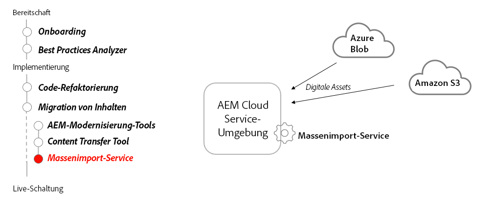

# Massenimport-Dienst

Erfahren Sie, wie AEM as a Cloud Services Bulk Import Service zum Importieren von Assets aus Nicht-AEM-Quellen verwendet werden kann.

>[!VIDEO](https://video.tv.adobe.com/v/336969/?quality=12&learn=on)

## Verwenden des Bulk Import-Dienstes

Der Bulk Import Service wird verwendet, um im Azure Blob Storage- oder Amazon S3-Speicher gespeicherte Dateien in AEM as a Cloud Service als Assets zu übertragen.

### Wichtigste Aktivitäten

+ Laden Sie die zu importierenden Dateien in Ihren Cloud-Speicher-Provider hoch (Azure Blob Storage oder Amazon S3).
+ Konfigurieren Sie den Bulk Import Service von AEM as a Cloud Service Author-Dienst und führen Sie ihn aus.
+ Führen Sie den Bulk Service Importer als einmaligen Import aus oder planen Sie einen regelmäßigen Import.

### Sonstige -Ressourcen

+ [Adobe-Entwickler-Live-Sitzung zur Asset-Erfassung](https://experienceleague.adobe.com/docs/adobe-developers-live-events/events/2021/feb2021/asset-bulk-ingestion.html?lang=en)

