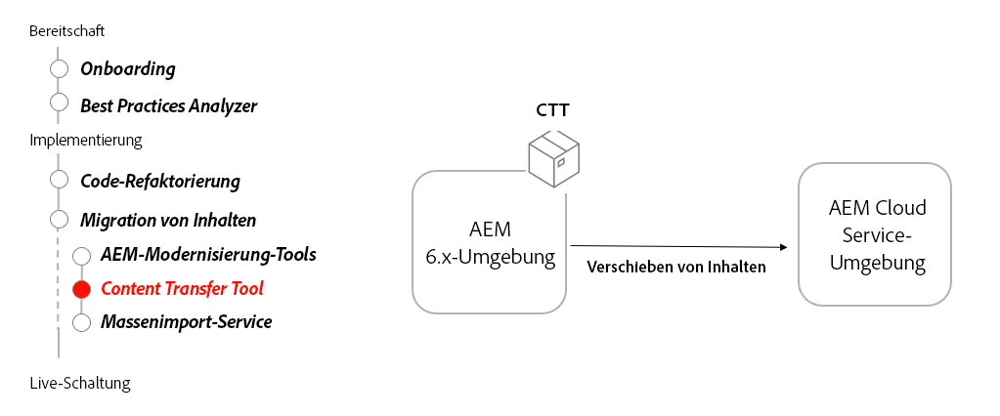

# Content Transfer Tool

Erfahren Sie, wie Sie mit dem Content Transfer Tool Inhalte von AEM 6.3 oder höher auf AEM as a Cloud Service migrieren können.

>[!VIDEO](https://video.tv.adobe.com/v/336970?quality=12&learn=on)

## Verwenden des Content Transfer Tools

Das Content Transfer Tool wird auf AEM 6.3 oder höher installiert und überträgt Inhalte an AEM as a Cloud Service.

## Wichtigste Aktivitäten

+ Laden Sie die [neueste Version des Content Transfer Tools](https://experience.adobe.com/#/downloads/content/software-distribution/en/aemcloud.html?fulltext=Content*+Transfer*+Tool*&amp;1_group.propertyvalues.property=.%2Fjcr%3Acontent%2Fmetadata%2Fdc%3AsoftwareType&amp;1_group.propertyvalues.operation=equals&amp;1_group.propertyvalues.0_values=software-type%3Atooling&amp;orderby=%40jcr%3Acontent%2Fjcr%3AlastModified&amp;orderby.sort=desc&amp;layout=list&amp;p.offset=0&amp;p.limit=2) herunter.
+ Übertragen Sie den finalen Inhalt von AEM Author 6.3 oder höher an den Author-Service von AEM as a Cloud Service.
   + Installieren Sie das Content Transfer Tool auf AEM Author 6.3 oder höher, welches den endgültigen Inhalt für die Übertragung enthält.
   + Führen Sie das Content Transfer-Tool stapelweise aus, um Inhaltssätze zu übertragen.
+ Übertragen Sie Endinhalte von AEM Publish 6.3 oder höher an den Publish-Service von AEM as a Cloud Service.
   + Installieren Sie das Content Transfer Tool auf AEM Publish 6.3 oder höher, welches den endgültigen Inhalt für die Übertragung enthält.
   + Führen Sie das Content Transfer-Tool stapelweise aus, um Inhaltssätze zu übertragen.
+ Optional können Sie Inhalte auf AEM as a Cloud Service „auffüllen“, indem Sie Inhalte, die seit der letzten Inhaltsübertragung neu sind, übertragen.

## Praktische Übung

Wenden Sie Ihr Wissen an, indem Sie ausprobieren, was Sie mit dieser praktischen Übung gelernt haben.

Vergewissern Sie sich, dass Sie das obige Video und die folgenden Materialien gesehen und verstanden haben, bevor Sie die praktische Übung durchführen:

+ [AEM-Modernisierungs-Tools](../aem-modernization-tools.md)
+ [Onboarding](../onboarding.md)
+ [Cloud Manager](../cloud-manager.md)

Stellen Sie außerdem sicher, dass Sie die vorherige praktische Übung abgeschlossen haben:

+ [Praktische Dispatcher-Übung](../dispatcher.md#hands-on-exercise)

<table style="border-width:0">
    <tr>
        <td style="width:150px">
                    
        </td>
        <td style="width:100%;margin-bottom:1rem;">
            
Praktische Content Transfer Tool-Übung

            

                Erfahren Sie, wie das Content Transfer Tool Inhalte automatisch von AEM 6 auf AEM as a Cloud Service verschieben kann.
            

            <a  rel="noreferrer"
                target="_blank"
                href="https://github.com/adobe/aem-cloud-engineering-video-series-exercises/tree/session6-transfercontent#cloud-acceleration-bootcamp---session-6-content" class="spectrum-Button spectrum-Button--primary spectrum-Button--sizeM">
 Content Transfer Tool ausprobieren
 </a>
        </td>
    </tr>
</table>

## Sonstige Ressourcen

+ [Content Transfer Tool herunterladen](https://experience.adobe.com/#/downloads/content/software-distribution/en/aemcloud.html?fulltext=Content*+Transfer*+Tool*&amp;1_group.propertyvalues.property=.%2Fjcr%3Acontent%2Fmetadata%2Fdc%3AsoftwareType&amp;1_group.propertyvalues.operation=equals&amp;1_group.propertyvalues.0_values=software-type%3Atooling&amp;orderby=%40jcr%3Acontent%2Fjcr%3AlastModified&amp;orderby.sort=desc&amp;layout=list&amp;p.offset=0&amp;p.limit=2)
+ [Anleitungsvideo zum Massenimport-Dienst](https://experienceleague.adobe.com/docs/experience-manager-learn/cloud-service/migration/bulk-import.html?lang=de)

