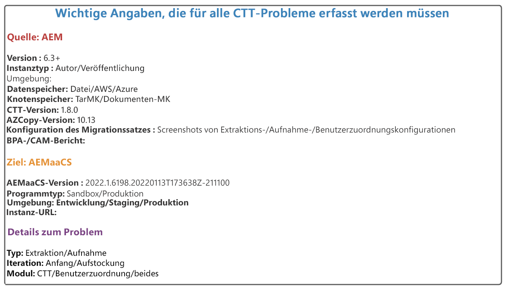
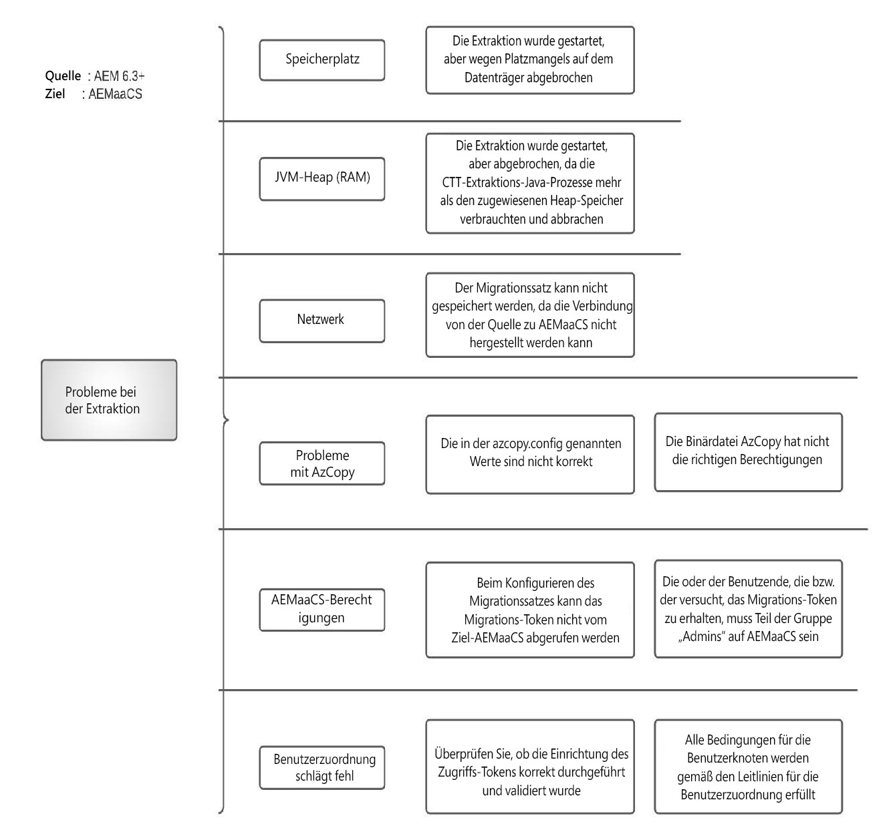
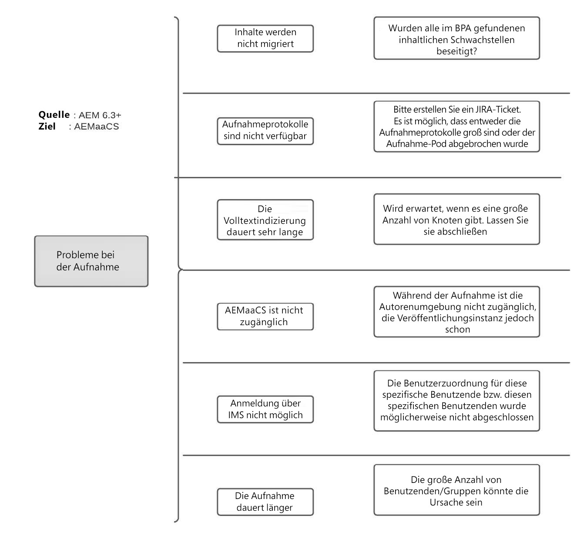

# Häufig gestellte Fragen zur Migration as a Cloud Service Inhalte AEM

Erhalten Sie Antworten auf häufig gestellte Fragen zur Migration von Inhalten auf AEM as a Cloud Service.

## Terminologie

+ **AEMaaCS**: [AEM as a Cloud Service](https://experienceleague.adobe.com/docs/experience-manager-cloud-service/content/overview/introduction.html?lang=de)
+ **BPA**: [Best Practices Analyzer](https://experienceleague.adobe.com/docs/experience-manager-cloud-service/content/migration-journey/cloud-migration/best-practices-analyzer/overview-best-practices-analyzer.html)
+ **CTT**: [Content Transfer Tool](https://experienceleague.adobe.com/docs/experience-manager-cloud-service/content/migration-journey/cloud-migration/content-transfer-tool/overview-content-transfer-tool.html?lang=de)
+ **CAM**: [Cloud Acceleration Manager](https://experienceleague.adobe.com/docs/experience-manager-cloud-service/content/migration-journey/cloud-acceleration-manager/using-cam/getting-started-cam.html)
+ **IMS**: [Identity Management-System](https://experienceleague.adobe.com/docs/experience-manager-cloud-service/content/security/ims-support.html?lang=de)
+ **DM**: [Dynamic Media](https://experienceleague.adobe.com/docs/experience-manager-cloud-service/content/assets/dynamicmedia/dm-journey/dm-journey-part1.html)

Verwenden Sie die unten stehende Vorlage, um weitere Informationen beim Erstellen von Support-Tickets für Adoben im Zusammenhang mit CTT zu erhalten.

 { align=&quot;center&quot; }

## Allgemeine Fragen zur Inhaltsmigration

### F: Welche Methoden gibt es, um Inhalte als Cloud Services in AEM zu migrieren?

Es stehen drei verschiedene Methoden zur Verfügung

+ Verwenden des Content Transfer Tool (AEM 6.3+ → AEMaaCS)
+ Über Package Manager (AEM → AEMaaCS)
+ Vordefinierter Bulk Import Service für Assets (S3/Azure → AEMaaCS)

### F: Gibt es eine Begrenzung für die Menge an Inhalten, die mit CTT übertragen werden können?

Anzahl CTT als Tool könnte aus AEM Quelle extrahieren und in AEMaaCS aufnehmen. Es gibt jedoch bestimmte Einschränkungen auf der AEMaaCS-Plattform, die vor der Migration berücksichtigt werden sollten.

Weitere Informationen finden Sie unter [Voraussetzungen für die Cloud-Migration](https://experienceleague.adobe.com/docs/experience-manager-cloud-service/content/migration-journey/cloud-migration/content-transfer-tool/prerequisites-content-transfer-tool.html).

### F: Ich habe den neuesten BPA-Bericht aus meinem Quellsystem, was soll ich damit machen?

Exportieren Sie den Bericht als CSV-Datei und laden Sie ihn dann in Cloud Acceleration Manager hoch. [Ihrer IMS-Organisation zugeordnet sind](https://experienceleague.adobe.com/docs/experience-manager-cloud-service/content/migration-journey/cloud-acceleration-manager/using-cam/getting-started-cam.html). Gehen Sie dann den Überprüfungsprozess wie folgt durch: [in der Bereitschaftsphase beschrieben](https://experienceleague.adobe.com/docs/experience-manager-cloud-service/content/migration-journey/cloud-acceleration-manager/using-cam/cam-readiness-phase.html).

Bitte überprüfen Sie die vom Tool bereitgestellte Code- und Inhaltskomplexitätsbewertung und notieren Sie sich die zugehörigen Aktionselemente, die zu einem Rückstand bei der Code-Refaktorierung oder einer Cloud-Migrationsbewertung führen.

### F: Wird empfohlen, die Quellautor-Komponente zu extrahieren und sie in AEMaaCS-Autoren und -Veröffentlichungen aufzunehmen?

Es wird immer empfohlen, eine 1:1-Extraktion und -Aufnahme zwischen der Autoren- und der Veröffentlichungsstufe durchzuführen. Trotzdem ist es akzeptabel, den Autor der Quellproduktion zu extrahieren und in die Entwicklungs-, Staging- und Produktions-CS zu integrieren.

### F: Gibt es eine Möglichkeit, die Zeit zu schätzen, es dauert, den Inhalt mithilfe von CTT von der AEM in AEMaaCS zu migrieren?

Da der Migrationsprozess von der Breite des Internetbands, dem für den CTT-Prozess zugewiesenen Heap, dem verfügbaren freien Speicher und dem Datenträger-I/O abhängt, die für jedes Quellsystem subjektiv sind, wird empfohlen, die Migration zum Testversand frühzeitig auszuführen und diese Datenpunkte zu extrapolieren, um Schätzungen zu erhalten.

### F: Wie wirkt sich die Leistung AEM Quelle aus, wenn ich den CTT-Extraktionsprozess starte?

Das CTT-Tool läuft in einem eigenen Java™-Prozess, der bis zu 4gb-Heap benötigt, der über die OSGi-Konfiguration konfigurierbar ist. Diese Zahl kann sich ändern, aber Sie können für den Java™-Prozess grüßen und das herausfinden.

Wenn AZCopy installiert ist und/oder die Option/Validierung der Vorkopie aktiviert ist, verbraucht der AZCopy-Prozess CPU-Zyklen.

Neben jvm verwendet das Tool auch Disk IO, um die Daten auf einem temporären temporären temporären Speicherplatz zu speichern, der nach dem Extraktionszyklus bereinigt wird. Neben RAM, CPU und Datenträger IO verwendet das CTT-Tool auch die Netzwerkbandbreite des Quellsystems, um Daten in Azure Blob Store hochzuladen.

Die Menge der Ressourcen, die der CTT-Extraktionsprozess benötigt, hängt von der Anzahl der Knoten, der Anzahl der Blobs und ihrer aggregierten Größe ab. Es ist schwierig, eine Formel bereitzustellen. Daher wird empfohlen, einen kleinen Migrationsnachweis auszuführen, um die Aktualisierungsanforderungen für den Quellserver zu ermitteln.

Wenn Klonumgebungen für die Migration verwendet werden, hat dies keine Auswirkungen auf die Ressourcenauslastung des Live-Produktionsservers, sondern hat eigene Nachteile bei der Synchronisierung von Inhalten zwischen der Live-Produktion und dem Klon

### F: In meinem Quellautorensystem haben wir SSO so konfiguriert, dass sich die Benutzer bei der -Autoreninstanz authentifizieren können. Muss ich in diesem Fall die Funktion &quot;Benutzerzuordnung&quot;von CTT verwenden?

Die kurze Antwort lautet: &quot;**Ja**&quot;.

Extraktion und Aufnahme mittels CTT **without** Benutzerzuordnung migriert nur den Inhalt, die zugehörigen Prinzipien (Benutzer, Gruppen) von der Quell-AEM zu AEMaaCS. Diese Benutzer (Identitäten) müssen jedoch in Adobe IMS vorhanden sein und Zugriff auf die AEMaaCS-Instanz (bereitgestellt) haben, damit sie sich erfolgreich authentifizieren können. Die Aufgabe von [Tool für Benutzerzuordnung](https://experienceleague.adobe.com/docs/experience-manager-cloud-service/content/migration-journey/cloud-migration/content-transfer-tool/legacy-user-mapping-tool/overview-user-mapping-tool-legacy.html) ist es, den lokalen AEM Benutzer dem IMS-Benutzer zuzuordnen, damit Authentifizierung und Berechtigungen zusammenarbeiten.

In diesem Fall wird der SAML-Identitäts-Provider für Adobe IMS so konfiguriert, dass entweder Federated/Enterprise ID verwendet wird, anstatt den Authentifizierungs-Handler direkt AEM zu verwenden.

### F: In meinem Quellautorensystem haben wir eine einfache Authentifizierung konfiguriert, damit sich die Benutzer bei lokalen AEM in der -Autoreninstanz authentifizieren können. Muss ich in diesem Fall die Funktion &quot;Benutzerzuordnung&quot;von CTT verwenden?

Die kurze Antwort lautet: &quot;**Ja**&quot;.

Die CTT-Extraktion und -Aufnahme ohne Benutzerzuordnung migriert den Inhalt und die zugehörigen Prinzipien (Benutzer, Gruppen) von der Quell-AEM zu AEMaaCS. Diese Benutzer (Identitäten) müssen jedoch in Adobe IMS vorhanden sein und Zugriff auf die AEMaaCS-Instanz (bereitgestellt) haben, damit sie sich erfolgreich authentifizieren können. Die Aufgabe von [Tool für Benutzerzuordnung](https://experienceleague.adobe.com/docs/experience-manager-cloud-service/content/migration-journey/cloud-migration/content-transfer-tool/legacy-user-mapping-tool/overview-user-mapping-tool-legacy.html) ist es, den lokalen AEM Benutzer dem IMS-Benutzer zuzuordnen, damit Authentifizierung und Berechtigungen zusammenarbeiten.

In diesem Fall verwenden die Benutzer die persönliche Adobe ID und die Adobe ID wird vom IMS-Administrator für die Bereitstellung des Zugriffs auf AEMaaCS verwendet.

### F: Was bedeuten die Begriffe &quot;wischen&quot;und &quot;überschreiben&quot;im Kontext der CTT?

Im Kontext von [Extraktionsphase](https://experienceleague.adobe.com/docs/experience-manager-cloud-service/content/migration-journey/cloud-migration/content-transfer-tool/getting-started-content-transfer-tool.html?lang=en#extraction-setup-phase), sind die Optionen entweder, um die Daten im Staging-Container aus vorherigen Extraktionszyklen zu überschreiben, oder die Differenz (hinzugefügt/aktualisiert/gelöscht) hinzuzufügen. Der Staging-Container ist nichts anderes, als der Blob-Speicher-Container, der mit dem Migrationssatz verknüpft ist. Jeder Migrationssatz erhält einen eigenen Staging-Container.

Im Kontext von [Aufnahmephase](https://experienceleague.adobe.com/docs/experience-manager-cloud-service/content/migration-journey/cloud-migration/content-transfer-tool/ingesting-content.html?lang=de), sind die Optionen + , um das gesamte Inhalts-Repository von AEMaaCS zu ersetzen oder den differenziellen (hinzugefügten/aktualisierten/gelöschten) Inhalt aus dem Staging-Migrationsbehälter zu synchronisieren.

### F: Es gibt mehrere Websites, verknüpfte Assets, Benutzer und Gruppen im Quellsystem. Ist es möglich, sie stufenweise zu AEMaaCS zu migrieren?

Ja, es ist möglich, erfordert jedoch eine sorgfältige Planung in Bezug auf:

+ Erstellen der Migrationssätze unter der Annahme, dass die Sites, Assets in ihre jeweiligen Hierarchien eingebunden sind
   + Überprüfen Sie, ob es zulässig ist, alle Assets als Teil eines Migrationssatzes zu migrieren und dann die Sites, die sie verwenden, in Phasen zu laden.
+ Im aktuellen Status stellt der Authoring-Erfassungsvorgang die Autoreninstanz für die Inhaltserstellung nicht zur Verfügung, obwohl die Veröffentlichungsstufe den Inhalt weiterhin bereitstellen kann
   + Das bedeutet, bis die Aufnahme in der Autoreninstanz abgeschlossen ist, werden die Content-Authoring-Aktivitäten eingefroren

Lesen Sie vor der Planung der Migration die Beschreibung des Auffüllextraktions- und Aufnahmeprozesses.

### F: Sind meine Websites für Endbenutzer verfügbar, auch wenn die Aufnahme in die AEMaaCS-Autoren- oder Veröffentlichungsinstanz erfolgt?

Ja. Der Traffic der Endbenutzer wird nicht durch die Inhaltsmigrationsaktivität unterbrochen. Die Autorenaufnahme friert jedoch die Inhaltsbearbeitung ein, bis sie abgeschlossen ist.

### F: Der BPA-Bericht zeigt Elemente im Zusammenhang mit fehlenden Original-Ausgabeformaten an. Sollte ich sie vor der Extraktion an der Quelle bereinigen?

Ja. Das fehlende ursprüngliche Ausgabeformat bedeutet, dass die Asset-Binärdatei überhaupt nicht ordnungsgemäß hochgeladen wurde. Wenn Sie es als fehlerhafte Daten betrachten, überprüfen Sie, sichern Sie sie nach Bedarf mit Package Manager und entfernen Sie sie aus der AEM, bevor Sie die Extraktion ausführen. Die fehlerhaften Daten haben negative Ergebnisse bei den Asset-Verarbeitungsschritten.

### F: Der BPA-Bericht enthält Elemente zu fehlenden `jcr:content` Knoten für Ordner. Was soll ich mit ihnen machen?

Wann `jcr:content` fehlt auf Ordnerebene, jede Aktion zum Übertragen von Einstellungen wie Verarbeitungsprofilen usw. von Eltern werden auf dieser Ebene brechen. Bitte überprüfen Sie den Grund für das Fehlschlagen `jcr:content`. Obwohl diese Ordner migriert werden können, beachten Sie bitte, dass diese Ordner das Benutzererlebnis beeinträchtigen und später zu unnötigen Fehlerbehebungszyklen führen.

### F: Ich habe einen Migrationssatz erstellt. Ist es möglich, die Größe zu überprüfen?

Ja, es gibt eine [Größe überprüfen](https://experienceleague.adobe.com/docs/experience-manager-cloud-service/content/migration-journey/cloud-migration/content-transfer-tool/getting-started-content-transfer-tool.html#migration-set-size) -Funktion, die Teil der CTT ist.

### F: Ich führe die Migration durch (Extraktion, Aufnahme). Ist es möglich zu überprüfen, ob alle meine extrahierten Inhalte in die Zielgruppe aufgenommen werden?

Ja, es gibt eine [Validierung](https://experienceleague.adobe.com/docs/experience-manager-cloud-service/content/migration-journey/cloud-migration/content-transfer-tool/validating-content-transfers.html) -Funktion, die Teil der CTT ist.

### F: Mein Kunde muss Inhalte zwischen AEMaaCS-Umgebungen verschieben, z. B. von AEMaaCS Dev zu AEMaaCS Stage oder AEMaaCS Prod. Kann ich für diese Anwendungsfälle das Tool zur Inhaltsübertragung verwenden?

Leider nein. Das Anwendungsbeispiel von CTT besteht darin, Inhalte von der lokalen/AMS-gehosteten Quelle AEM 6.3+ in AEMaaCS-Cloud-Umgebungen zu migrieren. [Bitte lesen Sie die CTT-Dokumentation](https://experienceleague.adobe.com/docs/experience-manager-cloud-service/content/migration-journey/cloud-migration/content-transfer-tool/overview-content-transfer-tool.html?lang=de).

### F: Welche Probleme sind bei der Extraktion zu erwarten?

Die Extraktionsphase ist ein involvierter Prozess, bei dem mehrere Aspekte wie erwartet funktionieren. Wenn Sie sich der verschiedenen Arten von Problemen bewusst sind, die auftreten können, und wie diese gemindert werden können, erhöht sich der Gesamterfolg der Inhaltsmigration.

Die öffentliche Dokumentation wird auf der Grundlage der Erkenntnisse kontinuierlich verbessert, aber hier sind einige allgemeine Problemkategorien und mögliche Ursachen.

 { align=&quot;center&quot; }

### F: Welche Probleme werden bei der Aufnahme erwartet?

Die Aufnahmephase erfolgt vollständig in der Cloud-Plattform und erfordert Hilfe von den Ressourcen, die Zugriff auf die AEMaaCS-Infrastruktur haben. Bitte erstellen Sie ein Support-Ticket für weitere Hilfe.

Im Folgenden finden Sie mögliche Problemkategorien (bitte betrachten Sie dies nicht als exklusive Liste)

 { align=&quot;center&quot; }

### F: Muss mein Quellserver über eine ausgehende Internetverbindung verfügen, damit CTT funktioniert?

Die kurze Antwort lautet: &quot;**Ja**&quot;.

Der CTT-Prozess erfordert eine Verbindung zu den folgenden Ressourcen:

+ Die AEM as a Cloud Service-Zielumgebung: `author-p<program_id>-e<env_id>.adobeaemcloud.com`
+ Der Azure Blob Datenspeicherungs-Service: `casstorageprod.blob.core.windows.net`
+ Der IO-Endpunkt der Benutzerzuordnung: `usermanagement.adobe.io`

Weitere Informationen finden Sie in der Dokumentation . [Quellenverbindung](https://experienceleague.adobe.com/docs/experience-manager-cloud-service/content/migration-journey/cloud-migration/content-transfer-tool/getting-started-content-transfer-tool.html#source-environment-connectivity).

## Dynamic Media-bezogene Fragen zur Asset-Verarbeitung

### F: Werden Assets nach der Aufnahme in AEMaaCS automatisch erneut verarbeitet?

Anzahl Um die Assets zu verarbeiten, muss die Anforderung zur erneuten Verarbeitung initiiert werden.

### F: Werden Assets nach der Aufnahme in AEMaaCS automatisch neu indiziert?

Ja. Die Assets werden basierend auf den in AEMaaCS verfügbaren Indexdefinitionen neu indiziert.

### F: Die AEM hat eine Integration mit Dynamic Media. Gibt es bestimmte Dinge, die vor der Inhaltsmigration berücksichtigt werden müssen?

Ja, beachten Sie Folgendes, wenn AEM über eine Dynamic Media-Integration verfügt.

+ AEMaaCS unterstützt nur den Dynamic Media Scene7-Modus. Wenn sich das Quellsystem im Hybridmodus befindet, ist die DM-Migration in den Scene7-Modus erforderlich.
+ Wenn der Ansatz darin besteht, von Quell-Klon-Instanzen zu migrieren, ist es sicher, die DM-Integration für den Klon zu deaktivieren, der für CTT verwendet wird. Dieser Schritt dient lediglich dazu, Schreibvorgänge in DM zu vermeiden oder das Laden von DM-Traffic zu vermeiden.
+ Beachten Sie, dass CTT Knoten, Metadaten eines Migrationssatzes von der AEM in AEMaaCS migriert. Es werden keine Vorgänge für DM direkt ausgeführt.

### F: Was sind unterschiedliche Migrationsansätze, wenn die DM-Integration auf der AEM vorhanden ist?

Bitte lesen Sie die obige Frage und Antwort vorher

(Dies sind zwei mögliche Optionen, aber nicht nur diese beiden). Es hängt davon ab, wie der Kunde die UAT-Methode, Leistungstests, die verfügbare Umgebung und ob ein Klon für die Migration verwendet wird oder nicht. Bitte beachten Sie diese beiden als Ausgangspunkt für die Diskussion

**Option 1**

Wenn sich die Anzahl der Assets/Knoten in der Quellumgebung im unteren Ende (~100K) befindet und angenommen wird, dass diese über einen Zeitraum von 24 + 72 Stunden migriert werden können, einschließlich Extraktion und Aufnahme, ist der bessere Ansatz

+ Direkte Migration von der Produktion durchführen
+ Führen Sie eine erste Extraktion und Aufnahme in AEMaaCS mit `wipe=true`
   + Dieser Schritt migriert alle Knoten und Binärdateien
+ Arbeiten Sie weiterhin am On-Premise-/AMS-Prod-Autor
+ Führen Sie von nun an alle anderen Migrationszyklen mit `wipe=true`
   + Beachten Sie, dass dieser Vorgang den vollständigen Knotenspeicher migriert, jedoch nur geänderte Blobs anstelle ganzer Blobs. Die vorherigen Blobs befinden sich im Azure-Blobspeicher der AEMaaCS-Zielinstanz.
   + Verwenden Sie diesen Migrationsnachweis zur Messung der Migrationsdauer, des Benutzerzugs, des Tests, der Validierung aller anderen Funktionen.
+ Führen Sie vor der Woche der Live-Schaltung eine Migration vom Typ &quot;wp=true&quot;durch.
   + Verbinden der Dynamic Media mit AEMaaCS
   + Trennen Sie die DM-Konfiguration von AEM lokalen Quelle.

Mit dieser Option können Sie die Migration von eins zu eins ausführen, d. h. On-Premise Dev → AEMaaCS Dev usw. und verschieben Sie die DM-Konfigurationen aus den entsprechenden Umgebungen

(Für den Fall, dass die Migration von Clone aus geplant ist)

**Option 2**

+ Erstellen Sie den Klon des Produktionsautors, entfernen Sie die DM-Konfiguration aus Klon
+ On-Premise-Klon migrieren → AEMaaCS-Entwicklung/Staging
   + Verbinden des Produktions-DM-Unternehmens kurz mit der AEMaaCS-Entwicklungs-/Staging-Umgebung zu Validierungszwecken
   + Während die DM-Verbindung aktiv ist, vermeiden Sie die Asset-Aufnahme in AEMaaCS
   + Dadurch können sie CTT- und DM-spezifische Validierungen validieren
+ Sobald der Test auf AEMaaCS abgeschlossen ist
   + Führen Sie eine Wischmigration von der lokalen Staging- zur AEMaaCS-Staging-Umgebung durch

Führen Sie eine Wischmigration von der lokalen Entwicklung zu AEMaaCS Dev durch.

Der oben beschriebene Ansatz kann nur zur Messung der Migrationsdauer verwendet werden, erfordert jedoch eine spätere Bereinigung.

## Zusätzliche Ressourcen

+ [Tipps und Tricks für die Migration zum Experience Manager in der Cloud ( Summit 2022)](https://business.adobe.com/summit/2022/sessions/tips-and-tricks-for-migrating-to-experience-manage-tw109.html)

+ [Video der CTT Expert Series](https://experienceleague.adobe.com/docs/experience-manager-learn/cloud-service/migration/moving-to-aem-as-a-cloud-service/content-migration/content-transfer-tool.html)

+ [Videos aus Expertenreihen zu anderen AEMaaCS-Themen](https://experienceleague.adobe.com/docs/experience-manager-learn/cloud-service/expert-resources/aem-experts-series.html)
