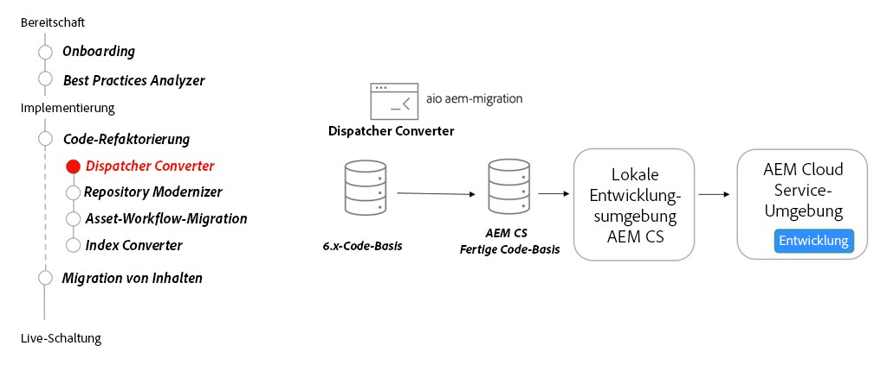

# Dispatcher

Erfahren Sie mehr über AEM Dispatcher für AEM as a Cloud Service mit Fokus auf wichtige Änderungen am Dispatcher für AEM 6, das Dispatcher-Konvertierungstool und die Verwendung des Dispatcher-Tools SDK.

>[!VIDEO](https://video.tv.adobe.com/v/336962?quality=12&learn=on)

## Dispatcher Converter

Verwenden Sie als Teil der Refaktorierung Ihrer Codebasis den [AEM Dispatcher Converter](https://experienceleague.adobe.com/docs/experience-manager-cloud-service/moving/refactoring-tools/dispatcher-transformation-utility-tools.html?lang=de), um bestehende On-Premise- oder Adobe Managed Services-Dispatcher-Konfigurationen zu einer AEM as a Cloud Service-kompatiblen Dispatcher-Konfiguration umzustrukturieren.

## Wichtigste Aktivitäten

+ Verwenden Sie das [Adobe I/O Dispatcher Converter-Tool](https://github.com/adobe/aio-cli-plugin-aem-cloud-service-migration#aio-aem-migrationdispatcher-converter), um eine vorhandene Dispatcher-Konfiguration zu migrieren.
+ Referenzieren Sie das Dispatcher-Modul aus dem [AEM Projektarchetyp](https://github.com/adobe/aem-project-archetype/tree/develop/src/main/archetype/dispatcher.cloud) als Best Practice.
+ [Richten Sie lokale Dispatcher-Tools ein](https://experienceleague.adobe.com/docs/experience-manager-learn/cloud-service/local-development-environment-set-up/dispatcher-tools.html?lang=de), um den Dispatcher vor dem Testen in einer Cloud Service-Umgebung zu validieren.

## Praktische Übung

Wenden Sie Ihr Wissen an, indem Sie ausprobieren, was Sie mit dieser praktischen Übung gelernt haben.

Vergewissern Sie sich, dass Sie das obige Video und die folgenden Materialien gesehen und verstanden haben, bevor Sie die praktische Übung durchführen:

+ [AEM-Modernisierungs-Tools](./aem-modernization-tools.md)
+ [Onboarding](./onboarding.md)
+ [Cloud Manager](./cloud-manager.md)

Stellen Sie außerdem sicher, dass Sie die vorherige praktische Übung abgeschlossen haben:

+ [Praktische Übung zu Cloud Manager](./cloud-manager.md#hands-on-exercise)

<table style="border-width:0">
    <tr>
        <td style="width:150px">
                    
        </td>
        <td style="width:100%;margin-bottom:1rem;">
            
Übung mit Dispatcher-Tools

            

                Erfahren Sie, wie Sie mit den Dispatcher-Tools von AEM SDK Dispatcher-Konfigurationen überprüfen und AEM Dispatcher lokal mit Docker ausführen können.
            

            <a  rel="noreferrer"
                target="_blank"
                href="https://github.com/adobe/aem-cloud-engineering-video-series-exercises/tree/session5-dispatcher#cloud-acceleration-bootcamp---session-5-dispatcher" class="spectrum-Button spectrum-Button--primary spectrum-Button--sizeM">
                Ausprobieren der Dispatcher-Tools
            </a>
        </td>
    </tr>
</table>
