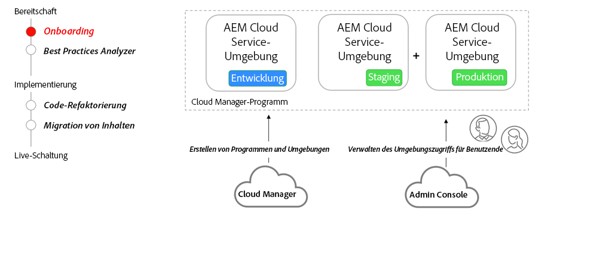

# Einstieg in AEM as a Cloud Service

Erfahren Sie mehr über das Onboarding in AEM as a Cloud Service, angefangen von der Vertragsphase bis hin zur Einrichtung der Umgebungen mit Cloud Manager.

>[!VIDEO](https://video.tv.adobe.com/v/336959?quality=12&learn=on)

## Cloud Manager und Admin Console

Ein wichtiger Bestandteil des Onboarding-Programms ist die Erstellung AEM as a Cloud Service Programme und die Bereitstellung verschiedener Umgebungen mithilfe von Adobe Cloud Manager. Die [Admin Console](https://adminconsole.adobe.com/) wird verwendet, um Benutzerrollen zuzuweisen und Benutzern in Ihrer Organisation Zugriff auf AEM Umgebungen zu gewähren.

## Wichtigste Aktivitäten

+ Ein Systemadministrator verwendet die Variable [Admin Console](https://adminconsole.adobe.com/) , um einen oder mehrere Benutzer der [Cloud Manager - Business Owner](https://experienceleague.adobe.com/docs/experience-manager-cloud-manager/using/requirements/setting-up-users-and-roles.html?lang=de) Produktprofil.
+ Dem Business Owner Product Profile zugewiesene Benutzer verwenden die Self-Service-Funktionen von [Cloud Manager](https://experienceleague.adobe.com/docs/experience-manager-cloud-manager/using/introduction-to-cloud-manager.html?lang=de) nach [Programm(e) erstellen](https://experienceleague.adobe.com/docs/experience-manager-cloud-service/implementing/using-cloud-manager/production-programs/creating-production-program.html) und [Umgebungen hinzufügen](https://experienceleague.adobe.com/docs/experience-manager-cloud-service/implementing/using-cloud-manager/manage-environments.html?lang=de)
+ Verwenden Sie die [Admin Console](https://adminconsole.adobe.com/) , um Entwickler und Benutzer verschiedenen [Cloud Manager-Rollen](https://experienceleague.adobe.com/docs/experience-manager-cloud-manager/using/requirements/setting-up-users-and-roles.html?lang=de) und gewähren Berechtigungen für verschiedene AEM Umgebungen.

## Übungen

Wenden Sie Ihr Wissen an, indem Sie ausprobieren, was Sie mit dieser praktischen Übung gelernt haben.

Bevor Sie die praktische Übung testen, müssen Sie sich das Video und die folgenden Materialien angesehen und verstanden haben:

+ [Über AEM as a Cloud Service anders nachdenken](./introduction.md)
+ [Cloud Manager](./cloud-manager.md)

Stellen Sie außerdem sicher, dass Sie die vorherige praktische Übung abgeschlossen haben:

+ [AEM-Modernisierungs-Tools - praktische Übung](./aem-modernization-tools.md#hands-on-exercise)

<table style="border-width:0">
    <tr>
        <td style="width:150px">
                    
        </td>
        <td style="width:100%;margin-bottom:1rem;">
            
Hands-on mit Onboarding

            

                Erfahren Sie AEM as a Cloud Service Onboarding-Prozess und wie Sie eine AEM App im AEM SDK bereitstellen.
            

            <a  rel="noreferrer"
                target="_blank"
                href="https://github.com/adobe/aem-cloud-engineering-video-series-exercises/tree/session3-onboarding#bootcamp---session-3-on-boarding" class="spectrum-Button spectrum-Button--primary spectrum-Button--sizeM">
                Onboarding ausprobieren
            </a>
        </td>
    </tr>
</table>
