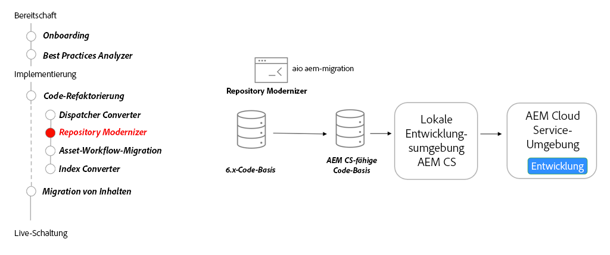

# Repository-Modernisierung

Erfahren Sie mehr über die Modernisierung von Repositorys, veränderliche und unveränderliche Inhalte, die Paketstruktur und das Repository Modernizer-CLI-Tool.

>[!VIDEO](https://video.tv.adobe.com/v/336958?quality=12&learn=on)

## Repository Modernizer Tool

Verwenden Sie im Rahmen der Refaktorierung Ihrer Code-Basis das [Repository Modernizer Tool](https://experienceleague.adobe.com/docs/experience-manager-cloud-service/moving/refactoring-tools/repo-modernizer.html?lang=de), um eine 6.x-Code-Basis in eine modernere Struktur umzustrukturieren.

## Wichtigste Aktivitäten

* Verwenden Sie das Tool [Adobe I/O Repository Modernizer](https://github.com/adobe/aio-cli-plugin-aem-cloud-service-migration#command-aio-aem-migrationrepository-modernizer), um ein Projekt so umzustrukturieren, dass es der erwarteten Struktur eines AEM as a Cloud Service-Projekts entspricht.
* Passen Sie die aktualisierte Code-Basis manuell an und beheben Sie etwaige Build-Fehler.
* Richten Sie eine [lokale Entwicklungsumgebung](https://experienceleague.adobe.com/docs/experience-manager-learn/cloud-service/local-development-environment-set-up/overview.html?lang=de) ein und stellen Sie die aktualisierte Code-Basis bereit. Iterieren Sie, bis das Projekt einen stabilen Zustand erreicht hat.
* Stellen Sie die aktualisierte Code-Basis in einer AEM as a Cloud Service-Entwicklungsumgebung bereit und fahren Sie mit der Validierung fort.
