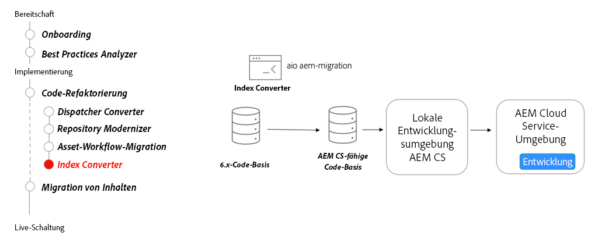

# Suche und Indizierung

Erfahren Sie mehr über Suchindizes von AEM as a Cloud Service, wie Sie AEM 6-Indexdefinitionen konvertieren, um mit AEM as a Cloud Service kompatibel zu sein, und wie Sie Indizes für AEM as a Cloud Service bereitstellen.

>[!VIDEO](https://video.tv.adobe.com/v/336963?quality=12&learn=on)

## Index-Converter-Tool

Verwenden Sie als Teil der Refaktorierung Ihrer Code-Basis die Variable [Index-Converter-Tool](https://github.com/adobe/aio-cli-plugin-aem-cloud-service-migration#command-aio-aem-migrationindex-converter), um benutzerdefinierte Oak-Indexdefinitionen in mit AEM as a Cloud Service kompatible Indexdefinitionen zu konvertieren.

Den vollständigen und aktuellen Satz der Index Converter-Funktionen finden Sie in der [Dokumentation zum Index Converter](https://experienceleague.adobe.com/docs/experience-manager-cloud-service/content/migration-journey/refactoring-tools/index-converter.html?lang=de).

## Wichtigste Aktivitäten

+ Verwenden Sie das Tool [Adobe I/O Workflow Migrator](https://github.com/adobe/aio-cli-plugin-aem-cloud-service-migration#command-aio-aem-migrationindex-converter), um Asset-Verarbeitungs-Workflows zur Verwendung der Asset Compute-Microservices zu migrieren.
+ Richten Sie eine [lokale Entwicklungsumgebung](https://experienceleague.adobe.com/docs/experience-manager-learn/cloud-service/local-development-environment-set-up/overview.html?lang=de) ein und stellen Sie die benutzerdefinierten Indizes bereit. Stellen Sie sicher, dass die aktualisierten Indizes auf dem neuesten Stand sind.
+ Stellen Sie die aktualisierte Code-Basis in einer AEM as a Cloud Service-Entwicklungsumgebung bereit und fahren Sie mit der Validierung fort.
+ Wenn Sie einen vordefinierten Index ändern, kopieren Sie **IMMER** die neueste Indexdefinition aus einer AEM as a Cloud Service-Umgebung, in der die neueste Version ausgeführt wird. Ändern Sie die kopierte Indexdefinition entsprechend Ihren Anforderungen.

## Praktische Übung

Wenden Sie Ihr Wissen an, indem Sie ausprobieren, was Sie mit dieser praktischen Übung gelernt haben.

Vergewissern Sie sich, dass Sie das obige Video und die folgenden Materialien gesehen und verstanden haben, bevor Sie die praktische Übung durchführen:

+ [Anders denken über AEM as a Cloud Service](./introduction.md)
+ [Repository-Modernisierung](./repository-modernization.md)

Stellen Sie außerdem sicher, dass Sie die vorherige praktische Übung abgeschlossen haben:

+ [Praktische Übung mit dem Content-Transfer-Tool](./content-migration/content-transfer-tool.md#hands-on-exercise)

<table style="border-width:0">
    <tr>
        <td style="width:150px">
                    
        </td>
        <td style="width:100%;margin-bottom:1rem;">
            
Übung mit Indizes

            

                Erfahren Sie mehr über das Definieren und Bereitstellen von Oak-Indizes für AEM as a Cloud Service.
            

            <a  rel="noreferrer"
                target="_blank"
                href="https://github.com/adobe/aem-cloud-engineering-video-series-exercises/tree/session7-indexes#cloud-acceleration-bootcamp---session-7-search-and-indexing" class="spectrum-Button spectrum-Button--primary spectrum-Button--sizeM">
Testen der Indizierung
</a>
        </td>
    </tr>
</table>
