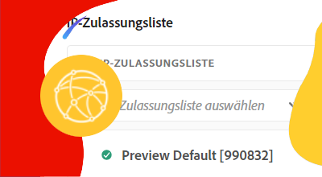

# Erweiterte Netzwerkfunktionen

AEM as a Cloud Service bietet erweiterte Netzwerkfunktionen, die eine präzise Verwaltung der Verbindungen zu und von Programmen bei AEM as a Cloud Service ermöglichen.

|                                                   | [Produktionsprogramme](https://experienceleague.adobe.com/docs/experience-manager-cloud-service/content/implementing/using-cloud-manager/programs/introduction-production-programs.html?lang=de) | [Sandbox-Programme](https://experienceleague.adobe.com/docs/experience-manager-cloud-service/content/implementing/using-cloud-manager/programs/introduction-sandbox-programs.html?lang=de) |
|---------------------------------------------------|:-----------------------:|:---------------------:|
| Unterstützt erweiterte Netzwerke | ✔ | ✘ |

Die erweiterten Netzwerkfunktionen von AEM umfassen drei Optionen für die Verwaltung der Verbindung mit externen Diensten. Ein Cloud Manager-Programm und seine AEM as a Cloud Service-Umgebungen können jeweils nur einen einzigen Typ der erweiterten Netzwerkkonfiguration gleichzeitig verwenden. Stellen Sie daher sicher, dass der am besten geeignete Typ ausgewählt ist.

|                                   | HTTP/HTTPS bei Standard-Ports | HTTP/HTTPS bei nicht standardmäßigen Ports | Nicht-HTTP/HTTPS-Verbindungen | Dedizierte Ausgangs-IP-Adresse | Liste „Keine Proxy-Hosts“ | Herstellen einer Verbindung zu VPN-geschützten Diensten | Beschränken des AEM Publish-Traffics nach IP |
|-----------------------------------|:----------------------------:|:--------------------------------:|:--------------------------:|:-------------------:|:-------------------------------------:|:-------------------------------------:|:----:|
| __Keine erweiterten Netzwerkfunktionen__ | ✔ | ✘ | ✘ | ✘ | ✘ | ✘ | ✘ |
| [__Flexibler Port-Ausgang__](./flexible-port-egress.md) | ✔ | ✔ | ✔ | ✘ | ✘ | ✘ | ✘ |
| [__Dedizierte Ausgangs-IP-Adresse__](./dedicated-egress-ip-address.md) | ✔ | ✔ | ✔ | ✔ | ✔ | ✘ | ✘ |
| [__Virtuelles privates Netzwerk__](./vpn.md) | ✔ | ✔ | ✔ | ✔ | ✔ | ✔ | ✔ |

Weitere Informationen zu den Überlegungen bei der Auswahl des geeigneten erweiterten Netzwerktyps finden Sie in der [Dokumentation zu erweiterten Netzwerken](https://experienceleague.adobe.com/docs/experience-manager-cloud-service/security/configuring-advanced-networking.html?lang=de).

## Tutorials für erweiterte Netzwerke

Sobald Sie die für Ihr Unternehmen am besten geeignete erweiterte Netzwerkoption gefunden haben, klicken Sie auf die entsprechende Anleitung unten, um Schritt-für-Schritt-Anweisungen und Code-Beispiele zu erhalten.

<table>
  <tr>
   <td>
      
      
<strong><a href="./flexible-port-egress.md">Flexibler Port-Ausgang</a></strong>

      

          Erlauben Sie ausgehenden AEM as a Cloud Service-Traffic auf nicht standardmäßigen Ports.
      

    </td>   
   <td>
      
      
<strong><a href="./dedicated-egress-ip-address.md">Dedizierte Ausgangs-IP-Adresse</a></strong>

      

        Ausgehender AEM as a Cloud Service-Traffic wird über eine dedizierte IP-Adresse abgewickelt.
      

    </td>   
   <td>
      
      
<strong><a href="./vpn.md">Virtuelles privates Netzwerk (VPN)</a></strong>

      

        Sicherer Datenverkehr zwischen einer Kunden- oder Anbieterinfrastruktur und AEM as a Cloud Service.
      

    </td>   
  </tr>
</table>

## Code-Beispiele

Diese Sammlung enthält Beispiele für die Konfiguration und den Code, die erforderlich sind, um erweiterte Netzwerkfunktionen für bestimmte Anwendungsfälle zu nutzen.

Vergewissern Sie sich, dass die entsprechende [erweiterte Netzwerkkonfiguration](#advanced-networking) eingerichtet wurde, bevor Sie diesem Tutorial folgen.

<table><tr>
   <td>
      
      
<strong><a href="./examples/email-service.md">E-Mail-Dienst</a></strong>

      

        Beispiel für eine OSGi-Konfiguration mit AEM für die Verbindung mit externen E-Mail-Diensten.
      

    </td>  
    <td>
        
        
<strong><a href="./examples/http-dedicated-egress-ip-vpn.md">HTTP/HTTPS</a></strong>

        

            Java™-Codebeispiel, das die HTTP/HTTPS-Verbindung mithilfe des HTTP/HTTPS-Protokolls von AEM as a Cloud Service zu einem externen Dienst herstellt.
        

    </td>
    <td>
      
      
<strong><a href="./examples/sql-datasourcepool.md">SQL-Verbindung über JDBC DataSourcePool</a></strong>

      

            Java™-Code-Beispiel für die Verbindung mit externen SQL-Datenbanken durch die Konfiguration von JDBC-Datenquellen-Pools von AEM.
      

    </td>   
    </tr><tr>
    <td>
      
      
<strong><a href="./examples/sql-java-apis.md">SQL-Verbindung über Java™-APIs</a></strong>

      

            Java™-Code-Beispiel für die Verbindung mit externen SQL-Datenbanken über die SQL-APIs von Java™.
      

    </td>   
    <td>
      
      
<strong><a href="https://experienceleague.adobe.com/docs/experience-manager-cloud-service/implementing/using-cloud-manager/ip-allow-lists/apply-allow-list.html?lang=de">Anwenden einer IP-Zulassungsliste</a></strong>

      

            Konfigurieren Sie eine IP-Zulassungsliste so, dass nur VPN-Traffic auf AEM zugreifen kann.
      

    </td>
   <td>
      
      
<strong><a href="https://experienceleague.adobe.com/docs/experience-manager-cloud-service/security/configuring-advanced-networking.html?lang=de#restrict-vpn-to-ingress-connections">Pfadbasierte VPN-Zugriffsbeschränkungen für AEM Publish</a></strong>

      

            VPN-Zugriff für bestimmte Pfade in AEM Publish erforderlich machen.
      

    </td>
</tr>
</table>
