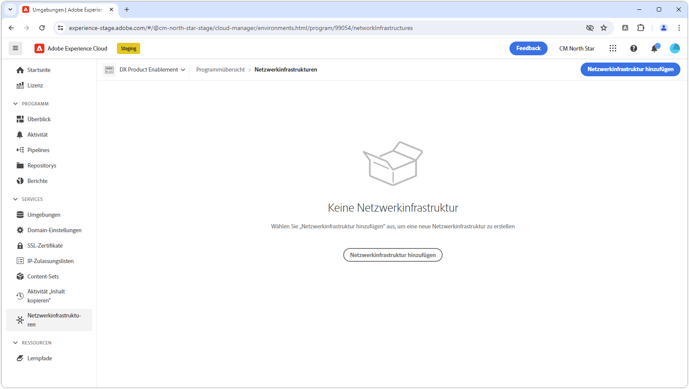
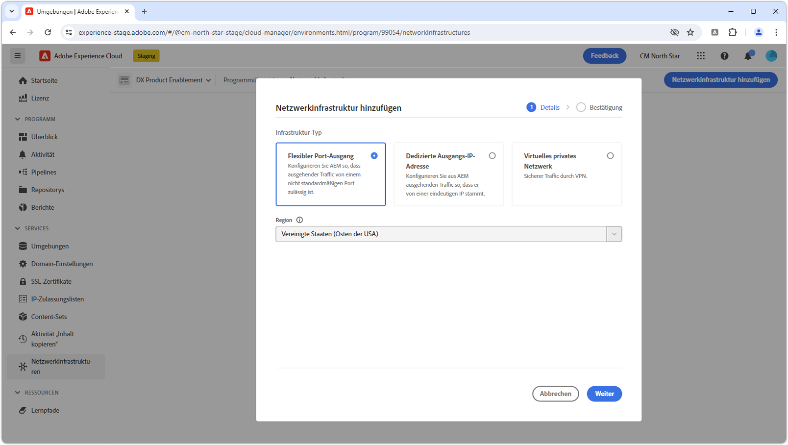
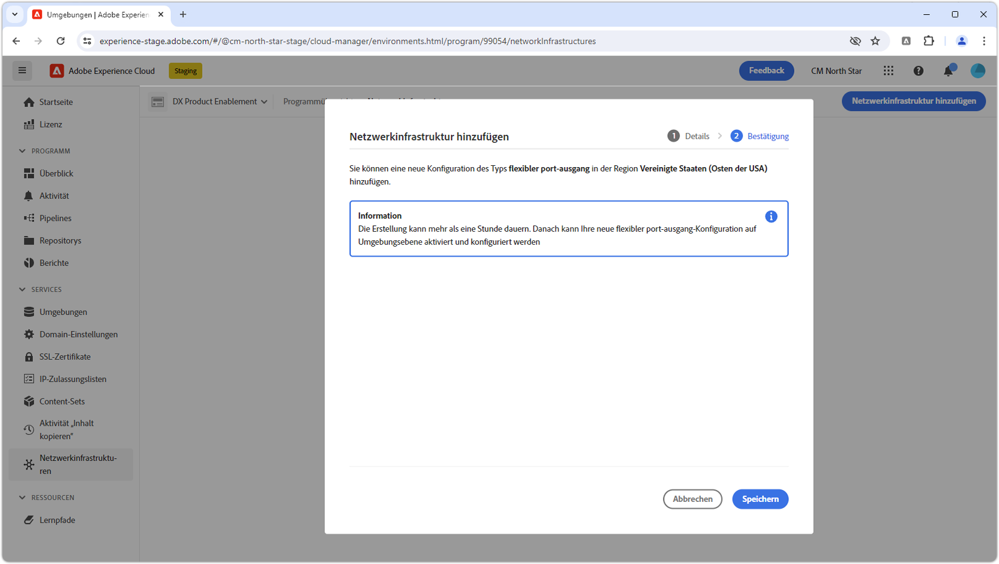
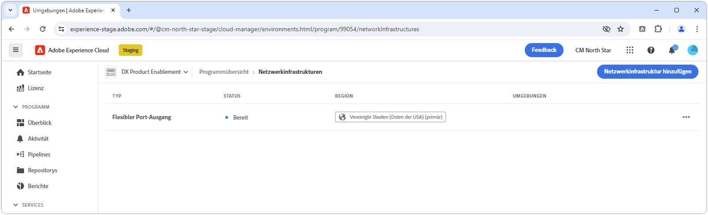

# Flexibler Port-Ausgang

Erfahren Sie, wie Sie einen flexiblen Port-Ausgang einrichten und verwenden, um externe Verbindungen von AEM as a Cloud Service zu externen Diensten zu unterstützen.

## Was ist ein flexibler Port-Ausgang?

Ein flexibler Port-Ausgang ermöglicht die Anbindung benutzerdefinierter, spezifischer Port-Weiterleitungsregeln an AEM as a Cloud Service, sodass Verbindungen von AEM zu externen Diensten hergestellt werden können.

Ein Cloud Manager-Programm kann nur einen __einzigen__ Netzinfrastrukturtyp haben. Stellen Sie sicher, dass der flexible Port-Auslöser der beste ist. [geeignete Art von Netzwerkinfrastruktur](./advanced-networking.md) für Ihre AEM as a Cloud Service, bevor Sie die folgenden Befehle ausführen.

>[!MORELIKETHIS]
>
> Weitere Informationen zu flexiblen Port-Ausgängen finden Sie in der [AEM as a Cloud Service-Dokumentation zur erweiterten Netzwerkkonfiguration](https://experienceleague.adobe.com/en/docs/experience-manager-cloud-service/content/security/configuring-advanced-networking).


## Voraussetzungen

Beim Festlegen oder Konfigurieren eines flexiblen Port-Ausgangs mithilfe von Cloud Manager-APIs ist Folgendes erforderlich:

+ Adobe Developer Console-Projekt mit aktivierter Cloud Manager-API und [Geschäftsinhaber-Berechtigungen für Cloud Manager](https://developer.adobe.com/experience-cloud/cloud-manager/guides/getting-started/permissions/)
+ Zugriff auf [Authentifizierungs-Anmeldeinformationen der Cloud Manager-API](https://developer.adobe.com/experience-cloud/cloud-manager/guides/getting-started/create-api-integration/)
   + Organisations-ID (auch als IMS-Org-ID bezeichnet)
   + Client-ID (auch als API-Schlüssel bezeichnet)
   + Zugriffs-Token (auch als Bearer- oder Träger-Token bezeichnet)
+ Cloud Manager-Programm-ID
+ Cloud Manager-Umgebungs-IDs

Weitere Informationen dazu, wie Sie Anmeldeinformationen für die Cloud Manager-API einrichten, konfigurieren sowie abrufen und wie Sie diese zum Ausführen eines Cloud Manager-API-Aufrufs verwenden können, finden Sie in der folgenden Anleitung.

>[!VIDEO](https://video.tv.adobe.com/v/342235?quality=12&learn=on)

In diesem Tutorial wird `curl` verwendet, um die Cloud Manager-API-Konfigurationen vorzunehmen. Die bereitgestellten `curl`-Befehle setzen eine Linux-/macOS-Syntax voraus. Ersetzen Sie bei Verwendung der Windows-Eingabeaufforderung das Zeilenumbruchszeichen `\` durch `^`.


## Aktivieren flexibler Port-Ausgänge pro Programm

Aktivieren Sie zunächst den flexiblen Port-Ausgang für AEM as a Cloud Service.

>[!BEGINTABS]

>[!TAB Cloud Manager]

Flexible Port-Ausdrücke können mit Cloud Manager aktiviert werden. Die folgenden Schritte beschreiben, wie Sie mithilfe von Cloud Manager eine flexible Port-Auslösung auf AEM as a Cloud Service aktivieren.

1. Melden Sie sich bei [Adobe Experience Manager Cloud Manager](https://experience.adobe.com/cloud-manager/) as a Cloud Manager Business Owner.
1. Navigieren Sie zum gewünschten Programm.
1. Navigieren Sie im linken Menü zu __Dienste > Netzwerkinfrastrukturen__.
1. Wählen Sie die __Netzwerkinfrastruktur hinzufügen__ Schaltfläche.

   

1. Im __Netzwerkinfrastruktur hinzufügen__ wählen Sie das __Flexibles Port-Egress__ und wählen Sie die __Region__ , um die dedizierte Ausgangs-IP-Adresse zu erstellen.

   

1. Auswählen __Speichern__ zur Bestätigung des Hinzufügens des flexiblen Port-Ausgangs.

   

1. Warten Sie, bis die Netzwerkinfrastruktur erstellt und als __Bereit__. Dieser Vorgang kann bis zu 1 Stunde dauern.

   

Mit der Erstellung des flexiblen Port-Ausgangs können Sie jetzt die Regeln für die Anschlussweiterleitung mithilfe der Cloud Manager-APIs konfigurieren, wie unten beschrieben.

>[!TAB Cloud Manager-APIs]

Flexible Port-Ausdrücke können mithilfe von Cloud Manager-APIs aktiviert werden. Die folgenden Schritte beschreiben, wie Sie mithilfe der Cloud Manager-API eine flexible Port-Auslösung auf AEM as a Cloud Service aktivieren.

1. Bestimmen Sie zunächst die Region Advanced Networking in mithilfe der Cloud Manager-API. [listRegions](https://developer.adobe.com/experience-cloud/cloud-manager/reference/api/) Vorgang. `region name` ist erforderlich, um nachfolgende Cloud Manager-API-Aufrufe durchzuführen. In der Regel wird die Region verwendet, in der sich die Produktionsumgebung befindet.

   Suchen Sie in [Cloud Manager](https://my.cloudmanager.adobe.com) unter [Umgebungsdetails](https://experienceleague.adobe.com/en/docs/experience-manager-cloud-service/content/implementing/using-cloud-manager/manage-environments) nach der Region Ihrer AEM as a Cloud Service-Umgebung. Der in Cloud Manager angezeigte Regionsname kann dem [Regions-Code zugeordnet](https://developer.adobe.com/experience-cloud/cloud-manager/guides/api-usage/creating-programs-and-environments/#creating-aem-cloud-service-environments) werden, der in der Cloud Manager-API verwendet wird.

   __HTTP-Anfrage „listRegions“__

   ```shell
   $ curl -X GET https://cloudmanager.adobe.io/api/program/{programId}/regions \
       -H 'x-gw-ims-org-id: <ORGANIZATION_ID>' \
       -H 'x-api-key: <CLIENT_ID>' \
       -H 'Authorization: Bearer <ACCESS_TOKEN>' \
       -H 'Content-Type: application/json' 
   ```

2. Aktivieren Sie den flexiblen Port-Ausgang für ein Cloud Manager-Programm mithilfe des Cloud Manager-API-Vorgangs [createNetworkInfrastructure](https://developer.adobe.com/experience-cloud/cloud-manager/reference/api/). Verwenden Sie den entsprechenden Code für `region`, der über den Cloud Manager-API-Vorgang `listRegions` abgerufen wurde.

   __HTTP-Anfrage „createNetworkInfrastructure“__

   ```shell
   $ curl -X POST https://cloudmanager.adobe.io/api/program/{programId}/networkInfrastructures \
       -H 'x-gw-ims-org-id: <ORGANIZATION_ID>' \
       -H 'x-api-key: <CLIENT_ID>' \ 
       -H 'Authorization: Bearer <ACCESS_TOKEN>' \
       -H 'Content-Type: application/json' \
       -d '{ "kind": "flexiblePortEgress", "region": "va7" }'
   ```

   Warten Sie 15 Minuten, bis das Cloud Manager-Programm die Netzwerkinfrastruktur bereitgestellt hat.

3. Überprüfen, ob die Umgebung abgeschlossen ist __flexibler Port-Ausgang__ Konfiguration mithilfe der Cloud Manager-API [getNetworkInfrastructure](https://developer.adobe.com/experience-cloud/cloud-manager/reference/api/#operation/getNetworkInfrastructure) -Vorgang mithilfe der `id` zurückgegeben von `createNetworkInfrastructure` HTTP-Anforderung im vorherigen Schritt.

   __HTTP-Anfrage „getNetworkInfrastructure“__

   ```shell
   $ curl -X GET https://cloudmanager.adobe.io/api/program/{programId}/networkInfrastructure/{networkInfrastructureId} \
       -H 'x-gw-ims-org-id: <ORGANIZATION_ID>' \
       -H 'x-api-key: <CLIENT_ID>' \ 
       -H 'Authorization: Bearer <ACCESS_TOKEN>' \
       -H 'Content-Type: application/json'
   ```

   Überprüfen Sie, ob die HTTP-Antwort einen __Status__ von __ready__ enthält. Falls noch nicht „ready“, überprüfen Sie den Status alle paar Minuten.

Mit der Erstellung des flexiblen Port-Ausgangs können Sie jetzt die Regeln für die Anschlussweiterleitung mithilfe der Cloud Manager-APIs konfigurieren, wie unten beschrieben.

>[!ENDTABS]

## Konfigurieren von flexiblen Port-Ausgangs-Proxys pro Umgebung

1. Aktivieren und Konfigurieren der Konfiguration __flexibler Port-Ausgang__ in jeder AEM as a Cloud Service-Umgebung mithilfe des Cloud Manager-API-Vorgangs [enableEnvironmentAdvancedNetworkingConfiguration](https://developer.adobe.com/experience-cloud/cloud-manager/reference/api/).

   __HTTP-Anfrage „enableEnvironmentAdvancedNetworkingConfiguration“__

   ```shell
   $ curl -X PUT https://cloudmanager.adobe.io/api/program/{programId}/environment/{environmentId}/advancedNetworking \
       -H 'x-gw-ims-org-id: <ORGANIZATION_ID>' \
       -H 'x-api-key: <CLIENT_ID>' \ 
       -H 'Authorization: Bearer <ACCESS_TOKEN>' \
       -H 'Content-Type: application/json' \
       -d @./flexible-port-egress.json
   ```

   Definieren Sie die JSON-Parameter in `flexible-port-egress.json` und stellen Sie sie cURL über `... -d @./flexible-port-egress.json` zur Verfügung.

   [Laden Sie das Beispiel „flexible-port-egress.json“ herunter.](./assets/flexible-port-egress.json). Diese Datei ist nur ein Beispiel. Konfigurieren Sie Ihre Datei nach Bedarf auf der Grundlage der unter [enableEnvironmentAdvancedNetworkingConfiguration](https://developer.adobe.com/experience-cloud/cloud-manager/reference/api/) dokumentierten optionalen/erforderlichen Felder.

   ```json
   {
       "portForwards": [
           {
               "name": "mysql.example.com",
               "portDest": 3306,
               "portOrig": 30001
           },
           {
               "name": "smtp.sendgrid.com",
               "portDest": 465,
               "portOrig": 30002
           }
       ]
   }
   ```

   Für jede `portForwards`-Zuordnung definiert das erweiterte Netzwerk die folgende Weiterleitungsregel:

   | Proxy-Host | Proxy-Port |  | Externer Host | Externer Port |
   |---------------------------------|----------|----------------|------------------|----------|
   | `AEM_PROXY_HOST` | `portForwards.portOrig` | → | `portForwards.name` | `portForwards.portDest` |

   Wenn Ihre AEM-Bereitstellung __nur__ HTTP/HTTPS-Verbindungen (Port 80/443) zu externen Diensten erfordert, lassen Sie das Array `portForwards` leer, da diese Regeln nur für Nicht-HTTP/HTTPS-Anfragen erforderlich sind.

1. Überprüfen Sie für jede Umgebung, ob die Ausgangsregeln in Kraft sind, indem Sie den Cloud Manager-API-Vorgang [getEnvironmentAdvancedNetworkingConfiguration](https://developer.adobe.com/experience-cloud/cloud-manager/reference/api/) verwenden.

   __HTTP-Anfrage „getEnvironmentAdvancedNetworkingConfiguration“__

   ```shell
   $ curl -X GET https://cloudmanager.adobe.io/api/program/{programId}/environment/{environmentId}/advancedNetworking \
       -H 'x-gw-ims-org-id: <ORGANIZATION_ID>' \
       -H 'Authorization: Bearer <ACCESS_TOKEN>' \
       -H 'x-api-key: <CLIENT_ID>' \ 
       -H 'Content-Type: application/json'
   ```

1. Flexible Port-Ausgangskonfigurationen können mit dem Cloud Manager-API-Vorgang [enableEnvironmentAdvancedNetworkingConfiguration](https://developer.adobe.com/experience-cloud/cloud-manager/reference/api/) aktualisiert werden. Denken Sie daran, dass `enableEnvironmentAdvancedNetworkingConfiguration` ein `PUT`-Vorgang ist, sodass alle Regeln bei jedem Aufruf dieses Vorgangs angegeben werden müssen.

1. Jetzt können Sie die flexible Port-Ausgangskonfiguration in Ihrem benutzerdefinierten AEM-Code und Ihrer Konfiguration verwenden.


## Anbindung an externe Dienste über flexiblen Port-Ausgang

Wenn der flexible Port-Ausgangs-Proxy aktiviert ist, können AEM-Code und -Konfiguration diese für Anrufe an externe Dienste verwenden. Es gibt zwei Varianten von externen Aufrufen, die AEM unterschiedlich behandelt:

1. HTTP/HTTPS-Aufrufe an externe Dienste bei nicht standardmäßigen Ports
   + Einschließlich HTTP/HTTPS-Aufrufe an Dienste, die auf anderen Ports als den Standard-Ports 80 oder 443 ausgeführt werden.
1. Nicht-HTTP-/HTTPS-Aufrufe an externe Dienste
   + Enthält alle Nicht-HTTP-Aufrufe, z. B. Verbindungen mit Mail-Servern, SQL-Datenbanken oder Dienste, die mit anderen Nicht-HTTP-/HTTPS-Protokollen ausgeführt werden.

HTTP/HTTPS-Anfragen von AEM über Standard-Ports (80/443) sind standardmäßig zulässig und erfordern keine zusätzlichen Konfigurationen oder Überlegungen.


### HTTP/HTTPS bei nicht standardmäßigen Ports

Beim Erstellen von HTTP/HTTPS-Verbindungen zu nicht standardmäßigen Ports (nicht 80/443) aus AEM müssen die Verbindungen über spezielle Hosts und Ports erfolgen, die über Platzhalter bereitgestellt werden.

AEM stellt zwei Sätze spezieller Java™-Systemvariablen bereit, die HTTP/HTTPS-Proxys von AEM zugeordnet sind.

| Variablenname | Verwenden Sie | Java™-Code | OSGi-Konfiguration |
| - |  - | - | - |
| `AEM_PROXY_HOST` | Proxy-Host für beide HTTP/HTTPS-Verbindungen | `System.getenv().getOrDefault("AEM_PROXY_HOST", "proxy.tunnel")` | `$[env:AEM_PROXY_HOST;default=proxy.tunnel]` |
| `AEM_HTTP_PROXY_PORT` | Proxy-Port für HTTPS-Verbindungen (setzen Sie „fallback“ auf `3128`) | `System.getenv().getOrDefault("AEM_HTTP_PROXY_PORT", 3128)` | `$[env:AEM_HTTP_PROXY_PORT;default=3128]` |
| `AEM_HTTPS_PROXY_PORT` | Proxy-Port für HTTPS-Verbindungen (setzen Sie „fallback“ auf `3128`) | `System.getenv().getOrDefault("AEM_HTTPS_PROXY_PORT", 3128)` | `$[env:AEM_HTTPS_PROXY_PORT;default=3128]` |

Wenn HTTP/HTTPS-Aufrufe an externe Dienste auf nicht standardmäßigen Ports erfolgen, muss kein entsprechender `portForwards`-Vorgang mit der Cloud Manager API `enableEnvironmentAdvancedNetworkingConfiguration` definiert werden, da die „Regeln“ für die Port-Weiterleitung „im Code“ definiert werden.

>[!TIP]
>
> In der Dokumentation zu AEM as a Cloud Service (flexibler Port-Ausgang) finden Sie [den vollständigen Satz an Routing-Regeln](https://experienceleague.adobe.com/en/docs/experience-manager-cloud-service/content/security/configuring-advanced-networking).

#### Code-Beispiele

<table>
<tr>
<td>
    <a  href="./examples/http-on-non-standard-ports-flexible-port-egress.md"></a>
    <div><strong><a href="./examples/http-on-non-standard-ports-flexible-port-egress.md">HTTP/HTTPS bei nicht standardmäßigen Ports</a></strong></div>
    <p>
        Java™-Code-Beispiel, das eine HTTP/HTTPS-Verbindung von AEM as a Cloud Service zu einem externen Dienst bei nicht standardmäßigen HTTP/HTTPS-Ports herstellt.
    </p>
</td>   
<td></td>   
<td></td>   
</tr>
</table>

### Nicht-HTTP/HTTPS-Verbindungen zu externen Diensten

Beim Erstellen von Nicht-HTTP-/HTTPS-Verbindungen (z. B. SQL, SMTP usw.) aus AEM, muss die Verbindung über einen speziellen Host-Namen hergestellt werden, der von AEM bereitgestellt wird.

| Variablenname | Verwenden Sie | Java™-Code | OSGi-Konfiguration |
| - |  - | - | - |
| `AEM_PROXY_HOST` | Proxy-Host für Verbindungen ohne HTTP/HTTPS | `System.getenv().getOrDefault("AEM_PROXY_HOST", "proxy.tunnel")` | `$[env:AEM_PROXY_HOST;default=proxy.tunnel]` |


Verbindungen zu externen Diensten werden dann über `AEM_PROXY_HOST` und den zugeordneten Port (`portForwards.portOrig`) aufgerufen und anschließend von AEM zum zugeordneten externen Host-Namen (`portForwards.name`) und Port (`portForwards.portDest`) geleitet.

| Proxy-Host | Proxy-Port |  | Externer Host | Externer Port |
|---------------------------------|----------|----------------|------------------|----------|
| `AEM_PROXY_HOST` | `portForwards.portOrig` | → | `portForwards.name` | `portForwards.portDest` |

#### Code-Beispiele

<table><tr>
   <td>
      <a  href="./examples/sql-datasourcepool.md"></a>
      <div><strong><a href="./examples/sql-datasourcepool.md">SQL-Verbindung über JDBC DataSourcePool</a></strong></div>
      <p>
            Java™-Code-Beispiel für die Verbindung mit externen SQL-Datenbanken durch die Konfiguration von JDBC-Datenquellen-Pools von AEM.
      </p>
    </td>   
   <td>
      <a  href="./examples/sql-java-apis.md"></a>
      <div><strong><a href="./examples/sql-java-apis.md">SQL-Verbindung über Java™-APIs</a></strong></div>
      <p>
            Java™-Code-Beispiel für die Verbindung mit externen SQL-Datenbanken über die SQL-APIs von Java™.
      </p>
    </td>   
   <td>
      <a  href="./examples/email-service.md"></a>
      <div><strong><a href="./examples/email-service.md">E-Mail-Dienst</a></strong></div>
      <p>
        Beispiel für eine OSGi-Konfiguration mit AEM für die Verbindung mit externen E-Mail-Diensten.
      </p>
    </td>   
</tr></table>
