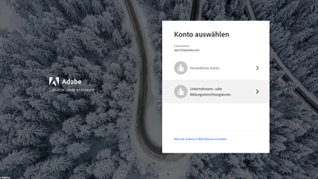

# Überblick {#overview}

Adobe Experience Manager (AEM) ist nun als Cloud Service verfügbar. AEM als Cloud Service führt die nächste Generation der Produktlinie des Experience Managers ein und baut dabei auf bisherigen Investitionen und Innovationen auf, bewahrt und erweitert alle Anwendungsfälle und Funktionalitäten.

>[!VIDEO](https://video.tv.adobe.com/v/31085/?quality=12&learn=on)

## Neue Funktionen

* **[Erweiterbarkeit von Asset Compute-Mikrodiensten (Tutorial)](./asset-compute/overview.md)**

    
   *Erfahren Sie, wie Sie Asset Compute-Mitarbeiter entwickeln, um benutzerdefinierte Asset-Darstellungen zu erstellen.*

* **[Konfigurieren des Zugriffs auf AEM als Cloud Service (Tutorial)](./accessing/overview.md)**

    
   *Erfahren Sie, wie Sie IMS-Benutzer in Adobe Admin Console so konfigurieren, dass sie auf AEM zugreifen können*

* **[Debugging von AEM als Cloud Service (Tutorial)](./debugging/cloud-service/overview.md)**

    
   *Debugging von AEM als Cloud Service*

* **[Debugging AEM SDK (Tutorial)](./debugging/aem-sdk-local-quickstart/overview.md)**

    
   *Lernen Sie die verschiedenen Tools kennen, mit denen Sie Ihre Anwendung auf dem AEM als lokaler Schnellstart des Cloud Service-SDK debuggen können.*

* **[Einrichtung einer Umgebung für lokale Entwicklung (Tutorial)](./local-development-environment/overview.md)**

    
   *Erfahren Sie, wie Sie Ihren lokalen Entwicklungscomputer für AEM als Cloud Service einrichten.*

## Personalauswahl

<table>
   <td>
      
      

         <a href="./accessing/overview.md">
         <strong>Konfigurieren des Zugriffs auf AEM Lernprogramm</strong>
         </a>
      

      

         <em>Konfigurieren Sie IMS-Benutzer in Adobe Admin Console für den Zugriff auf AEM.</em>
      

   </td>   
   <td>
      
      

         <a href="./local-development-environment/overview.md">
         <strong>Umgebung zur lokalen Entwicklung - Lernprogramm</strong>
         </a>
      

      

         <em>Bereiten Sie Ihre dev-Maschine vor Ort AEM als Cloud Service-Entwicklung!</em>
      

   </td>   
   <td>
      
      

         <a href="./debugging/aem-sdk-local-quickstart/overview.md">
         <strong>Debugging AEM SDK</strong>
         </a>
      

      

         <em>Erfahren Sie, welche Tools zum Debuggen der Anwendung auf dem AEM als lokaler Schnellstart des Cloud Service-SDK verwendet werden.</em>
      

   </td>
</table>

## Zusätzliche Ressourcen

* [Experience League - Adobe Experience Manager entdecken](https://experienceleague.adobe.com/#recommended/solutions/experience-manager)
* [Adobe Experience Manager als Cloud Service-Dokumentation](https://docs.adobe.com/content/help/de-DE/experience-manager-cloud-service/landing/home.translate.html)
