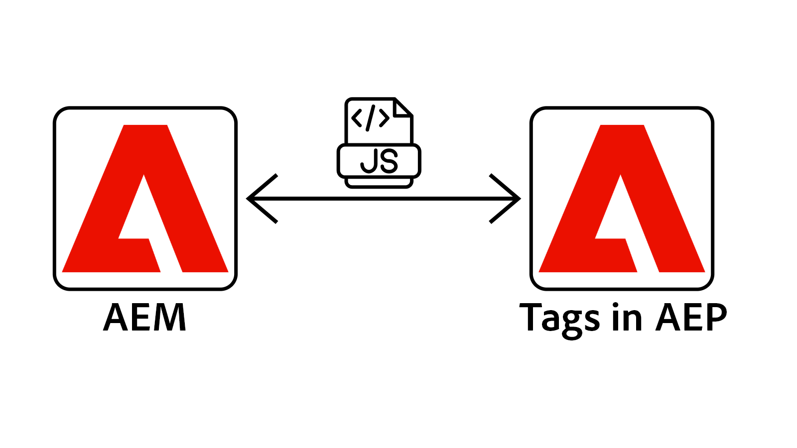
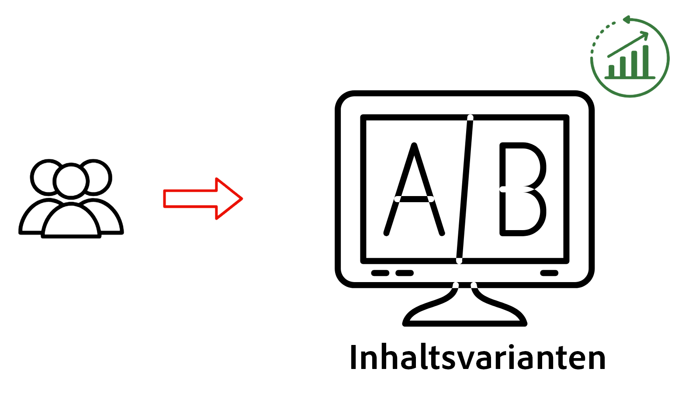

# Übersicht über die Personalisierung

Erfahren Sie, wie AEM as a Cloud Service (AEMCS) mit Adobe Target und Adobe Experience Platform (AEP) integriert wird. Erfahren Sie, wie Sie personalisierte Erlebnisse mit A/B-Tests bereitstellen, Benutzer basierend auf ihrem Verhalten ansprechen oder Inhalte mithilfe von Kundenprofilen personalisieren können.

## Voraussetzungen

Um verschiedene Personalisierungsszenarien zu demonstrieren, verwendet dieses Tutorial das Beispielprojekt [AEM WKND](https://github.com/adobe/aem-guides-wknd/). Um dem Beispiel zu folgen, benötigen Sie:

- Eine Adobe-Organisation mit Zugriff auf:
   - **AEM as a Cloud Service-Umgebung** - zum Erstellen und Verwalten von Inhalten
   - **Adobe Target** - zum Erstellen und Bereitstellen personalisierter Erlebnisse
   - **Adobe Experience Platform-Programme** - zum Verwalten von Kundenprofilen und Audiences
   - **Tags (früher Launch) in AEP** - zum Bereitstellen des Web-SDK und des benutzerdefinierten JavaScript für die Datenerfassung und Personalisierung

- Grundlegendes zu AEM-Komponenten und Experience Fragments

- Das [AEM WKND](https://github.com/adobe/aem-guides-wknd/)-Projekt, das in Ihrer AEM as a Cloud Service-Umgebung bereitgestellt wird.

## Erste Schritte

Bevor Sie bestimmte Anwendungsfälle untersuchen, konfigurieren Sie zunächst AEM as a Cloud Service für die Personalisierung. Integrieren Sie zunächst Adobe Target und Tags, um die Client-seitige Personalisierung mithilfe der AEP Web SDK zu ermöglichen. Mit diesen grundlegenden Schritten können Ihre AEM-Seiten Experimente, Zielgruppen-Targeting und Echtzeit-Personalisierung unterstützen.

<!-- CARDS
{target = _self}

* ./setup/integrate-adobe-target.md
  {title = Integrate Adobe Target}
  {description = Integrate AEMCS with Adobe Target to activate personalized content as Adobe Target offers.}
  {image = ./assets/setup/integrate-target.png}
  {cta = Integrate Target}

* ./setup/integrate-adobe-tags.md
  {title = Integrate Tags}
  {description = Integrate AEMCS with Tags to inject the Web SDK and custom JavaScript for data collection and personalization.}
  {image = ./assets/setup/integrate-tags.png}
  {cta = Integrate Tags}
-->
<!-- START CARDS HTML - DO NOT MODIFY BY HAND -->

    

        

            

                <figure class="image x-is-16by9">
                    
                </figure>
            

            

                

                    

                        <a href="./setup/integrate-adobe-target.md" target="_self" rel="referrer" title="Integrieren mit Adobe Target">Integrieren von Adobe Target</a>
                    

                    
Integrieren Sie AEMCS mit Adobe Target, um personalisierte Inhalte als Adobe Target-Angebote zu aktivieren.

                

                <a href="./setup/integrate-adobe-target.md" target="_self" rel="referrer" class="spectrum-Button spectrum-Button--outline spectrum-Button--primary spectrum-Button--sizeM" style="align-self: flex-start; margin-top: 1rem;">
                    Target integrieren
                </a>
            

        

    

    

        

            

                <figure class="image x-is-16by9">
                    
                </figure>
            

            

                

                    

                        <a href="./setup/integrate-adobe-tags.md" target="_self" rel="referrer" title="Tags integrieren">Tags integrieren</a>
                    

                    
Integrieren Sie AEMCS mit Tags, um die Web-SDK und benutzerdefinierte JavaScript für die Datenerfassung und Personalisierung einzufügen.

                

                <a href="./setup/integrate-adobe-tags.md" target="_self" rel="referrer" class="spectrum-Button spectrum-Button--outline spectrum-Button--primary spectrum-Button--sizeM" style="align-self: flex-start; margin-top: 1rem;">
                    Tags integrieren
                </a>
            

        

    

<!-- END CARDS HTML - DO NOT MODIFY BY HAND -->

## Anwendungsfälle

Hier finden Sie die folgenden gängigen Anwendungsfälle für die Personalisierung, die von AEM CS, Adobe Target und Adobe Experience Platform unterstützt werden.

<!-- CARDS
{target = _self}

* ./use-cases/experimentation.md
  {title = Experimentation (A/B Testing)}
  {description = Learn how to test different content variations in AEMCS using Adobe Target for A/B testing.}
  {image = ./assets/use-cases/experiment/experimentation.png}
  {cta = Learn Experimentation}
-->
<!-- START CARDS HTML - DO NOT MODIFY BY HAND -->

    

        

            

                <figure class="image x-is-16by9">
                    
                </figure>
            

            

                

                    

                        <a href="./use-cases/experimentation.md" target="_self" rel="referrer" title="Experimentieren (A/B-Tests)">Experimentieren (A/B-Tests)</a>
                    

                    
Erfahren Sie, wie Sie verschiedene Inhaltsvarianten in AEM mit Adobe Target für A/B-Tests testen können.

                

                <a href="./use-cases/experimentation.md" target="_self" rel="referrer" class="spectrum-Button spectrum-Button--outline spectrum-Button--primary spectrum-Button--sizeM" style="align-self: flex-start; margin-top: 1rem;">
                    Experimentieren lernen
                </a>
            

        

    

<!-- END CARDS HTML - DO NOT MODIFY BY HAND -->

