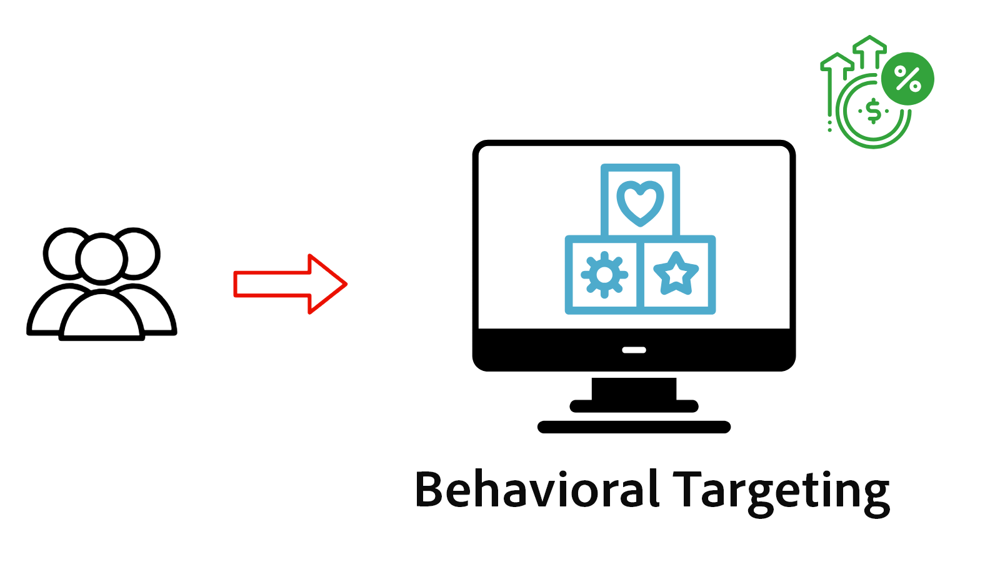

# Überblick über die Personalisierung

Erfahren Sie, wie AEM as a Cloud Service (AEMCS) mit Adobe Target und Adobe Experience Platform (AEP) integriert wird, um personalisierte Erlebnisse bereitzustellen. Erfahren Sie anhand von Experience Fragments als personalisierten Inhalt, wie Sie A/B-Tests durchführen, Benutzer basierend auf dem Echtzeit-Verhalten ansprechen oder Inhalte mithilfe einheitlicher Kundenprofile personalisieren, die aus systemübergreifenden Daten erstellt wurden.

## Voraussetzungen

Um verschiedene Personalisierungsszenarien zu demonstrieren, verwendet dieses Tutorial das [AEM WKND](https://github.com/adobe/aem-guides-wknd/)-Beispielprojekt. Um dem Tutorial folgen zu können, benötigen Sie Folgendes:

- Eine Adobe-Organisation mit Zugriff auf:
   - **AEM as a Cloud Service-Umgebung** – zum Erstellen und Verwalten von Inhalten
   - **Adobe Target** – zum Erstellen und Bereitstellen personalisierter Erlebnisse
   - **Adobe Experience Platform-Anwendungen** – zum Verwalten von Kundenprofilen und Zielgruppen
   - **Tags (früher Launch) in AEP** – zum Bereitstellen des Web SDK und des benutzerdefinierten JavaScript für die Datenerfassung und Personalisierung

- Ein grundlegendes Verständnis der AEM-Komponenten und Experience Fragments

- Das [AEM WKND](https://github.com/adobe/aem-guides-wknd/)-Projekt, das in Ihrer AEM as a Cloud Service-Umgebung bereitgestellt wird.

## Erste Schritte

Bevor Sie sich konkrete Anwendungsszenarien ansehen, konfigurieren Sie zunächst AEM as a Cloud Service für die Personalisierung. Integrieren Sie zunächst Adobe Target und Tags, um die Client-seitige Personalisierung mithilfe der Web-SDK zu ermöglichen. Mit diesen grundlegenden Schritten können Ihre AEM-Seiten Experimente, Zielgruppen-Targeting und die Echtzeit-Personalisierung unterstützen.

<!-- CARDS
{target = _self}

* ./setup/integrate-adobe-target.md
  {title = Integrate Adobe Target}
  {description = Integrate AEMCS with Adobe Target to activate personalized content, such as Experience Fragments, as offers.}
  {image = ./assets/setup/integrate-target.png}
  {cta = Integrate Target}

* ./setup/integrate-adobe-tags.md
  {title = Integrate Tags}
  {description = Integrate AEMCS with Tags to inject the Web SDK and custom JavaScript for data collection and personalization.}
  {image = ./assets/setup/integrate-tags.png}
  {cta = Integrate Tags}
  
-->
<!-- START CARDS HTML - DO NOT MODIFY BY HAND -->

    

        

            

                <figure class="image x-is-16by9">
                    
                </figure>
            

            

                

                    

                        <a href="./setup/integrate-adobe-target.md" target="_self" rel="referrer" title="Integrieren in Adobe Target">Integrieren in Adobe Target</a>
                    

                    
Integrieren Sie AEMCS mit Adobe Target, um personalisierte Inhalte wie Experience Fragments als Angebote zu aktivieren.

                

                <a href="./setup/integrate-adobe-target.md" target="_self" rel="referrer" class="spectrum-Button spectrum-Button--outline spectrum-Button--primary spectrum-Button--sizeM" style="align-self: flex-start; margin-top: 1rem;">
                    Integrieren in Target
                </a>
            

        

    

    

        

            

                <figure class="image x-is-16by9">
                    
                </figure>
            

            

                

                    

                        <a href="./setup/integrate-adobe-tags.md" target="_self" rel="referrer" title="Integrieren von Tags">Integrieren in Tags</a>
                    

                    
Integrieren Sie AEMCS in Tags, um das Web SDK und das benutzerdefinierte JavaScript für die Datenerfassung und Personalisierung einzufügen.

                

                <a href="./setup/integrate-adobe-tags.md" target="_self" rel="referrer" class="spectrum-Button spectrum-Button--outline spectrum-Button--primary spectrum-Button--sizeM" style="align-self: flex-start; margin-top: 1rem;">
                    Integrieren in Tags
                </a>
            

        

    

<!-- END CARDS HTML - DO NOT MODIFY BY HAND -->

## Anwendungsszenarien

Erkunden Sie die folgenden gängigen Anwendungsszenarien für die Personalisierung, die von AEMCS, Adobe Target und Adobe Experience Platform unterstützt werden.

<!-- CARDS
{target = _self}

* ./use-cases/experimentation.md
    {title = Experimentation (A/B Testing)}
    {description = Learn how to test different content variations on an AEMCS website using Adobe Target for A/B testing.}
    {image = ./assets/use-cases/experiment/experimentation.png}
    {cta = Learn Experimentation}

* ./use-cases/behavioral-targeting.md
    {title = Behavioral Targeting}
    {description = Learn how to personalize content based on user behavior using Adobe Experience Platform and Adobe Target.}
    {image = ./assets/use-cases/behavioral-targeting/behavioral-targeting.png}
    {cta = Learn Behavioral Targeting}

* ./use-cases/known-user-personalization.md
    {title = Known-user personalization}
    {description = Learn how to personalize content based on known user data by stitching information from multiple systems into a complete customer profile.}
    {image = ./assets/use-cases/known-user-personalization/known-user-personalization.png}
    {cta = Learn Known-user personalization}
-->
<!-- START CARDS HTML - DO NOT MODIFY BY HAND -->

    

        

            

                <figure class="image x-is-16by9">
                    
                </figure>
            

            

                

                    

                        <a href="./use-cases/experimentation.md" target="_self" rel="referrer" title="Experimente (A/B-Tests)">Experimente (A/B-Tests)</a>
                    

                    
Erfahren Sie, wie Sie mit Adobe Target für A/B-Tests verschiedene Inhaltsvarianten auf einer AEMCS-Website testen können.

                

                <a href="./use-cases/experimentation.md" target="_self" rel="referrer" class="spectrum-Button spectrum-Button--outline spectrum-Button--primary spectrum-Button--sizeM" style="align-self: flex-start; margin-top: 1rem;">
                    Experimentieren lernen
                </a>
            

        

    

    

        

            

                <figure class="image x-is-16by9">
                    
                </figure>
            

            

                

                    

                        <a href="./use-cases/behavioral-targeting.md" target="_self" rel="referrer" title="Verhaltensbasiertes Targeting">Behavioral Targeting</a>
                    

                    
Erfahren Sie, wie Sie Inhalte mit Adobe Experience Platform und Adobe Target basierend auf dem Benutzerverhalten personalisieren können.

                

                <a href="./use-cases/behavioral-targeting.md" target="_self" rel="referrer" class="spectrum-Button spectrum-Button--outline spectrum-Button--primary spectrum-Button--sizeM" style="align-self: flex-start; margin-top: 1rem;">
Erfahren Sie mehr über Behavioral Targeting
</a>
            

        

    

    

        

            

                <figure class="image x-is-16by9">
                    
                </figure>
            

            

                

                    

                        <a href="./use-cases/known-user-personalization.md" target="_self" rel="referrer" title="Personalisierung für bekannte Benutzende">Personalisierung für bekannte Benutzende</a>
                    

                    
Erfahren Sie, wie Sie Inhalte basierend auf bekannten Benutzerdaten personalisieren können, indem Sie Informationen aus mehreren Systemen zu einem vollständigen Kundenprofil zusammenfügen.

                

                <a href="./use-cases/known-user-personalization.md" target="_self" rel="referrer" class="spectrum-Button spectrum-Button--outline spectrum-Button--primary spectrum-Button--sizeM" style="align-self: flex-start; margin-top: 1rem;">
                    Erfahren Sie mehr über die Personalisierung bekannter 
                </a>
            

        

    

<!-- END CARDS HTML - DO NOT MODIFY BY HAND -->
