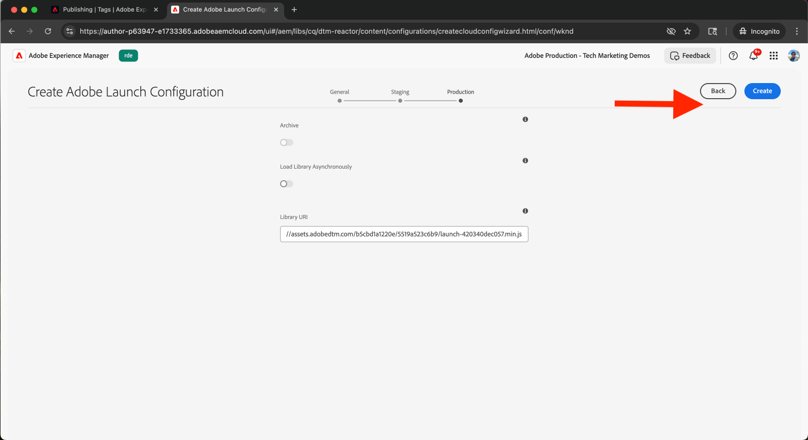

# Integrieren von Tags in Adobe Experience Platform

Erfahren Sie, wie Sie AEM as a Cloud Service (AEMCS) mit Tags in Adobe Experience Platform integrieren. Die Integration von Tags (auch als Launch bezeichnet) ermöglicht es Ihnen, Adobe Web SDK bereitzustellen und benutzerdefiniertes JavaScript für die Datenerfassung und Personalisierung in Ihre AEM-Seiten einzufügen.

Durch die Integration kann Ihr Marketing- oder Entwicklungs-Team JavaScript zur Personalisierung und Datenerfassung verwalten und bereitstellen, ohne erneut AEM-Code bereitstellen zu müssen.

## Allgemeine Schritte

Der Integrationsprozess umfasst vier Hauptschritte, die die Verbindung zwischen AEM und Tags herstellen:

1. **Erstellen, Konfigurieren und Veröffentlichen einer Tags-Eigenschaft in Adobe Experience Platform**
2. **Überprüfen einer Adobe IMS-Konfiguration für Tags in AEM**
3. **Erstellen einer Tags-Konfiguration in AEM**
4. **Anwenden der Tags-Konfiguration auf Ihre AEM-Seiten**

## Erstellen, Konfigurieren und Veröffentlichen einer Tags-Eigenschaft in Adobe Experience Platform

Erstellen Sie zunächst eine Tags-Eigenschaft in Adobe Experience Platform. Diese Eigenschaft hilft Ihnen, die Bereitstellung der Adobe Web SDK und des benutzerdefinierten JavaScript für die Personalisierung und Datenerfassung zu verwalten.

1. Gehen Sie Sie zur [Adobe Experience Platform](https://experience.adobe.com/platform), melden Sie sich mit Ihrer Adobe ID an, und navigieren Sie über das Menü links zu **Tags**.\
   

2. Klicken Sie auf **Neue Eigenschaft**, um eine neue Tags-Eigenschaft zu erstellen.\
   

3. Geben Sie im Dialogfeld **Eigenschaft erstellen** Folgendes ein:
   - **Eigenschaftenname**: Name für die Tags-Eigenschaft
   - **Eigenschaftstyp**: Wählen Sie **Web** aus.
   - **Domain**: die Domain, in der Sie die Eigenschaft bereitstellen (z. B. `.adobeaemcloud.com`)

   Klicken Sie auf **Speichern**.

   

4. Öffnen Sie die neue Eigenschaft. Die **Core**-Erweiterung sollte bereits enthalten sein. Später fügen Sie beim Einrichten des Experimentieren-Anwendungsfalls die **Web SDK**-Erweiterung hinzu, da eine zusätzliche Konfiguration, wie die **Datenstrom-ID**, erforderlich ist.\
   

5. Veröffentlichen Sie die Tags-Eigenschaft, indem Sie zu **Veröffentlichungsablauf** wechseln und auf **Bibliothek hinzufügen** klicken, um eine Bereitstellungsbibliothek zu erstellen.
   

6. Geben Sie im Dialogfeld **Bibliothek erstellen** Folgendes an:
   - **Name**: Name Ihrer Bibliothek
   - **Umgebung**: Wählen Sie **Entwicklung** aus.
   - **Ressourcenänderungen**: Wählen Sie **Alle geänderten Ressourcen hinzufügen** aus.

   Klicken Sie auf **Speichern und für Entwicklung erstellen**.

   

7. Um die Bibliothek in der Produktion zu veröffentlichen, klicken Sie auf **Genehmigen und zur Produktion veröffentlichen**. Sobald die Veröffentlichung abgeschlossen ist, kann die Eigenschaft in AEM verwendet werden.\
   

## Überprüfen einer Adobe IMS-Konfiguration für Tags in AEM

Wenn eine AEMCS-Umgebung bereitgestellt wird, enthält sie automatisch eine Adobe IMS-Konfiguration für Tags sowie ein entsprechendes Adobe Developer Console-Projekt. Diese Konfiguration gewährleistet eine sichere API-Kommunikation zwischen AEM und Tags.

1. Navigieren Sie in AEM zu **Tools** > **Sicherheit** > **Adobe IMS-Konfiguration**.\
   

2. Suchen Sie die Konfiguration **Adobe Launch**. Falls verfügbar, wählen Sie diese aus und klicken Sie auf **Konsistenzprüfung**, um die Verbindung zu überprüfen. Es sollte eine Erfolgsantwort zu sehen sein.\
   

## Erstellen einer Tags-Konfiguration in AEM

Erstellen Sie eine Tags-Konfiguration in AEM, um die Eigenschaft und die Einstellungen festzulegen, die für Ihre Website-Seiten erforderlich sind.

1. Gehen Sie in AEM zu **Tools** > **Cloud-Services** > **Adobe Launch-Konfigurationen**.\
   

2. Wählen Sie den Stammordner Ihrer Website aus (z. B. WKND-Website), und klicken Sie auf **Erstellen**.\
   

3. Geben Sie im Dialogfeld Folgendes ein:
   - **Titel**: z. B. „Adobe Tags“
   - **IMS-Konfiguration**: Wählen Sie die überprüfte **Adobe Launch**-IMS-Konfiguration aus.
   - **Unternehmen**: Wählen Sie das Unternehmen aus, das mit Ihrer Tags-Eigenschaft verknüpft ist.
   - **Eigenschaft**: Wählen Sie die zuvor erstellte Tags-Eigenschaft aus.

   Klicken Sie auf **Weiter**.

   

4. Behalten Sie zu Demonstrationszwecken die Standardwerte für die Umgebungen **Staging** und **Produktion** bei. Klicken Sie auf **Erstellen**.\
   

5. Wählen Sie die neu erstellte Konfiguration aus und klicken Sie auf **Veröffentlichen**, um sie für Ihre Website-Seiten verfügbar zu machen.\
   

## Anwenden der Tags-Konfiguration auf Ihre AEM-Site

Wenden Sie die Tags-Konfiguration an, um die Web SDK- und Personalisierungslogik in Ihre Website-Seiten einzufügen.

1. Wechseln Sie in AEM zu **Sites**, wählen Sie den Stammornder der Website aus (z. B. WKND-Website), und klicken Sie auf **Eigenschaften**.\
   

2. Öffnen Sie im Dialogfeld **Site-Eigenschaften** die Registerkarte **Erweitert**. Überprüfen Sie unter **Configurations**, ob `/conf/wknd` für **Cloud-Konfiguration** ausgewählt ist.\
   

## Überprüfen der Integration

Um sicherzustellen, dass die Tags-Konfiguration ordnungsgemäß funktioniert, können Sie:

1. die Quelltext-Ansicht einer veröffentlichten AEM-Seite überprüfen oder den Quelltext mit Browser-Entwickler-Tools inspizieren
2. mit dem [Adobe Experience Platform Debugger](https://chromewebstore.google.com/detail/adobe-experience-platform/bfnnokhpnncpkdmbokanobigaccjkpob) die Web SDK- und JavaScript-Einfügung validieren

## Zusätzliche Ressourcen

- [Überblick über Adobe Experience Platform Debugger](https://experienceleague.adobe.com/de/docs/experience-platform/debugger/home)
- [Überblick über Tags](https://experienceleague.adobe.com/de/docs/experience-platform/tags/home)
