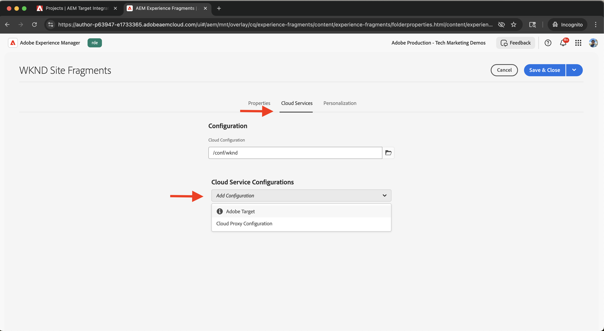

# Integrieren mit Adobe Target

Erfahren Sie, wie Sie AEM as a Cloud Service (AEMCS) mit Adobe Target integrieren können, um personalisierte Inhalte wie Experience Fragments als Angebote in Adobe Target zu aktivieren.

Durch die Integration kann Ihr Marketing-Team personalisierte Inhalte zentral in AEM erstellen und verwalten. Diese Inhalte können dann nahtlos als Angebote in Adobe Target aktiviert werden.

>[!IMPORTANT]
>
>Der Integrationsschritt ist optional, wenn Ihr Team es vorzieht, Angebote vollständig in Adobe Target zu verwalten, ohne AEM als zentralisiertes Inhalts-Repository zu verwenden.

## Allgemeine Schritte

Der Integrationsprozess umfasst vier Hauptschritte, die die Verbindung zwischen AEM und Adobe Target herstellen:

1. **Erstellen und Konfigurieren eines Adobe Developer Console-Projekts**
2. **Erstellen einer Adobe IMS-Konfiguration für Target in AEM**
3. **Erstellen einer Legacy-Adobe Target-Konfiguration in AEM**
4. **Wenden Sie die Adobe Target-Konfiguration auf Experience Fragments an**

## Erstellen und Konfigurieren eines Adobe Developer Console-Projekts

Damit AEM sicher mit Adobe Target kommunizieren kann, müssen Sie ein Adobe Developer Console-Projekt mithilfe der OAuth-Server-zu-Server-Authentifizierung konfigurieren. Sie können ein vorhandenes Projekt verwenden oder ein neues erstellen.

1. Wechseln Sie zur [Adobe Developer Console](https://developer.adobe.com/console) und melden Sie sich mit Ihrer Adobe ID an.

2. Erstellen Sie ein neues Projekt oder wählen Sie ein vorhandenes aus.\
   

3. Klicken Sie auf **API hinzufügen**. Filtern Sie **Dialogfeld „API hinzufügen** nach **Experience Cloud**, wählen Sie **Adobe Target** und klicken Sie auf **Weiter**.\
   

4. Wählen **Dialogfeld „API konfigurieren** die Authentifizierungsmethode **OAuth Server-zu-Server** aus und klicken Sie auf **Weiter**.\
   

5. Wählen **im Schritt** Produktprofile auswählen“ die Option **Standard-Workspace** und klicken Sie auf **Konfigurierte API speichern**.\
   

6. Wählen Sie in der linken Navigation **OAuth Server-zu-Server** aus und überprüfen Sie die Konfigurationsdetails. Beachten Sie die Client-ID und den geheimen Client-Schlüssel . Sie benötigen diese Werte, um die IMS-Integration in AEM zu konfigurieren.
   

## Erstellen einer Adobe IMS-Konfiguration für Target in AEM

Erstellen Sie in AEM eine Adobe IMS-Konfiguration für Target mit den Anmeldeinformationen aus der Adobe Developer Console. Diese Konfiguration ermöglicht AEM die Authentifizierung bei den Adobe Target-APIs.

1. Navigieren Sie in AEM zu **Tools** > **Sicherheit** und wählen Sie **Adobe IMS-Konfigurationen** aus.\
   

2. Klicken Sie auf **Erstellen**.\
   

3. Geben Sie auf **Seite Technische Kontokonfiguration für Adobe** Folgendes ein:
   - **Cloud-**: Adobe Target
   - **Title**: Ein Titel für die Konfiguration, z. B. &quot;Adobe Target&quot;
   - **Autorisierungsserver**: `https://ims-na1.adobelogin.com`
   - **Client-ID**: Aus der Adobe Developer Console
   - **Client-Geheimnis**: Aus der Adobe Developer Console
   - **Umfang**: Von der Adobe Developer Console
   - **Organisations-ID**: Aus der Adobe Developer Console

   Klicken Sie dann auf **Erstellen**.

   

4. Wählen Sie die Konfiguration aus und klicken Sie auf **Systemdiagnose**, um die Verbindung zu überprüfen. Eine Erfolgsmeldung bestätigt, dass AEM eine Verbindung zu Adobe Target herstellen kann.\
   

## Erstellen einer Legacy-Adobe Target-Konfiguration in AEM

Um Experience Fragments als Angebote nach Adobe Target zu exportieren, erstellen Sie eine ältere Adobe Target-Konfiguration in AEM.

1. Navigieren Sie in AEM zu **Tools** > **Cloud-** und wählen Sie **Legacy-Cloud-Services** aus.\
   

2. Klicken Sie im Abschnitt **Adobe Target** auf **Jetzt konfigurieren**.\
   

3. Geben **im Dialogfeld „Konfiguration erstellen** einen Namen wie &quot;Adobe Target Legacy“ ein und klicken Sie auf **Erstellen**.\
   

4. Geben Sie auf der Seite {0 **Adobe Target Legacy-Konfiguration} Folgendes an:**
   - **Authentifizierung**: IMS
   - **Client-Code**: Ihr Adobe Target-Client-Code (in Adobe Target unter **Administration** > **Implementierung**)
   - **IMS-**: Die zuvor erstellte IMS-Konfiguration

   Klicken Sie auf **Mit Adobe Target verbinden**, um die Verbindung zu überprüfen.

   

## Anwenden der Adobe Target-Konfiguration auf Experience Fragments

Verknüpfen Sie die Adobe Target-Konfiguration mit Ihren Experience Fragments, damit sie exportiert und als Angebote in Target verwendet werden können.

1. Navigieren Sie in AEM zu **Experience Fragments**.\
   

2. Wählen Sie den Stammordner aus, der Ihre Experience Fragments enthält (z. B. `WKND Site Fragments`), und klicken Sie auf **Eigenschaften**.\
   

3. Öffnen Sie auf **Seite** die Registerkarte **Cloud-**&quot;. Wählen Sie im Abschnitt **Cloud Service-** Ihre Adobe Target-Konfiguration aus.\
   

4. Füllen Sie im **&#x200B;**&#x200B;Adobe Target&rbrace; Folgendes aus:
   - **Adobe Target-Exportformat**: HTML
   - **Adobe Target Workspace**: Wählen Sie den zu verwendenden Arbeitsbereich aus (z. B. „Standard-Workspace„)
   - **Externalizer-**: Geben Sie die Domains ein, aus denen externe URLs generiert werden sollen

   

5. Klicken Sie auf **Speichern und schließen**, um die Konfiguration anzuwenden.

## Überprüfen der Integration

Um sich zu vergewissern, dass die Integration ordnungsgemäß funktioniert, testen Sie die Exportfunktion:

1. Erstellen Sie in AEM ein neues Experience Fragment oder öffnen Sie ein vorhandenes. Klicken Sie **der Symbolleiste auf** In Adobe Target exportieren“.\
   

2. Navigieren Sie in Adobe Target zum Abschnitt **Angebote** und überprüfen Sie, ob das Experience Fragment als Angebot angezeigt wird.\
   

## Zusätzliche Ressourcen

- [Target-API - Übersicht](https://experienceleague.adobe.com/en/docs/target-dev/developer/api/target-api-overview)
- [Target-Angebot](https://experienceleague.adobe.com/en/docs/target/using/experiences/offers/manage-content)
- [Adobe Developer Console](https://developer.adobe.com/developer-console/docs/guides/)
- [Experience Fragments in AEM](https://experienceleague.adobe.com/en/docs/experience-manager-learn/sites/experience-fragments/experience-fragments-feature-video-use)